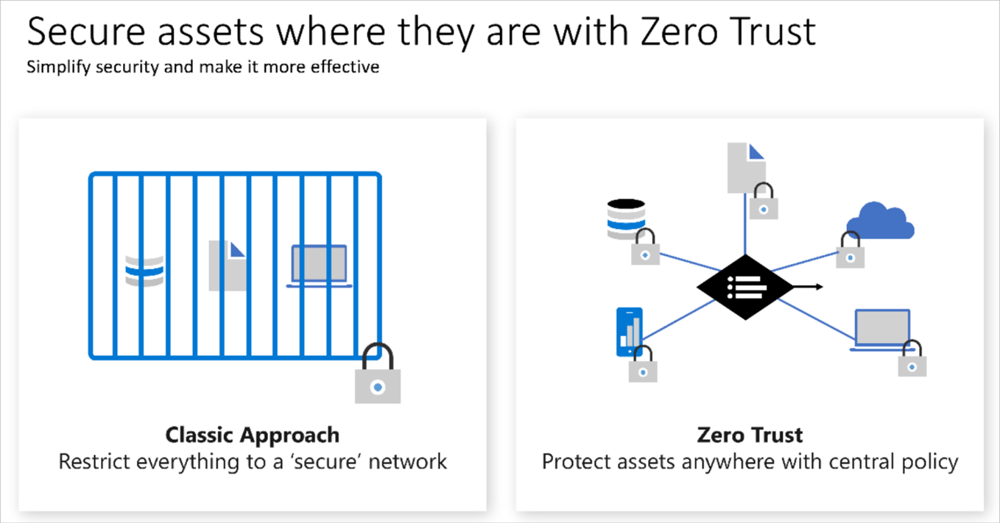

# Azure Fundamentals AZ-900 # 

# Cloud Concepts 

## Basics
- **cloud computing**: delivery of computing services over the internet 
    - common infra (VMs, storage, db, networking, etc... now expanded to include AI, ML...)
    - virtually unlimited resources in cloud provider's data center 
    - compute power & storage are main things offered by external data center - backups, OS updates...
- **describe shared responsibility model** 
    - Cloud provider is ALWAYS responsible for: 
        - physical hosts
        - physical network 
        - physical datacenter 
    - PaaS: OS owned by datacenter - network/applicaiton & AD is a mix 
    - SaaS: AD is a mix, but applications, network, OS, hosts etc all owned by cloud provider 
    - client is ALWAYS responsible for: 
        - info & data stored in the cloud 
        - devices that are allowed to connect to your cloud 
        - accounts & IDs of people/services/devices in cloud 
    - Depending on what you select, these services can change:
        - OS
        - Network controls 
        - applications 
        - ID & AD Infra 
- **public/private/hybrid clouds**
    - private cloud has startup costs, own all data/security/maintenance... 
    - public you can offload these costs 
    - hybrid provides flexibility, but adds complexity 
    - multi-cloud - use multiple cloud environments 
    - Azure Arc: manage cloud envm in Azure or private data center or hybrid config 
    - Azure VMware: allows you to run VMware workloads in Azure with seamless integration & scalability 
- use-cases for each cloud
- **consumption based model** 
    - CapEx vs OpEx 
        - Cloud computing is OpEx because (in theory) your costs will scale up & down with your org's operations 
        - no upfront costs, don't pay for resources when you don't need them or aren't using them... (in theory) no waste or excess capacity 
    - Cloud is a pay-as-you-go 
        - plan and manage your operating costs 
        - run infra more efficiently
        - scale as your business needs to change 
        - rent your infra s you need it, cloud provider will handle the rest 

## Key Concepts 
- **HA & Scalability** 
    - High Availability (HA): ensuring maximum availability - often done through uptime guarantees as part of SLA 
    - Azure SLA: service level agreement - agreement between
        - % of uptime: a service or application's availability - and what happens when uptime breaks (often monetary payment to make amends) 
        - often 99% & up - requires extra cost & often duplicate infra, etc and the more 9s added generally adds more cost 
    - Scalability: ability to adjust resources to meet demand 
        - grants flexibility to be "waste-free" when allocating compute/storage etc...
        - vertical scaling: increasing/decreasing machine resources 
        - horizontal scaling: adding/removing extra machines 
- **Realiability & Predictability** 
    - Realiability: ability of a system to recover from failures & continue to function 
        - Decentralizing allows for a reliable & resilient infra 
    - Predictability: cost/price predictability & performance predictability to confidently move business forward 
        - Performance predictability: autoscaling, load balancing, HA allow you to grow/shrink resources to meet demand and provide consistent exp to users 
        - Cost predictability: track resource usage in RT, forecast spend, optimize spend, etc... 
- **Security & Governance** 
    - Cloud has features to support governance & compliance
        - establishing templates to meet common corp/regulatory standards (can auto-update) 
        - auditing - to flag resources out of compliance & basic mitigation strategies 
    - can meet security needs: can take control of OS, patching and maintenance or defer that to cloud provider 
        - can handle DDoS
- **Manageability** 
    - Cloud Management capabilities: 
        - management of cloud to autoscale 
        - auto deploy based on preconfigured templates 
        - monitor health of resources & auto replace failing ones 
        - receive alerts & metrics 
    - You can take action to manage these through: web portal, CLI, APIs or powershell 

## IaaS, PaaS & SaaS ## 
- **IaaS Infrastructure as a Service** 
    - most flexibile and provides user with most amount of control (network, ID/AD, OS, install, config, maintenance, patching, updates, sescurity...)
        - you are literally renting hardware from cloud provider and doing the rest 
    - Makes the most sense for: 
        - Lift n shift migration: Get your applications/services/etc running in the cloud by copy-pasting it there 
        - Testing & development: stand up/shut down environments, builds as needed 
- **PaaS Platform as a Service** 
    - Middle ground - where licensing/patching/updates for OS & Databases are taken care of 
    - Makes the most sense for: 
        - Development framework: complete a dev environment without all dev infra -- reference HA databases so developer doesn't have to maintain an HA database, just code against one 
        - Analytics/Business Intelligence: tools provided with PaaS to allow orgs to analyze & mine their data, finding insights/patterns for various org uses and business purposes 
- **SaaS Software as a Service**
    - most complete software service - essentially renting a fully developed app (salesforce) 
        - places most resp on cloud owner and least on client 
        - client is basically only responsible for data they put in, the devices that connect & the users they add 
    - Makes the most sense for: email/messaging, business productivity applications, finance & expense tracking 

# Azure Architecture & Services 

## Core Components 
- Physical org of Azure - Datacenters, availability zones & regions 
- Logical/Management structure of azure - resource groups, subscriptions & management groups 
- selection of services 
    - azure web apps
    - azure functions - serverless (FaaS)
    - K8s services 
    - DBs on demand 
    - Cosmos DB - noSQL db ~ dynamodb from amazon? 
- Azure cloud is continously improved and offerings grow, you can build on your terms in your language/framework/globally 
    - allows you to opearte hybrid, public cloud, security from the ground up 
- Over 100 services, clients typically start with VMs, but you can expand to variety of services - AI/ML, etc... 

### Azure Accounts
- **Azure Account**: Top level parent/root
- **Subscriptions**: (development/marketing/sales...) ?groupings within an account? 
- **Resource Groups**: group resources together
    - **Resources**: Azure services and objects 

- free account includes 12 months access for free to 25 products, a credit to use within 1 month 
- Azure student grants 12 months free for certain software dev tools and a credit to use within 12 months 
- Learn exercises use a temp subscription called a sandbox that will clean up resources after you've completed the exercise 

### Physical Infra - Regions & AZs 
- Physically Azure is a set of datacenters spread across the globe 
    - just like in a corporate datacenter, they are large facilities filled with racks of servers/cpus/storage with dedicated power, cooling and networking infra 
- **Region**: geographical area that contains at least one datacenter(s) that are nearby and networked with a low-latency network 
    - Azure assigns & controls resources within each region to ensure workloads are appropriately balanced 
    - When you deploy a resource - you choose a region to put it in  
        - NOTE: certain services and types of services (storage, VM sizes, etc...) are only available in certain regions, others are globally standard 
- **Availability Zones**: physically separate datacenters within an Azure region 
    - one or more datacenters equipped with indp power, cooling and network... 
    - It's an isolation boundary should 1 zone go down, the other continues working --> Azure works to have 3 AZs in each region for full HA/availability support. 

#### Ensuring Availability with AZs & Regions 
- setting up redundancy originally required duplicate hardware environments, now you can just click through different AZs 
    - you can colocate across AZs or replicate data to backup in a different AZ 
- **Zonal Services**: you pin the resource to a specific zone (VMs, Managed Disks, IP addresses...)
- **Zone-redundant services**: platform auto replicates across zones (zone redundant storage, SQL db...)
- **Non-regional Services**: services always available and are resilient to zone-wide outages & region-wide outages. 
- **Region Pairs**: most azure regions are paired with another region at least 300 miles away for DR purposes 
    - West US paired with East US region to be resilient to a west coast disaster or east coast disaster. 
        - NOTE: data replication across regions is not always automatic and may need to be manually configured 
    - if extensive outage occurs, one region out of every pair is prioritized for restore 
    - updates are rolled out to one region within a pair at a time to minimize downtime/risk 
    - data resides within same geography (to comply with tax/law enforcement rules) 
- **Sovereign Regions**: Azure instances issolated from main instance often for governmental purposes
    - US DoD Central, US Gov Virginia, US Gov Iowa and others 

### Management Infra - Resources & Resource Groups & Subscriptions and Management Groups
- Accounts --> Subscriptions --> Resource Groups --> Resources 
- **Resource**: the building block of Azure, anything you create, provision & deploy  
- **Resource Groups**: Groupings of resources - any resource must exist within a resource group. 
    - Each resource can only be in one resource group at a time (if you take it out of Resource Group A and put it into B, it is no longer a part of A)
    - Resource Groups cannot be nested 
    - with the above restrictions - resource groups should be designed carefully: a dev environment under 1 entire resource group to be easily provisioned or removed - or a 3 schema compute engine spread across 3 RGs... 
    - Resource Groups Auto-inherit settings from subscriptions, and resources inherit settings from resource groups. (for current & future resources)

- **Subscriptions**: a unit of management, billing and scale - just how resource groups organize resources, subscriptions allow you to organize your resource groups and facilitate billing
    - Links to an Azure account which is an ID in Azure AD or directory/domain which azure trusts --> this allows you to provide an authenticated & authorized access to provision & use azure products/services. 
- Subscription Boundaries: configure different billing models and/or different access controls 
    - *Billing boundary*: determines how an Azure account is billed for - can create multiple subscriptions for different billing reqs with different invoices/reports to allow you to organize & manage costs 
    - *Access control boundary*: access-mgt policies applied at subscription level to reflect org structure and billing to different departments or set policies at dept levels 
        - limit marketing to small VMs for example 
- Reasons to create separate subscriptions: 
    - Environments - dev/test/prod costs & access control set at subscription level 
    - Org Structures - subscriptions to follow org structure and grant/deny access to org structure 
    - Billing - create subscriptions for billing levels - prod vs dev workloads 

- **Management Groups** : Groupings of subscriptions 
    - All subscriptions within a management group auto-inherit conditions applied to management group
    - allow for enterprise-grade management at scale 
        - hierarchy that applies a policy (limit VM locations to US West Region for PROD, and US East for DR)
        - provide user access to multiple subscriptions (allows for single RBAC to grant multi subscription access - rather than multi-RBAC per user)
    - Capabilities: CAN be nested 
    - Restrictions: a tree structure that goes 6 deep (not including head) and doesn't allow one branch to have 2 parents, max 10k mgt groups under a single directory   

 

## Compute & Networking Services 
### Virtual Machines in Azure
- VMs are a basic unit of IaaS and are abstraction of core, ram, & storage making it very versatile. Use when you need: 
    - total control over OS 
    - ability to run custom software 
    - use custom hosting configs 
- VMs provide flexibility of infra without OS/software updates and maintenance 
    - can create/provision VM in minutes using images
- **VM Scale Sets** 
    - VM scale creates a group of identical, load-balanced VMs 
        - can be configured to auto increase/decrease with demand - or scale based on schedule 
        - great for variable compute, big data, container workloads 
    - MUCH easier than manually setting up *N* number of VMs individually and configuring individually 
- **VM Machine Availability Sets**
    - VMs stagger updates and have varied power/network connectivity preventing loss of VMs during catastrophic event 
    - Can group VMs in 2 ways: 
        - *Update Domain*: VMs that can be rebooted at the same time, can apply updates in a roll-out fashion, and given 30 min to recover before next group begins updates
        - *Fault domain*: groups VMs by common power source & network switch - by default, it will split across 3 fault domains (? is this the same as AZ?) 
    - you only pay for VM instances you create - not using this Availability auto-setup 
- Usages for VMs: 
    - Testing & Development: quick * easy way to create different OS & app configs, easy delete when done 
    - Running apps in the cloud: applications can be started/stopped when needed to limit infra costs 
    - Extending datacenter into the cloud: adding a VNet in Azure and adding VMs to that VNet 
    - During DR - can create VMs in Azure as a DR strategy 
    - Assist with lift & shift strategy into the cloud 
- VM Resources - additional azure objects/resources tied to VM that are necessary for it to function
    - Size of VM (purpose, # of cores, RAM) 
    - Storage (Hard drives, SSD, etc) 
    - Networking (VNet, Public IP, Port config...)

### Virtual Desktop 
- A desktop & app virtualization service that runs in the cloud - enables you to use a cloud-hosted version of windows from any location 
    - works across devices, OS, and apps/browsers everywhere 
    - centralized RBAC with Azure AD, and can enable multi-factor authc 
    - can separate your data/apps from local hardware (physical laptop) 
- Multi-session Windows 10 or 11: enables concurrent users on a single VM 

### Azure Containers 
- To run multiple apps on a single host machine requires extensive app configs or multiple VMs 
    - can do that more easily with containers
    - less duplication of OS/VM operations 
    - containers virtualize the OS 
    - Portability: containers can be used to ensure consistency across deployments - as VMs between dev/prod can have different configs, etc... 
- VMs have an OS you can connect to and manage - containers don't allow you to config the OS and treat the container as a "unit" 
    - this allows you to build/deploy/test/delete containers rather than an app and its various configs
- Azure container instances - allow you to run through their containers in a PaaS
    - primarily used with microservices architecture with small, independent pieces that can be split off and run as containers & individually scale up/down services as needed

### Azure Functions
- FaaS (serverless) event based, reactive applications 
- all you need is a bit of code or particular process to run when a certain event occurs. 
    - you are only charged for CPU time when function runs 
- Stateless functions are default (restart anew with no memory of the past for every request, and treat them all the same)
- Stateful (Durable Functions)  context is passed through the function to track prior activity 

### App hosting options 
- Beyond VMs & Containers - Azure App Service is a great alternative to hosting apps 
- Can build and host web apps, background jobs, mobile backends and RESTful APIs in programming language of choice without managing infra 
    - all with auto-scaling and HA for Windows/Linux
    - enables automated deployments from Github, azure or other git repos 
- robust hosting option to build and maintain app, while Azure keeps infra running 
- Hosts common apps like: 
    - Web Apps 
        - ASP, .NET, Java, Ruby, Node.js PHP or python
    - API Apps 
    - WebJobs 
        - run a program or script in same context as webapp, etc - scheduled or run by trigger 
    - Mobile Apps 
        - authenticate users, store data, send notifications, execute custom logic 
- App Service handles most of the infra decisions you deal with in hosting web-accessible apps 
    - deployment and management are integrated into platform 
    - endpoints can be secured
    - scalable to handle dynamic demand with built in load balancing and traffic manager to provide HA 

### Virtual Networking 
- Azure virtual networks & subnets enable Azure resources such as VMs webapps & databases to communicate with each other & across the public internet  
- Extra details from [VNet Service Endpoints](https://learn.microsoft.com/en-us/azure/virtual-network/virtual-network-service-endpoints-overview)
    - VNet service endpoint provides secure/direct connectivity to Az services over an optimized route over Azure backbone network 
    - endpoints are enabled on subnets configured in AZ VNets - can't be used for traffic from on-prem to azure services as they are not reachable from on-prem network 
- Azure Networks Capabilities: 
    - **Isolation & Segmentation** 
        - can create multiple isolated vnets 
        - you define a private IP address space by using public or private IP address ranges 
        - IP range only exists within the vnet and isn't internet routable. 
        - can divide the IP address space into subnets and allocate part of the defined address space to each named subset 
    - **Internet Comms**
        - you can enable incoming connections from the internet by assigning a public IP address to an Azure resource, or putting it behind a load balancer
    - **Communicate between Azure resources** 
        - can communicate securely between resources, not just your own, but Azure services like AKS, App service, VM scale sets... 
        - service endpoints can enable you to link multiple azure resource to vnets to improve security and provide optimal routing 
    - **Communicate with on-premises resources** 
        - Azure VNets allow you to link on-prem resources to your azure subscription - creating a network that spans local and cloud envm 
        - _Point-to-site VPN_ a computer outside your org, back into your corp network. Client computer begins an encrypted VPN to connect to Azure VNet
        - _Site-to-Site VPN_ link your on-premise VPN device or gateway to Azure VPN gateway in a VNet - devices in Azure can appear as being on local network through an encrypted public connection 
        - _Azure ExpressRoute_ dedicated private connectivity that doesn't travel over internet. - Used for high bandwidth, high security scenarios 
    - **Route Network Traffic** 
        - azure routes traffic between subnets on any connected Vnets, on-prem and the internet 
        - these rules are defined in route tables and can be customized to control how packets are routed between subnets 
        - BGP works with Azure VPN gateways, Azure Route Server or ExpressRoute to propagate on-prem BGP routes to Azure VNet 
    - **Filter network Traffic** 
        - _Network Security Groups_ allow you to filter traffic between subnets by defining inbound/outbound security rules based on IP address, port, protocol, source/destination... 
            - can create an NSG that gets applied to certain types of VMs... 
        - _Network Virtual Appliances_ specialized VMs that are similar to a physical network appliance - run a firewall, provide WAN, etc... 
    - **Connect VNets** 
        - can link VNets through peering, and enables separate VNets to communicate (even across regions)
        - network traffic between peered networks is private & secured - it travels through MSFT network never connecting to public internet 
        - *User Defined Routing (UDR)* allows you to control routing tables between subnets within a VNet or between VNets

### Azure VPN 
- a VPN uses an encrypted tunnel within another network 
    - typically deployed to connect 2+ trusted private networks to one another over an untrusted network (typically internet)
    - encrypts traffic during untrusted network to prevent malfeasance & ensure safe/secure sharing of info 
- **VPN Gateway** 
    - One type of VNet Gateway that allows: (A network gateway joins two networks so the devices on one network can communicate with the devices on another network.) 
        - connecting to on-prem datacenters to VNets through a site-to-site connection 
        - connect indv devices to VNets through a point-to-site connection 
        - connect VNets to other VNets through a network-to-network connection 
    - only ONE VPN Gateway for each VNet - can use one gateway to connect to multiple locations which can have their own VPN Gateways 
    - When you deploy a VPN Gateway, you specify the TYPE: Policy or Route, both use pre-shared key as only method of authc
        - *Policy-based VPN Gateways*: specify statically the IP address of packets that should be encrypted through each tunnel 
            - said another way - they evaluate every data packet against those sets of IP addresses to choose the tunnel where that packet is going to be sent through 
        - *Route based VPN Gateways*: IPSec tunnels are modeled as a NIC or Virtual Tunnel Interface - IP routing (either static routes or dynamic routing) decides which one of these tunnel interfaces to use when sending each packet 
            - route-based VPNs are preferred method for on-premises, they are more resilient to topology changes (creation of new subnets)
            - route-based works best for: Connections between VNets, Point-to-site connections, multi-site connections, coexistence with ExpressRoute 
            - seems like this is the *preferred* choice 
- HA scenarios for VPN
    - **Active/Standby**: default configuration 
        - when planned maintenance occurs connections are interrumpted and restored within a few seconds, uninterrupted can take as much as 90 seconds 
    - **Active/Active**: Using BGP routing protocol, you can deploy VPN gateways in an active/active 
        - you assign unique public IPs to each, then create separate tunnels from on-prem device to each IP
        - can be extended by deploying additional VPN devices on-prem 
    - **ExpressRoute Failover to VPN Gateway**: If ExpressRoute fails, can configure it to failover to VPN gateway 
        - while expressroute built in with resiliency - there could be an outage that compromises it & can setup VPN gateway as a backup to ensure constant connection to VNet
    - **Zone Redundant Gateways**: can setup VPN Gateways & ExpressRoute gateways in zone-redundant config 
        - ultra extreme resiliency and HA - with physical and logical separation within a region
        - use different resources (Gateway Stock Keeping Units SKUs) & use standard public IP addresses instead of basic Public IP addresses 

### Azure ExpressRoute 
- Extend on-prem network to MSFT cloud datacenter with private connection - connection is called "ExpressRoute Circuit" 
- can connect offices, datacenters, etc. Each connection has its own expressroute 
- connectivity can be from any-to-any IP VPN network, a point-to-point Ethernet network, or Virtual cross-connection through a provider 
- these connections are more secure (don't go over internet) and offer more reliability, speed & consistency 
    - DNS queries, certificate revocation list checking and Azure CDN are sent over public internet 
- **Benefits of ExpressRoute** 
    - connectivity to MSFT cloud services across all regions in geo-region 
    - global connectivity using Global Reach 
    - Dynamic routing between network & microsoft via BGP 
    - built in redundancy 
- Can connect to services in ALL regions: 
    - MS Office 365
    - MS Dynamics 365
    - Azure Compute services (VMs)
    - Azure Cloud services (Azure Cosmos DB / Az storage) 
- Global connectivity through ExpressRoute Global reach to exchange data across on-prem sites - a private highway to send data across continents 
- Dynamic routing through BGP to exchange routes between on-prem and resources running in Azure 
- Connectivity Approaches with ExpressRoute 
    - Cloud Exchange colocation: your datacenter/office physically colocated at cloud exchange/ISP - request virtual cross-connect to MSFT cloud 
    - Point-to-Point Ethernet Connection: using a point-to-point connection between your facility and MSFT Azure (data link layer ? laying cable ?)
    - Any-to-Any Connection: Integrate your WAN with Azure by providing connections to multi office/datacenter. Azure integrates with WAN so you can connect between datacenter, branch offices & Azure 
    - Direct from ExpressRoute Sites: connect with global network peering location 

### Azure DNS 
- Hosting service for DNS domains that provide name resolution by using MS Azure infra 
    - can manage your DNS records with Azure using same creds, APIs, tools & billing as other Azure infra 
    - does NOT buy domain names - once purchased, it can be hosted in Azure DNS
- Benefits: reliability & performance, security, ease of use, customizable VNets, alias records 
    - Reliability: Azure DNS are hosted on Azure's global network of DNS name servers with HA and resiliency
    - Performance: Azure uses anycast networking, so DNS query is answered by closest avail DNS server for perf 
    - Security: Azure DNS based on Resource Manager which allows RBAC, activity logs & resource locking (no accidental deletes)
    - Ease of Use: can provide DNS for external services & azure stuff you own, can be managed via CLI and through existing Azure subscription (one-stop-shop)
    - customizable VNets with private domains: can setup custom domains in private VNets, so you don't have to use Azure ones 
    - Alias record sets: can set alias records

### Public/Private Endpoints 

## Storage Services 

### Azure Storage Accounts 

- storage account type determines redundancy, archival, etc... 

|  Type     |   Supported Services  | Redundancy Options |  Usage                   |
|-----------|-----------------------|--------------------|--------------------------|
| Standard, general purpose v2 | Blob Storage, Queue Storage, Table storage & Azure files | ALL | Standard storage for blobs, file shares, queues and tables. | 
| Premium Block Blobs | Blob storage (including data lake) | LRS, ZRS | Premium for block blobs & append blobs - recommended for high Tx or small obj, or low storage latency |
| Premium file shares | Azure Files | LRS, ZRS | Premium storage for file shares - recommended for HP apps, or storage account that supports Server Message block and NFS file systems. |
| Premium page blobs | Page blobs ONLY | LRS | Premium storage for page blobs only. |

- storage account endpoints
    - must have a unique (in Azure) account name & combo of account name and azure storage endpoint 
    - storage account names must be 3-24 chars in len with lowercase alnum 
    - storage account name must be unique within Azure to enable unique accessible namespaces

| Storage service |	Endpoint |
|-----------------|-----------------------|
| Blob Storage    |	https://<*storage-account-name*>.***blob***.core.windows.net |
| Data Lake Storage Gen2    |	https://<*storage-account-name*>.***dfs***.core.windows.net |
| Azure Files   |	https://<*storage-account-name*>.***file***.core.windows.net |
| Queue Storage |	https://<*storage-account-name*>.***queue***.core.windows.net |
| Table Storage   |	https://<*storage-account-name*>.***table***.core.windows.net |

### Azure Storage redundancy 
- Azure always stores multiple copiess of data for availability & durability 
- Consider trade-offs between lower costs and HA requirements 
    - how data is replicated in primary region
    - whether data is replicated to second region for DR purposes 
    - whether app requires read access to replicated data in sescond region if primary goes down 
- Types of Redundancy
    - LRS:   Locally Redundant Storage
    - ZRS:   Zone Redundant Storage 
    - GRS:   Geo-Redundant storage
    - RA-GRS:   Read-access Geo-Redundant Storage
    - GZRS:  Geo-Zone Redundant Storage 
    - RA-GZRS:  Read Access Geo-Zone-Redundant Storage

#### Redundancy in Primary Region (LRS, ZRS)
- LRS:   Locally Redundant Storage
    - Replicates data 3x *SYNCHronously* in single data center in primary region's chosen zone 
    - Provides 11 9's durability 
    - lowest cost option - provides protection against server rack & drive failures - but no true DR strategy 
- ZRS:   Zone Redundant Storage 
    - For AZ enabled regions, ZRS replicates Azure storage data *SYNCHronously* across 3 AZs in primary region
    - provides 12 9's durability - basically an HA LRS
    - allows r/w if zone dies, recommended for data replication within a country, or to handle Azure network update downtime or zone DR

#### Redundancy in a secondary region (GRS, RA-GRS, GZRS, RA-GZRS)
- the 'G'*RS - copy data to a secondary region for DR 
- Storage accounts made in one region are AUTOMATICALLY paired to a secondary region that CANNOT be changed. 
    - GRS ~ LRS  and  GZRS ~ ZRS just across 2 regions 
- by default, data in secondary region isn't avail for r/w access until there's a failover to secondary - in short it needs to be "promoted" to primary before it allows r/w 
    - largely due to the fact data is replicated to secondary region *ASYNCHronously* 
    - Interval between most recent writes to primary and last write to secondary is RPO - generally less than 15 min, but no official SLA 
- GRS:   Geo-redundant Storage
    - Does LRS in primary (synch copy 3x), THEN does ASYNCH to secondary then does LRS
    - provides 16 9's durability
- GZRS: Geo-zone redundant Storage
    - Combines geo & ZRS - does ZRS in primary (synch copy 3x across AZs), THEN does ASYNCH to secondary, then does ZRS there 
    - used for maximum consistency, durability, HA, performance and ultimate DR resilience 
    - provides 16 9's durability 
- Read access to data in secondary region - can be set up using RA-GRS or RA-GZRS so secondary can be read from, but it may not match primary due to RPO

### Azure Storage Services  
- General benefits of Azure Storage: 
    - durable & HA - Azure's already got infra & systems & software in place to perform data replication across disks, datacenters & regions 
    - secure - all data written to azure storage account is encrypted (at rest?)
    - scalable - designed to be massively scalable to meet storage & perf needs 
    - managed - azure manages all hardware maintenance, updates and critical issues for you 
    - accessible - access form anywhere over HTTP(S) and with CLI packages that make it easy to manage
- Allows for selection & creation of below types: 
    - Container (Blob storage as it is held in Containers)
    - File Shares 
    - Queues
    - Tables 

- **Blob Storage**: massively scalable obj store for text & binary data - images/docs, archive, video/audio
    - supports big data analytics through data lake storage Gen2 
    - blob storage is unstructured - no restriction on data it can hold AND can manage thousands of simultaneous uploads, data, log files, etc...
    - Best for: images & docs -> browser, storing files for distr access, streaming video & audio, storing data for backup/restore/DR/archival, storing data for analysis 
    - Blob objects can be accessed through their URL using various languages 
    - Azure calls "containers" ~ AWS Bucket
    - **Blob Storage Tiers** - To manage costs for data storage, you can set a retention period and frequency of access   
        - Hot: Optimized for storing data that is accessed frequently (website)
        - Cool: Optimized for data that is infrequently accessed and stored for at least 30 days 
        - Cold: rarely accessed data you want to keep for at least 90 days
        - Archive: data that is rarely accessed and has flexible latency 
        - NOTE: hot & cool can be set at account level, archive isn't avail at account level 
        - NOTE: hot/cool/archive can be set at blob level - during or after upload 
        - NOTE: Archive offers lowest storage costs, but higher costs to pull data, cool storage is between
- **Azure file share**: managed file shares for sharing data across multiple machines/services (for cloud/on-prem) 
    - Offers Server Message Block (SMB) (accessible by Windows, Linux & macOS) or *NFS* protocol (accessible by Linux & macOS)
    - can be mounted concurrently by cloud or on-prem - can be cached on Windows Servers with Azure File Sync for faster access
    - Key Benefits: 
        - shared access: can replace on-prem file-shares with azure file shares without worrying about compatibility 
        - fully managed: no need to manage OS/hardware, patches, security updates, etc... 
        - scripting and tooling: CLI can create/mount/manage AZFS
        - built for resiliency and durable 
        - familiar programmability: can be accessed through APIs, storage client libraries or azure storage REST API 
- **Azure Disk Storage**: adds disks to VMs (SSDs & HDD) - block level storage volumes 
    - block-level storage volumes managed by azure - virtualized for easy management and durable 
- **Azure Queues**: message queue store for reliable messaging between application components 
    - service for storing large numbers of 64KB messages 
    - can be tied with Azure Functions to take action nwhen a message is received
        - should be able to access from anywhere in the world

### Data Migration to Azure 
- Synch data migration (Azure Migrate) & Asynch Data Migration (Azure Data Box)
- **Azure Migrate** : central hub to manage assessment and migration of on-prem datacenter to Azure
    - unified migration platform to start, run and track migration to Azure 
    - range of tools for assessment & migration for basic discovery & assessment 
        - Azure Migrate: Discovery & Assessment - discover & assess on-prem servers running VMware, Hyper-V and physical servers in prep for migration 
        - Azure Migrate: Server Migration - migrate VMware VMs, Hyper-V VMs, physical and other VMs to public cloud VMs in Azure 
        - Data Migration Assistant - standalone tool to assess SQL server - poinpoints potential problems that could block migration, unsupported features, and new features to transition to 
        - Azure DB Migration service - migrate on-prem db to Azure VMs running SQL Server, Azure  SQL database, or SQL managed instances 
        - Web App Migration assistant - assess on-prem websites for migration to Azure App Service, migrate .NET & PHP web apps to Azure 
        - Azure Data Box - move large amounts of offline data to Azure 
- **Azure Data Box** : physical migration service that helps transfer large amounts of data in a quick, inexpensive and reliable way. 
    - Azure ships you a giant data storage device with 80 TB max capacity, then transported in a robust case and uploaded to datacenter 
    - can be ordered from Azure portal & can be set up and then sent back to Azure. It is tracked end-to-end 
    - best suited for 40+ TB data transfer with limited/no network connectivity and frequency can be one-time, periodic, or bulk 
        - one-time migration for initial migration, moving media library to create online media library, migrating VM farm, SQL server, apps, historical data
        - initial bulk transfer done with data box (seed) then followed by incremental transfers over the network 
        - periodic uploads - periodic boxes sent 
    - once uploaded, disks on databox are wiped in accordance with NIST 800-88r1 standards
    - Scenarios Data Box can be used to export data from Azure: 
        - DR: a copy of data from Azure is restored on an on-prem network, data placed on Databox, and shipped to client 
        - Security req - when you need to export data out of azure due to govt or sec reqm
        - Migrate back to on-prem or another cloud service - when you want to move all the data, use data box 

### Azure File Movement Options 
- Azure has tools to help you move indv files or small file groups 
- **AzCopy** 
    - CLI utility to copy blobs or files to/from storage account 
    - can upload/download or copy files between storage accounts
    - can synch files (one direction synch) it will copy files/blobs from source to destination. Does not synch timestamps or other metadata 
- **Azure Storage Explorer**  
    - standalone app that provides GUI to manage files/blobs in Az storage account 
    - runs on Windows, macOS & Linux - uses AzCopy on the backend to perform uploads to Azure, downloads or movement between accounts 
- **Azure File Sync** 
    - tool that lets you centralize your files in Azure Files and keep flexibility, perf and compatibility of Windows file server 
        - like turning windows file server into a mini-CDN
    - you install Azure file sync on a local windows server, it stays bi-directionally synched with files in Azure 
    - allows you to use any protocol avail to Windows server to access data locally (SMB, NFS & FTPS) 
    - setup as many of these as you like around the world 
    - replace a failed local server by installing Azure file synch on a new server in the same datacenter 
    - configure cloud tiering so most frequently accessed files are replicated locally, while others are kept in cloud 

## Access Controls, Identiy & Security 

### Azure Directory Services (Azure AD) 
- directory service that allows you to sign in and access MSFT cloud apps & cloud apps you develop 
- can also maintain on-prem AD 
    - AD running on Windows Server provides ID & Access Mgt service that's managed by your org 
- Azure AD is MSFT cloud-based ID & Access Mgt service 
    - you control ID accounts, but MSFT ensures service is available globally 
    - has additional featurs normal on-prem AD doesn't have (monitoring sign in attempts from unexpected locations, devices, etc...)

- Azure AD can be used by: 
    - IT Admins - for controlling access to apps & resources based on biz req 
    - App Devs - providing standards based approach for adding functionatliy to apps they build - SSO to an app, or enabling to work with existing creds... 
    - Users - can manage their IDs & take maintenance actions (password reset, etc...)
    - Online service subscribers - MSFT 365, MSFT Office 365, Azure, etc can use Azure AD to authc 
- Azure AD provides: 
    - *Authc*: verifying ID to access apps & resources AND self-service password reset, MFA, banned passwds & smart lockout services 
    - *SSO*: enables you to remember only 1 user/pass for multiple apps, can simplify security model and enable easier management of user on/off boarding 
    - *app mgt*: manage your cloud and on-prem apps using Azure AD - app proxy, SaaS apps, my apps portal & SSO provide better user exp 
    - *device mgt*: Az AD can register devices to be managed through MSFT Intune - or device-based conditional access policies (only allow access from valid device) 

- What do you do with existing on-prem AD? 
    - If you have a separate Azure AD and on-prem AD, they need to run indp with 2 identity sets 
    - you can connect your AD with Azure AD enabling consistent ID set --> Azure AD Connect 
    - **Azure AD Connect** *bi-directional synchs* user IDs btw on-prem AD & Az AD for authc, MFA, SSO... 

- **Azure AD DS (Domain Services)**
    - a service that provides managed domain services: domain join, group policy, LDAP, & Kerberos/NTLM authc  
        - as with other AZ services, no need to maintain infra or deploy/manage/patch domain controllers in the cloud 
    - can run legacy apps in cloud that can use modern authc methods, or you don't want to do directory lookups that hit on-prem all the time 
    - Azure AD DS integrates with existing Azure AD tenant - users can sign into services & apps connected to managed domain using existing creds 
        - can also use existing groups & user accounts to secure access to resources 
    - when you create an Azure AD DS - you define a unique namespace AKA the domain name 
        - then two windows server domain controllers (a replica set) are then deployed into your selected Azure region
        - no need to manage, configure/update the DCs, includes backups & encryption at rest 
    - Managed domain is configured to perform a *one-way synch* from Azure AD --> Azure AD DS (see below on theh left) 
        - you can create resources directly in managed domain, but they aren't synched back 
        - can be chained with on-prem AD --> Azure AD connect --> Azure AD --> Azure AD DS (managed service) {opposite direction from diagram below}

 

### Azure Authc Methods (password, SSO, MFA, passwordless)
- authentication Authc is the process of establishing the identity of a person, service or device. 
- It requires the person/service/device to provide some type of credential to prove who they are (like showing ID) 
    - It doesn't mean you are ticketed (authorized), but simply that you are who you say you are 
- **SSO** : enables a user to sign in one time and use that credential to access multiple resources & apps across the network 
    - *For SSO to work, those resources & apps MUST trust the initial authenticator*
    - This is beneficial to simplify passwords used across apps & individual authc (user-id/passwd) setup across all of them, let alone management for on/off boarding
    - SSO allows users to only know one ID & password, which simplifies security model and makes it easy for centralized access management. 
- **MFA** : process of prompting a user for an extra form (or factor) of ID during sign-in 
    - this is a code text sent to phone, or an MFA app, etc... So that it increases chances it is really "you"
    - Authentication is based on these categories: 
        - something the user knows (password, challenge question...)
        - something the user has (ID card, specific mobile phone...)
        - something the user is (fingerprint or bioscan) 
    - Azure AD MFA: a msft service that provides MFA - such as phone call or mobile app notification 
- **Passwordless** : password is replaced with other items
    - requires pre-setup on device like a specific laptop or computer, and it needs to be registered with Azure so it is "trusted" 
    - Once setup, you can provide something (a pin or finger print) and get authenticated without using a password 
    - Windows Hello for Business : best for info workers that have a designated PC - can use biometric & PIN creds 
        - these can be setup with PKI & SSO for passwordless access
    - MSFT Authenticator App : can be setup for MFA or to be used ass passwordless option 
        - sign into platform/browser, match number to authc app, and facial recognition and now you have access!
    - FIDO2 security keys : Fast IDentity Online Alliance helps promote open auth standards WebAuthn is the latest
        - FIDO2 security keys are unphishable stds based passwordless authc by using a security or platform key built into a device 
        - users register and then select this key at sign in. With hardware handling authc, very little chance password is exposed. 
        - typically USB, but could be bluetooth/NFC... 
     
### Azure External IDs 
- A person/device/service that's outside of your org
- sometimes your partners, clients, vendors, distributors, suppliers, etc need to interact with your AZ resources and you need to authc & auth them
- External users can "bring their own identities" - use a corporate or govt issued digital ID (Facebook, Google...) 

- **B2B Collaboration** - collaborate with external users by letting them use their preferred ID to sign-in to your msft apps or other enterprise apps
    - generally represented as "guest users" in you directory 
- **B2B Direct Connect** - est a mutual 2-way trust with another Azure AD org for seamless collab 
    - supports teams shared channels, allow users to access your resources within their home instances of teams 
    - users aren't represented in your directory, but are visible from Teams shared channel and can be monitored 
- **Azure AD B2C** - publish SaaS apps or custom dev apps to consumers/customers while using this service for ID & Access Mgt 

- Can use combo of the above, can use Azure AD B2B to invite users from a different AD
    - then set up guest users with appropriate access, and have an elevated guest user certify other guest users prior to access... 

 

### Azure Conditional Access  
- a tool that AZ AD uses to allow/deny access to resources based on ID signals 
- this is pre-auth, but post-authc to filter out valid IDs that are requesting the wrong things or from the wrong places
    - signals being: who the user is, where the user is and what device the user is requesting from. 
- allows for more granular MFA - if user is at known location, no MFA. If unexpected, MFA 
- simple business logic based on user, location, device and requested resource and deciding to allow access/deny/restrict/MFA... 
    - I.E. a high risk location may be blocked entirely 
- Usecases: 
    - MFA that's dependent on requester role, location, network (MFA for admins but not users)
    - Restrict access through approved client apps (only outlook can access email) 
    - Require access to app from managed devices (only company laptop accesses corp website)
    - Block access from untrusted sources

### Azure RBAC 
- Principle of Least Privilege: Only grant access up to level needed to complete a task 
    - can fulfill that with RBAC by defining role templates that can get assigned to users that grant specific levels of access within Mgt Groups, Subscriptions, Resource Groups & specific resources 
    - Management Group (collection of multiple subscriptions) --> subscription --> resource group --> single resource 
    - parent scope is auto-inherited by all child objects 
- *RBAC is enforced on any action initiated against an az resource that passes through AZ Resource Manager* 
    - AZ Resource manager is a service that provides a way to organize & secure your cloud resources 
    - AZ Resource manager is Accessible through portal, shell, powershell & cli 
    - NOTE: Does NOT enforce permissions at application (within app) or data level 
    - RBAC uses an allow model (additive) - it allows you to perform actions within scope of those combined roles
        - meaning it will grant you the TOTAL of allowable actions defined by your roles assigned 
        - I.E. contributor role at subscription, but reader on resource group -> still get ability to create resources within that resource group. 

### Zero Trust Model 
- a security model that assumes worst case scenario and protects resources with that expectation AKA verify everything
    - Verify each request as though it originated from an uncontrolled network 
    - requires you to do anything/everything in Azure with right creds & keys 
- Guiding principles of Zero Trust
    - Verify Explicitly: Always authc & auth with all avail data points 
    - Use least privilege access: limit user access with just in time & just enough access - risk adaptive policies and data protection 
    - assume breach: mimimize blast radius and segment access - verify E2E encryption, use analytics to drive visibility, threat detection...
- Generally, in a corp network, everyone is assumed trusted within the walled garden 
- Now that the hardware & network are "rented" you need to get everyone to authc all the time. 

 

### Defense-in-Depth 
- objective: protect info & prevent it from being stolen by unauth users

**7 Layers of Defense** 
1. Physical Security - protect computing hardware in datacenter 
    - building access, physically securing building, and physically safeguard hardware
2. ID & Access Mgt - controls access to infra & change control 
    - Ensuring IDs are secure, access only granted to what's needed, and all sign-ins & changes are logged 
    - control access to infra & change control, use SSO & MFA, audit events & changes 
3. Perimeter Layer - users DDoS protection to filter requests before DDoS occurs
    - Stops network based attacks (DDoS) & Perimeter firewalls to ID & alert on malicious attacks 
4. Network layer - limits comms between resources through segmentation & access controls 
    - Limiting network connectivity between your resources to reduce contagion 
    - deny by default, restrict inbound internet access & limit outbound access 
    - secure connectivty to on-prem network 
5. Compute layer - secures access to VMs & stay up to date with patching & implement endpoint protection
    - malware, unpatched and improperly secured systems leave envm open
6. Application layer - ensures apps are secure and free of vulnerabilities 
    - integrate security in App Dev Lifecycle - free of vulnerabilities 
    - store sensitive app secrets in secure medium 
    - make security design a req for all app dev 
7. Data layer - controls access to biz & customer data you need to protect 
    - those who store & control data are resp for it. So secure it in 
        - databases
        - on disk (at rest) in VM 
        - stored in SaaS apps 
        - managed through cloud storage 

### MSFT Defender for Cloud 
- Azure native Monitoring tool for security posture mgt & threat protection 
    - monitors cloud, on-prem, hybrid & multi-cloud envm to provide guidance and notifications 
    - does this automatically for Azure machines
- Many Azure services are monitored & protected without needing MSFT Defender for cloud deployed 
    - need a separate deployment for Azure to monitor your on-prem or multi-cloud setup 
    - can auto-deploy a log analytics agent to gather security related data 
        - uses Azure Arc to extend to non Azure machines
        - Cloud security posture management (CSPM) features 
- **Azure-Native Protections** 
    - Azure PaaS services: threat detection for Azure App Service, Azure SQL, Azure Storage acct, and other data services. 
        - can perform anomaly detection on azure activity logs using MSFT Defender for Cloud Apps
    - Azure Data Services: can auto-classify data in Azure SQL & get assessments for potential vulnerabilities across SQL & Storages services with mitigation recommendations
    - Networks: Defender for cloud limits exposure to brute force attacks 
        - reduce access to VM ports, and just in time VM access, can harden network by preventing unnecessary access 
        - set secure access policies on selected ports, for select authorized users, allowable IP ranges, and for certain times 
- Hybrid cloud deployments - can protect your on-prem stuff. Deploy Azure Arc & enable Defender for Cloud's enhanced features 
- Multi Cloud - can support AWS & GCP 
    - CSPM extend to AWS resources and assess for compliance to AWS standards
    - Container defense can extend to Amazon EKS Linux clusters 
    - Servers defense brings threat detection to windows/linux EC2 instances 
- **Assess, Secure & Defend** 
    - *Continuously Assess*: know your security posture, ID & track vulnerabilities 
        - monitoring, providing vulnerability assessments and vulnerability scans for compute, data & infra that show results in defender for cloud
    - *Secure*: harden resources and services within Az Security Benchmarks 
        - security from your head to toes - security policies can be set to run on mgt, groups, subscriptions and tenants
        - will constantly monitor for new resources and assess if they are configured within IT policy spec 
            - issues are flagged and prioritized with recommendations from Az Security Benchmark: MSFT & Az specific benchmark for security & compliance best practices based on a variety of frameworks 
            - provides a high level aggregated dashboard 
    - *Defend*: detect & resolve threats to resources, workloads & services 
        - monitors for security breaches 
        - security alerts: generated after threat identified, describes details of affected resources, suggested remediation steps, and provides an option to trigger logic app in response 
            - can even do analysis on a cyber kill-chain to figure out story of attack campaign, where it started and impact on resources 
        - advanced threat protection: can secure the management ports of your VMs with just-in-time access & adaptive app controls to create allowlists for what apps should & shouldn't run on your machine

# Azure Management & Governance 

## Cost Management in Azure 

## Features & Tools for Govn & Compliance

## Managing & Deploying Azure Resources 

## Monitoring Tools in Azure 
