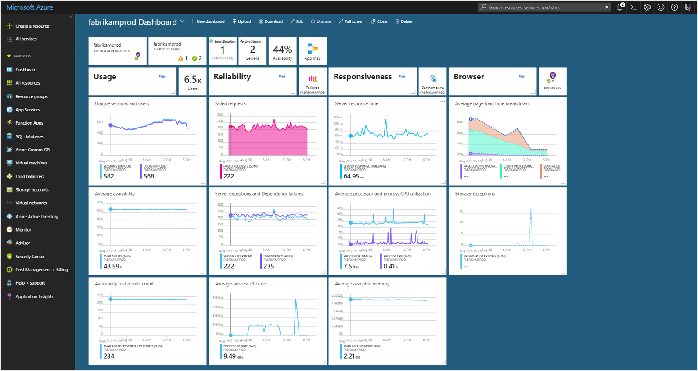

# Azure Fundamentals AZ-900 # 

# Cloud Concepts 

## Basics
- **cloud computing**: delivery of computing services over the internet 
    - common infra (VMs, storage, db, networking, etc... now expanded to include AI, ML...)
    - virtually unlimited resources in cloud provider's data center 
    - compute power & storage are main things offered by external data center - backups, OS updates...
- **describe shared responsibility model** 
    - Cloud provider is ALWAYS responsible for: 
        - physical hosts
        - physical network 
        - physical datacenter 
    - SaaS: AD is a mix, but applications, network, OS, hosts etc all owned by cloud provider 
    - client is ALWAYS responsible for: 
        - info & data stored in the cloud 
        - devices that are allowed to connect to your cloud 
        - accounts & IDs of people/services/devices in cloud 
    - Depending on what you select, these services can change:
        - OS
        - Network controls 
        - applications 
        - ID & AD Infra 
- **public/private/hybrid clouds**
    - private cloud has startup costs, own all data/security/maintenance... 
    - public you can offload these costs 
    - hybrid provides flexibility, but adds complexity 
    - multi-cloud - use multiple cloud environments 
    - Azure Arc: manage cloud envm in Azure or private data center or hybrid config 
    - Azure VMware: allows you to run VMware workloads in Azure with seamless integration & scalability 
- use-cases for each cloud
- **consumption based model** 
    - CapEx vs OpEx 
        - Cloud computing is OpEx because (in theory) your costs will scale up & down with your org's operations 
        - no upfront costs, don't pay for resources when you don't need them or aren't using them... (in theory) no waste or excess capacity 
    - Cloud is a pay-as-you-go 
        - plan and manage your operating costs 
        - run infra more efficiently
        - scale as your business needs to change 
        - rent your infra as you need it, cloud provider will handle the rest 

## Key Concepts 
- **HA & Scalability** 
    - High Availability (HA): ensuring maximum availability - often done through uptime guarantees as part of SLA 
    - Azure SLA: service level agreement - agreement between
        - % of uptime: a service or application's availability - and what happens when uptime breaks (often monetary payment to make amends) 
        - often 99% & up - requires extra cost & often duplicate infra, etc and the more 9s added generally adds more cost 
    - Scalability: ability to adjust resources (ram/cpu, vms...) to meet demand 
        - grants flexibility to be "waste-free" when allocating compute/storage etc...
        - vertical scaling: increasing/decreasing machine resources 
        - horizontal scaling: adding/removing extra machines 
- **Realiability & Predictability** 
    - Realiability: ability of a system to recover from failures & continue to function 
        - Decentralizing allows for a reliable & resilient infra 
    - Predictability: cost/price predictability & performance predictability to confidently move business forward 
        - Performance predictability: autoscaling, load balancing, HA allow you to grow/shrink resources to meet demand and provide consistent exp to users 
        - Cost predictability: track resource usage in RT, forecast spend, optimize spend, etc... 
- **Security & Governance** 
    - Cloud has features to support governance & compliance
        - establishing templates to meet common corp/regulatory standards (can auto-update) 
        - auditing - to flag resources out of compliance & basic mitigation strategies 
    - can meet security needs: can take control of OS, patching and maintenance or defer that to cloud provider 
        - can handle DDoS
- **Manageability** 
    - Cloud Management capabilities: 
        - management of cloud to autoscale 
        - auto deploy based on preconfigured templates 
        - monitor health of resources & auto replace failing ones 
        - receive alerts & metrics 
    - You can take action to manage these through: web portal, CLI, APIs or powershell 

- **Elasticity**: configure cloud-based apps to take advantage of auto-scaling (automated scalability)
- **Agility**: ability to deploy & configure cloud based resources quickly as app reqs change (flexibility to biz req)

## IaaS, PaaS & SaaS ## 
- **IaaS Infrastructure as a Service** 
    - most flexibile and provides user with most amount of control (network, ID/AD, OS, install, config, maintenance, patching, updates, sescurity...)
        - you are literally renting hardware from cloud provider and doing the rest
    - Consumption based (pay as you go) model
    - Makes the most sense for: 
        - Lift n shift migration: Get your applications/services/etc running in the cloud by copy-pasting it there 
        - Testing & development: stand up/shut down environments, builds as needed 
- **PaaS Platform as a Service** 
    - Middle ground - where licensing/patching/updates for OS & Databases are taken care of 
    - Consumption based (pay as you go) model
    - Makes the most sense for: 
        - Development framework: complete a dev environment without all dev infra -- reference HA databases so developer doesn't have to maintain an HA database, just code against one 
        - Analytics/Business Intelligence: tools provided with PaaS to allow orgs to analyze & mine their data, finding insights/patterns for various org uses and business purposes 
- **SaaS Software as a Service**
    - most complete software service - essentially renting a fully developed app (salesforce) 
        - places most resp on cloud owner and least on client 
        - client is basically only responsible for data they put in, the devices that connect & the users they add 
    - Makes the most sense for: email/messaging, business productivity applications, finance & expense tracking 
    - generally paid for through subscription 

 

# Azure Architecture & Services 

## Core Components 
- Physical org of Azure - Datacenters, availability zones & regions 
- Logical/Management structure of azure - resource groups, subscriptions & management groups 
- selection of services 
    - azure web apps
    - azure functions - serverless (FaaS)
    - K8s services 
    - DBs on demand 
    - Cosmos DB - noSQL db ~ dynamodb from amazon? 
- Azure cloud is continously improved and offerings grow, you can build on your terms in your language/framework/globally 
    - allows you to opearte hybrid, public cloud, security from the ground up 
- Over 100 services, clients typically start with VMs, but you can expand to variety of services - AI/ML, etc... 

### Azure Accounts
- **Azure Account**: is a "user" that can be associated with multiple subscriptions
- Mgt Org? 
- **Subscriptions**: (development/marketing/sales...) ?groupings within an account? - are NOT tied to a region
- **Resource Groups**: group resources together - are tied to a region
    - **Resources**: Azure services and objects 

- An organization can have multiple subscriptions
- A subscription can have multiple licenses
- Licenses can be assigned to individual user accounts
- User accounts are stored in an Azure AD tenant (one instance of Azure AD)

- free account includes 12 months access for free to 25 products, a credit to use within 1 month 
- Azure student grants 12 months free for certain software dev tools and a credit to use within 12 months 
- Learn exercises use a temp subscription called a sandbox that will clean up resources after you've completed the exercise 

### Physical Infra - Regions & AZs 
- Physically Azure is a set of datacenters spread across the globe 
    - just like in a corporate datacenter, they are large facilities filled with racks of servers/cpus/storage with dedicated power, cooling and networking infra 
- **Region**: geographical area that contains at least one datacenter(s) that are nearby and networked with a low-latency network 
    - Azure assigns & controls resources within each region to ensure workloads are appropriately balanced 
    - When you deploy a resource - you choose a region to put it in  
        - NOTE: certain services and types of services (storage, VM sizes, etc...) are only available in certain regions, others are globally standard  
- **Availability Zones**: physically separate datacenters within an Azure region 
    - one or more datacenters equipped with indp power, cooling and network... 
    - It's an isolation boundary should 1 zone go down, the other continues working --> Azure works to have 3 AZs in each region for full HA/availability support. 

#### Ensuring Availability with AZs & Regions 
- setting up redundancy originally required duplicate hardware environments, now you can just click through different AZs 
    - you can colocate across AZs or replicate data to backup in a different AZ 
- **Zonal Services**: you pin the resource to a specific zone (VMs, Managed Disks, IP addresses...)
- **Zone-redundant services**: platform auto replicates across zones (zone redundant storage, SQL db...)
- **Non-regional Services**: services always available and are resilient to zone-wide outages & region-wide outages. 
- **Region Pairs**: most azure regions are paired with another region at least 300 miles away for DR purposes 
    - West US paired with East US region to be resilient to a west coast disaster or east coast disaster. 
        - NOTE: data replication across regions is not always automatic and may need to be manually configured 
    - if extensive outage occurs, one region out of every pair is prioritized for restore 
    - updates are rolled out to one region within a pair at a time to minimize downtime/risk 
    - data resides within same geography (to comply with tax/law enforcement rules) 
    - *Region Pairs*: each region is paired with another region within the same geography that allows for DR strategies and replication between the two  
        - allows for Azure-specific updates to go out 1 region at a time 
        - allows for data to reside within geography for tax & law purposes 
- **Sovereign Regions**: Azure instances issolated from main instance often for governmental purposes
    - US DoD Central, US Gov Virginia, US Gov Iowa and others 
    - *Soveriegn regions*: special regions carved out for legal/compliance/govt purposes

### Management Infra - Resources & Resource Groups & Subscriptions and Management Groups
- Mgt Groups --> Subscriptions --> Resource Groups --> Resources 
- **Resource**: the building block of Azure, anything you create, provision & deploy  
- **Resource Groups**: Groupings of resources - any resource must exist within a resource group. Can only be in one Subscription
    - Each resource can only be in one resource group at a time (if you take it out of Resource Group A and put it into B, it is no longer a part of A)
    - Resource Groups cannot be nested 
    - with the above restrictions - resource groups should be designed carefully: a dev environment under 1 entire resource group to be easily provisioned or removed - or a 3 schema compute engine spread across 3 RGs... 
    - Resource Groups Auto-inherit settings/permissions/policies from subscriptions, and resources inherit settings from resource groups. (for current & future resources)
        - Tags do NOT cascade

- **Subscriptions**: a unit of management, billing and scale - just how resource groups organize resources, subscriptions allow you to organize your resource groups and facilitate billing
    - Links to an Azure account which is an ID in Azure AD or directory/domain which azure trusts --> this allows you to provide an authenticated & authorized access to provision & use azure products/services. 
- Azure by default breaks billing & invoices apart by subscriptions
    - resource groups can group costs, but they don't generate a separate invoice
- Subscription Boundaries: configure different billing models and/or different access controls 
    - *Billing boundary*: determines how an Azure account is billed for - can create multiple subscriptions for different billing reqs with different invoices/reports to allow you to organize & manage costs 
    - *Access control boundary*: access-mgt policies applied at subscription level to reflect org structure and billing to different departments or set policies at dept levels 
        - limit marketing to small VMs for example 
    - can have certain quotas assigned to limit usage
    - can have spending limits which you cannot go over, but you can remove the limit (if set)
    - if it expires - you can't create new resources, but you can always access the data stored there 
- Reasons to create separate subscriptions: 
    - Environments - dev/test/prod costs & access control set at subscription level 
    - Org Structures - subscriptions to follow org structure and grant/deny access to org structure 
    - Billing - create subscriptions for billing levels - prod vs dev workloads 

- **Management Groups** : Groupings of subscriptions to efficiently manage access, policies & compliance for subscriptions
    - All subscriptions within a management group auto-inherit conditions applied to management group
    - all subscriptions in mgt group should be associated with same Az AD 
    - allow for enterprise-grade management at scale 
        - hierarchy that applies a policy (limit VM locations to US West Region for PROD, and US East for DR)
        - provide user access to multiple subscriptions (allows for single RBAC to grant multi subscription access - rather than multi-RBAC per user)
    - Capabilities: CAN be nested 
    - Restrictions: a tree structure that goes 6 deep (not including head) and doesn't allow one branch to have 2 parents, max 10k mgt groups under a single directory   

 

## Compute & Networking Services 
### Virtual Machines in Azure
- VMs are a basic unit of IaaS and are abstraction of core, ram, & storage making it very versatile. Use when you need: 
    - total control over OS 
    - ability to run custom software 
    - use custom hosting configs 
- VMs provide flexibility of infra without OS/software updates and maintenance 
    - can create/provision VM in minutes using images
- **VM Scale Sets** 
    - VM scale creates a group of identical, load-balanced VMs 
        - can be configured to auto increase/decrease with demand - or scale based on schedule 
        - great for variable compute, big data, container workloads 
    - MUCH easier than manually setting up *N* number of VMs individually and configuring individually 
- **VM Machine Availability Sets**
    - VMs stagger updates and have varied power/network connectivity preventing loss of VMs during catastrophic event 
    - Can group VMs in 2 ways: 
        - *Update Domain*: VMs that can be rebooted at the same time, can apply updates in a roll-out fashion, and given 30 min to recover before next group begins updates
        - *Fault domain*: groups VMs by common power source & network switch - by default, it will split across 3 fault domains (? is this the same as AZ?) 
    - you only pay for VM instances you create - not using this Availability auto-setup 
- Usages for VMs: 
    - Testing & Development: quick * easy way to create different OS & app configs, easy delete when done 
    - Running apps in the cloud: applications can be started/stopped when needed to limit infra costs 
    - Extending datacenter into the cloud: adding a VNet in Azure and adding VMs to that VNet 
    - During DR - can create VMs in Azure as a DR strategy 
    - Assist with lift & shift strategy into the cloud 
- VM Resources - additional azure objects/resources tied to VM that are necessary for it to function
    - Size of VM (purpose, # of cores, RAM) 
    - Storage (Hard drives, SSD, etc) 
    - Networking (VNet, Public IP, Port config...)
- ?apparently cannot change the AZ of a deployed VM - at least not through the portal? 

### Virtual Desktop 
- A desktop & app virtualization service that runs in the cloud - enables you to use a cloud-hosted version of windows from any location 
    - works across devices, Mac, iOS, Andriod, Linux... OS, and apps/browsers everywhere 
    - centralized RBAC with Azure AD, and can enable multi-factor authc 
    - can separate your data/apps from local hardware (physical laptop) 
- Multi-session Windows 10 or 11: enables concurrent users on a single VM 

### Azure Containers 
- To run multiple apps on a single host machine requires extensive app configs or multiple VMs 
    - can do that more easily with containers
    - less duplication of OS/VM operations 
    - containers virtualize the OS 
    - Portability: containers can be used to ensure consistency across deployments - as VMs between dev/prod can have different configs, etc... 
- VMs have an OS you can connect to and manage - containers don't allow you to config the OS and treat the container as a "unit" 
    - this allows you to build/deploy/test/delete containers rather than an app and its various configs
- Azure container instances - allow you to run through their containers in a PaaS
    - primarily used with microservices architecture with small, independent pieces that can be split off and run as containers & individually scale up/down services as needed

### Azure Functions
- FaaS (serverless) event based, reactive applications 
- all you need is a bit of code or particular process to run when a certain event occurs. 
    - you are only charged for CPU time when function runs 
- Stateless functions are default (restart anew with no memory of the past for every request, and treat them all the same)
- Stateful (Durable Functions)  context is passed through the function to track prior activity 

### App hosting options 
- Beyond VMs & Containers - Azure App Service is a great alternative to hosting apps 
- Can build and host web apps, background jobs, mobile backends and RESTful APIs in programming language of choice without managing infra 
    - all with auto-scaling and HA for Windows/Linux
    - enables automated deployments from Github, azure or other git repos 
- robust hosting option to build and maintain app, while Azure keeps infra running 
- Hosts common apps like: 
    - Web Apps 
        - ASP, .NET, Java, Ruby, Node.js PHP or python
    - API Apps 
    - WebJobs 
        - run a program or script in same context as webapp, etc - scheduled or run by trigger 
    - Mobile Apps 
        - authenticate users, store data, send notifications, execute custom logic 
- App Service handles most of the infra decisions you deal with in hosting web-accessible apps 
    - deployment and management are integrated into platform 
    - endpoints can be secured
    - scalable to handle dynamic demand with built in load balancing and traffic manager to provide HA 

### Virtual Networking 
- Azure virtual networks & subnets enable Azure resources such as VMs webapps & databases to communicate with each other & across the public internet  

- Azure Networks Capabilities: 
    - **Isolation & Segmentation** 
        - can create multiple isolated vnets 
        - you define a private IP address space by using public or private IP address ranges 
        - IP range only exists within the vnet and isn't internet routable. 
        - can divide the IP address space into subnets and allocate part of the defined address space to each named subset 
    - **Internet Comms**
        - you can enable incoming connections from the internet by assigning a public IP address to an Azure resource, or putting it behind a load balancer
    - **Communicate between Azure resources** 
        - can communicate securely between resources, not just your own, but Azure services like AKS, App service, VM scale sets... 
        - service endpoints can enable you to link multiple azure resource to vnets to improve security and provide optimal routing 
    - **Communicate with on-premises resources** 
        - Azure VNets allow you to link on-prem resources to your azure subscription - creating a network that spans local and cloud envm 
        - _Point-to-site VPN_ a computer outside your org, back into your corp network. Client computer begins an encrypted VPN to connect to Azure VNet
        - _Site-to-Site VPN_ link your on-premise VPN device or gateway to Azure VPN gateway in a VNet - devices in Azure can appear as being on local network through an encrypted public connection 
        - _Azure ExpressRoute_ dedicated private connectivity that doesn't travel over internet. - Used for high bandwidth, high security scenarios 
    - **Route Network Traffic** 
        - azure routes traffic between subnets on any connected Vnets, on-prem and the internet 
        - these rules are defined in route tables and can be customized to control how packets are routed between subnets 
        - BGP works with Azure VPN gateways, Azure Route Server or ExpressRoute to propagate on-prem BGP routes to Azure VNet 
    - **Filter network Traffic** 
        - _Network Security Groups_ allow you to filter traffic between subnets by defining inbound/outbound security rules based on IP address, port, protocol, source/destination... 
            - can create an NSG that gets applied to certain types of VMs... 
        - _Network Virtual Appliances_ specialized VMs that are similar to a physical network appliance - run a firewall, provide WAN, etc... 
    - **Connect VNets** 
        - can link VNets through peering, and enables separate VNets to communicate (even across regions)
        - network traffic between peered networks is private & secured - it travels through MSFT network never connecting to public internet 
        - *User Defined Routing (UDR)* allows you to control routing tables between subnets within a VNet or between VNets
- Connecting to on-prem network using a VNet gateway - two types: VPN or ExpressRoute

### Azure VPN 

- a VPN uses an encrypted tunnel within another network 
    - typically deployed to connect 2+ trusted private networks to one another over an untrusted network (typically internet)
    - encrypts traffic during untrusted network to prevent malfeasance & ensure safe/secure sharing of info 
- **VPN Gateway** 
    - One type of VNet Gateway that allows: (A network gateway joins two networks so the devices on one network can communicate with the devices on another network.) 
    - a service that uses a specific type of VNet Gateway to send encrypted traffic between Azure VNet & on-prem location over Public IP 
        - connecting to on-prem datacenters to VNets through a site-to-site connection 
        - connect indv devices to VNets through a point-to-site connection 
        - connect VNets to other VNets through a network-to-network connection 
    - only ONE VPN Gateway for each VNet - can use one gateway to connect to multiple locations which can have their own VPN Gateways 
    - When you deploy a VPN Gateway, you specify the TYPE: Policy or Route, both use pre-shared key as only method of authc
        - *Policy-based VPN Gateways*: specify statically the IP address of packets that should be encrypted through each tunnel 
            - said another way - they evaluate every data packet against those sets of IP addresses to choose the tunnel where that packet is going to be sent through 
        - *Route based VPN Gateways*: IPSec tunnels are modeled as a NIC or Virtual Tunnel Interface - IP routing (either static routes or dynamic routing) decides which one of these tunnel interfaces to use when sending each packet 
            - route-based VPNs are preferred method for on-premises, they are more resilient to topology changes (creation of new subnets)
            - route-based works best for: Connections between VNets, Point-to-site connections, multi-site connections, coexistence with ExpressRoute 
            - seems like this is the *preferred* choice 
    - can set up VNet to VNet within Azure
    - can set up VNet to on-prem through a *site-to-site* or *point-to-site*
- HA scenarios for VPN
    - **Active/Standby**: default configuration 
        - when planned maintenance occurs connections are interrupted and restored within a few seconds, uninterrupted can take as much as 90 seconds 
    - **Active/Active**: Using BGP routing protocol, you can deploy VPN gateways in an active/active 
        - you assign unique public IPs to each, then create separate tunnels from on-prem device to each IP
        - can be extended by deploying additional VPN devices on-prem 
    - **ExpressRoute Failover to VPN Gateway**: If ExpressRoute fails, can configure it to failover to VPN gateway 
        - while expressroute built in with resiliency - there could be an outage that compromises it & can setup VPN gateway as a backup to ensure constant connection to VNet
    - **Zone Redundant Gateways**: can setup VPN Gateways & ExpressRoute gateways in zone-redundant config 
        - ultra extreme resiliency and HA - with physical and logical separation within a region
        - use different resources (Gateway Stock Keeping Units SKUs) & use standard public IP addresses instead of basic Public IP addresses 
            - essentially select the type of VM & bandwidth... it can handle 

### Azure ExpressRoute 
- a different kind of vnet gateway 
- Extend on-prem network to MSFT cloud datacenter with private connection - connection is called "ExpressRoute Circuit" 
- can connect offices, datacenters, etc. Each connection has its own expressroute 
- connectivity can be from any-to-any IP VPN network, a point-to-point Ethernet network, or Virtual cross-connection through a provider 
- these connections are more secure (don't go over internet) and offer more reliability, speed & consistency 
    - DNS queries, certificate revocation list checking and Azure CDN are sent over public internet 
- **Benefits of ExpressRoute** 
    - connectivity to MSFT cloud services across all regions in geo-region 
    - global connectivity using Global Reach 
    - Dynamic routing between network & microsoft via BGP 
    - built in redundancy 
- Can connect to services in ALL regions: 
    - MS Office 365
    - MS Dynamics 365
    - Azure Compute services (VMs)
    - Azure Cloud services (Azure Cosmos DB / Az storage) 
- Global connectivity through ExpressRoute Global reach to exchange data across on-prem sites - a private highway to send data across continents 
- Dynamic routing through BGP to exchange routes between on-prem and resources running in Azure 
- Connectivity Approaches with ExpressRoute 
    - Cloud Exchange colocation: your datacenter/office physically colocated at cloud exchange/ISP - request virtual cross-connect to MSFT cloud 
    - Point-to-Point Ethernet Connection: using a point-to-point connection between your facility and MSFT Azure (data link layer ? laying cable ?)
    - Any-to-Any Connection: Integrate your WAN with Azure by providing connections to multi office/datacenter. Azure integrates with WAN so you can connect between datacenter, branch offices & Azure 
    - Direct from ExpressRoute Sites: connect with global network peering location 

### Azure DNS 
- Hosting service for DNS domains that provide name resolution by using MS Azure infra 
    - can manage your DNS records with Azure using same creds, APIs, tools & billing as other Azure infra 
    - does NOT buy domain names - once purchased, it can be hosted in Azure DNS
- Benefits: reliability & performance, security, ease of use, customizable VNets, alias records 
    - Reliability: Azure DNS are hosted on Azure's global network of DNS name servers with HA and resiliency
    - Performance: Azure uses anycast networking, so DNS query is answered by closest avail DNS server for perf 
    - Security: Azure DNS based on Resource Manager which allows RBAC, activity logs & resource locking (no accidental deletes)
    - Ease of Use: can provide DNS for external services & azure stuff you own, can be managed via CLI and through existing Azure subscription (one-stop-shop)
    - customizable VNets with private domains: can setup custom domains in private VNets, so you don't have to use Azure ones 
    - Alias record sets: can set alias records 

### Public/Private Endpoints 
- **Azure Bastion**: web interface so you can remotely admin Azure VMs using SSH/RDP (think bastion host, or the one you land on to configure the others) 
- **Azure firewall**: stateful firewall service used to protect VNets 
- Extra details from [VNet Service Endpoints](https://learn.microsoft.com/en-us/azure/virtual-network/virtual-network-service-endpoints-overview)
    - VNet service endpoint provides secure/direct connectivity to Az services over an optimized route over Azure backbone network 
    - endpoints are enabled on subnets configured in AZ VNets - can't be used for traffic from on-prem to azure services as they are not reachable from on-prem network 
    - these allow you to connect an azure resource like Azure SQL Database to an azure VNet  (azure storage, azure SQL, cosmos db, key vault, service bus, datalake, app service) so your vnet can now see the az resource
    - A private endpoint is a network interface that uses a private IP address from your virtual network. This network interface connects you privately and securely to a service that's powered by Azure Private Link. By enabling a private endpoint, you're bringing the service into your virtual network.
- Public endpoints are endpoints that receive traffic over the internet - making your network available to attackers 

 

## Storage Services 

### Azure Storage Accounts 
- storage accounts are a pre-defined endpoint that's accessible across azure GLOBALLY that holds your specified storage object
- you select the region you want, then the rest of the details below...
- storage account type determines redundancy, archival, etc... 

|  Storage Account Type     |   Supported Services  | Redundancy Options |  Usage                   |
|-----------|-----------------------|--------------------|--------------------------|
| Standard, general purpose v2 | Blob Storage, Queue Storage, Table storage & Azure files | ALL | Standard storage for blobs, file shares, queues and tables. | 
| Premium Block Blobs       | Blob storage (including data lake) | LRS, ZRS | Premium for block blobs & append blobs - recommended for high Tx or small obj, or low storage latency |
| Premium file shares       | Azure Files       | LRS, ZRS | Premium storage for file shares - recommended for HP apps, or storage account that supports Server Message block and NFS file systems. |
| Premium page blobs        | Page blobs ONLY   | LRS | Premium storage for page blobs only. |

- storage account endpoints
    - must have a unique (in Azure) account name & combo of account name and azure storage endpoint 
    - storage account names must be 3-24 chars in len with lowercase alnum 
    - storage account name must be unique within Azure to enable unique accessible namespaces

| Storage service |	Endpoint |
|-----------------|-----------------------|
| Blob Storage    |	https://<*storage-account-name*>.***blob***.core.windows.net |
| Data Lake Storage Gen2    |	https://<*storage-account-name*>.***dfs***.core.windows.net |
| Azure Files     |	https://<*storage-account-name*>.***file***.core.windows.net |
| Queue Storage   |	https://<*storage-account-name*>.***queue***.core.windows.net |
| Table Storage   |	https://<*storage-account-name*>.***table***.core.windows.net | 
| Static Website (blob) | https://<*storage-account*>.***web***.core.windows.net |

Example blob storage full url: `https://*mystorageaccount*.blob.core.windows.net/*mycontainer*/*myblob*`

### Azure Storage redundancy 
- Azure always stores multiple copiess of data for availability & durability 
- Consider trade-offs between lower costs and HA requirements 
    - how data is replicated in primary region
    - whether data is replicated to second region for DR purposes 
    - whether app requires read access to replicated data in sescond region if primary goes down 
- Types of Redundancy
    - LRS:   Locally Redundant Storage
    - ZRS:   Zone Redundant Storage 
    - GRS:   Geo-Redundant storage
    - RA-GRS:   Read-access Geo-Redundant Storage
    - GZRS:  Geo-Zone Redundant Storage 
    - RA-GZRS:  Read Access Geo-Zone-Redundant Storage

#### Redundancy in Primary Region (LRS, ZRS)
- LRS:   Locally Redundant Storage
    - Replicates data 3x *SYNCHronously* in single data center in primary region's chosen zone 
    - Provides 11 9's durability 
    - lowest cost option - provides protection against server rack & drive failures - but no true DR strategy 
- ZRS:   Zone Redundant Storage 
    - For AZ enabled regions, ZRS replicates Azure storage data *SYNCHronously* across 3 AZs in primary region
    - provides 12 9's durability - basically an HA LRS
    - allows r/w if zone dies, recommended for data replication within a country, or to handle Azure network update downtime or zone DR

#### Redundancy in a secondary region (GRS, RA-GRS, GZRS, RA-GZRS)
- the 'G'*RS - copy data to a secondary region for DR 
- Storage accounts made in one region are AUTOMATICALLY paired to a secondary region that CANNOT be changed. 
    - GRS ~ LRS  and  GZRS ~ ZRS just across 2 regions 
- by default, data in secondary region isn't avail for r/w access until there's a failover to secondary - in short it needs to be "promoted" to primary before it allows r/w 
    - largely due to the fact data is replicated to secondary region *ASYNCHronously* 
    - Interval between most recent writes to primary and last write to secondary is RPO - generally less than 15 min, but no official SLA 
- GRS:   Geo-redundant Storage
    - Does LRS in primary (synch copy 3x), THEN does ASYNCH to secondary then does LRS
    - provides 16 9's durability
- GZRS: Geo-zone redundant Storage
    - Combines geo & ZRS - does ZRS in primary (synch copy 3x across AZs), THEN does ASYNCH to secondary, then does ZRS there 
    - used for maximum consistency, durability, HA, performance and ultimate DR resilience 
    - provides 16 9's durability 
- Read access to data in secondary region - can be set up using RA-GRS or RA-GZRS so secondary can be read from, but it may not match primary due to RPO

### Azure Storage Services  
- General benefits of Azure Storage: 
    - durable & HA - Azure's already got infra & systems & software in place to perform data replication across disks, datacenters & regions 
    - secure - all data written to azure storage account is encrypted (at rest?)
    - scalable - designed to be massively scalable to meet storage & perf needs 
    - managed - azure manages all hardware maintenance, updates and critical issues for you 
    - accessible - access form anywhere over HTTP(S) and with CLI packages that make it easy to manage
- Allows for selection & creation of below types: 
    - Container (Blob storage as it is held in Containers)
    - File Shares 
    - Queues
    - Tables 

- **Blob Storage**: massively scalable obj store for text & binary data - images/docs, archive, video/audio
    - supports big data analytics through data lake storage Gen2 
    - blob storage is unstructured - no restriction on data it can hold AND can manage thousands of simultaneous uploads, data, log files, etc...
    - Best for: images & docs -> browser, storing files for distr access, streaming video & audio, storing data for backup/restore/DR/archival, storing data for analysis 
    - Blob objects can be accessed through their URL using various languages 
    - Azure calls "containers" ~ AWS Bucket
    - **Block Blob Storage Tiers** - To manage costs for data storage, you can set a retention period and frequency of access   
        - Hot: Optimized for storing data that is accessed frequently (website)
        - Cool: Optimized for data that is infrequently accessed and stored for at least 30 days  (short term backups & dr data)
        - Cold: rarely accessed data you want to keep for at least 90 days
        - Archive: data that is rarely accessed and has flexible latency  - kept for min of 180 days 
            - can take hours to pull data from archive and generally done in 2 ways: rehydrate - change access tier to hot/cool OR copy the blob to another container with a hot/cool access tier 
        - NOTE: hot & cool can be set at account level, archive isn't avail at account level 
        - NOTE: hot/cool/archive can be set at blob level - during or after upload 
        - NOTE: Archive offers lowest storage costs, but higher costs to pull data, cool storage is between. The min days is there because you can get charged an early deletion penalty 
- **Azure file share**: managed file shares for sharing data across multiple machines/services (for cloud/on-prem) 
    - Offers Server Message Block (SMB) (accessible by Windows, Linux & macOS) or *NFS* protocol (accessible by Linux & macOS)
    - can be mounted concurrently by cloud or on-prem - can be cached on Windows Servers with Azure File Sync for faster access
    - Key Benefits: 
        - shared access: can replace on-prem file-shares with azure file shares without worrying about compatibility 
        - fully managed: no need to manage OS/hardware, patches, security updates, etc... 
        - scripting and tooling: CLI can create/mount/manage AZFS
        - built for resiliency and durable 
        - familiar programmability: can be accessed through APIs, storage client libraries or azure storage REST API 
- **Azure Disk Storage**: adds disks to VMs (SSDs & HDD) - block level storage volumes 
    - block-level storage volumes managed by azure - virtualized for easy management and durable 
- **Azure Queues**: message queue store for reliable messaging between application components 
    - service for storing large numbers of 64KB messages 
    - can be tied with Azure Functions to take action when a message is received
        - should be able to access from anywhere in the world

### Data Migration to Azure 
- Synch data migration (Azure Migrate) & Asynch Data Migration (Azure Data Box)
- **Azure Migrate** : central hub to manage assessment and migration of on-prem datacenter to Azure
    - unified migration platform to start, run and track migration to Azure 
    - range of tools for assessment & migration for basic discovery & assessment 
        - Azure Migrate: Discovery & Assessment - discover & assess on-prem servers running VMware, Hyper-V and physical servers in prep for migration 
        - Azure Migrate: Server Migration - migrate VMware VMs, Hyper-V VMs, physical and other VMs to public cloud VMs in Azure 
        - Data Migration Assistant - standalone tool to assess SQL server - poinpoints potential problems that could block migration, unsupported features, and new features to transition to 
        - Azure DB Migration service - migrate on-prem db to Azure VMs running SQL Server, Azure  SQL database, or SQL managed instances 
        - Web App Migration assistant - assess on-prem websites for migration to Azure App Service, migrate .NET & PHP web apps to Azure 
        - Azure Data Box - move large amounts of offline data to Azure 
- **Azure Data Box** : physical migration service that helps transfer large amounts of data in a quick, inexpensive and reliable way. 
    - Azure ships you a giant data storage device with 80 TB max capacity, then transported in a robust case and uploaded to datacenter 
    - can be ordered from Azure portal & can be set up and then sent back to Azure. It is tracked end-to-end 
    - best suited for 40+ TB data transfer with limited/no network connectivity and frequency can be one-time, periodic, or bulk 
        - one-time migration for initial migration, moving media library to create online media library, migrating VM farm, SQL server, apps, historical data
        - initial bulk transfer done with data box (seed) then followed by incremental transfers over the network 
        - periodic uploads - periodic boxes sent 
    - once uploaded, disks on databox are wiped in accordance with NIST 800-88r1 standards
    - Scenarios Data Box can be used to export data from Azure: 
        - DR: a copy of data from Azure is restored on an on-prem network, data placed on Databox, and shipped to client 
        - Security req - when you need to export data out of azure due to govt or sec reqm
        - Migrate back to on-prem or another cloud service - when you want to move all the data, use data box 

### Azure File Movement Options 
- Azure has tools to help you move indv files or small file groups 
- **AzCopy** 
    - CLI utility to copy blobs or files to/from storage account 
    - can upload/download or copy files between storage accounts
    - can synch files (one direction synch) it will copy files/blobs from source to destination. Does not synch timestamps or other metadata 
- **Azure Storage Explorer**  
    - standalone desktop app that provides GUI to manage files/blobs in Az storage account 
    - runs on Windows, macOS & Linux - uses AzCopy on the backend to perform uploads to Azure, downloads or movement between accounts 
- **Azure File Sync** 
    - tool that lets you centralize your files in Azure Files and keep flexibility, perf and compatibility of Windows file server 
        - like turning windows file server into a mini-CDN
    - you install Azure file sync on a local windows server, it stays bi-directionally synched with files in Azure 
    - allows you to use any protocol avail to Windows server to access data locally (SMB, NFS & FTPS) 
    - setup as many of these as you like around the world 
    - replace a failed local server by installing Azure file synch on a new server in the same datacenter 
    - configure cloud tiering so most frequently accessed files are replicated locally, while others are kept in cloud 

## Access Controls, Identiy & Security 

### Azure Directory Services (Azure AD) 
- directory service that allows you to sign in and access MSFT cloud apps & cloud apps you develop 
- can also maintain on-prem AD 
    - AD running on Windows Server provides ID & Access Mgt service that's managed by your org 
- Azure AD is MSFT cloud-based ID & Access Mgt service - name change to Azure Entra?
    - you control ID accounts, but MSFT ensures service is available globally 
    - has additional featurs normal on-prem AD doesn't have (monitoring sign in attempts from unexpected locations, devices, etc...)

- Azure AD can be used by: 
    - IT Admins - for controlling access to apps & resources based on biz req 
    - App Devs - providing standards based approach for adding functionatliy to apps they build - SSO to an app, or enabling to work with existing creds... 
    - Users - can manage their IDs & take maintenance actions (password reset, etc...)
    - Online service subscribers - MSFT 365, MSFT Office 365, Azure, etc can use Azure AD to authc 
- Azure AD provides: 
    - *Authc*: verifying ID to access apps & resources AND self-service password reset, MFA, banned passwds & smart lockout services 
    - *SSO*: enables you to remember only 1 user/pass for multiple apps, can simplify security model and enable easier management of user on/off boarding 
    - *app mgt*: manage your cloud and on-prem apps using Azure AD - app proxy, SaaS apps, my apps portal & SSO provide better user exp 
    - *device mgt*: Az AD can register devices to be managed through MSFT Intune - or device-based conditional access policies (only allow access from valid device) 

- What do you do with existing on-prem AD? 
    - If you have a separate Azure AD and on-prem AD, they need to run indp with 2 identity sets 
    - you can connect your AD with Azure AD enabling consistent ID set --> Azure AD Connect 
    - **Azure AD Connect** *bi-directional synchs* user IDs btw on-prem AD & Az AD for authc, MFA, SSO... 

- **Azure AD DS (Domain Services)**
    - a service that provides managed domain services: domain join, group policy, LDAP, & Kerberos/NTLM authc  
        - as with other AZ services, no need to maintain infra or deploy/manage/patch domain controllers in the cloud 
    - can run legacy apps in cloud that can use modern authc methods, or you don't want to do directory lookups that hit on-prem all the time 
    - Azure AD DS integrates with existing Azure AD tenant - users can sign into services & apps connected to managed domain using existing creds 
        - can also use existing groups & user accounts to secure access to resources 
    - when you create an Azure AD DS - you define a unique namespace AKA the domain name 
        - then two windows server domain controllers (a replica set) are then deployed into your selected Azure region
        - no need to manage, configure/update the DCs, includes backups & encryption at rest 
    - Managed domain is configured to perform a *one-way synch* from Azure AD --> Azure AD DS (see below on theh left) 
        - you can create resources directly in managed domain, but they aren't synched back 
        - can be chained with on-prem AD --> Azure AD connect --> Azure AD --> Azure AD DS (managed service) {opposite direction from diagram below}

 

### Azure Authc Methods (password, SSO, MFA, passwordless)
- authentication Authc is the process of establishing the identity of a person, service or device. 
- It requires the person/service/device to provide some type of credential to prove who they are (like showing ID) 
    - It doesn't mean you are ticketed (authorized), but simply that you are who you say you are 
- **SSO** : enables a user to sign in one time and use that credential to access multiple resources & apps across the network 
    - *For SSO to work, those resources & apps MUST trust the initial authenticator*
    - This is beneficial to simplify passwords used across apps & individual authc (user-id/passwd) setup across all of them, let alone management for on/off boarding
    - SSO allows users to only know one ID & password, which simplifies security model and makes it easy for centralized access management. 
- **MFA** : process of prompting a user for an extra form (or factor) of ID during sign-in 
    - this is a code text sent to phone, or an MFA app, etc... So that it increases chances it is really "you"
    - Authentication is based on these categories: 
        - something the user knows (password, challenge question...)
        - something the user has (ID card, specific mobile phone...)
        - something the user is (fingerprint or bioscan) 
    - Azure AD MFA: a msft service that provides MFA - such as phone call or mobile app notification 
- **Passwordless** : password is replaced with other items
    - requires pre-setup on device like a specific laptop or computer, and it needs to be registered with Azure so it is "trusted" 
    - Once setup, you can provide something (a pin or finger print) and get authenticated without using a password 
    - Windows Hello for Business : best for info workers that have a designated PC - can use biometric & PIN creds 
        - these can be setup with PKI & SSO for passwordless access
    - MSFT Authenticator App : can be setup for MFA or to be used as passwordless option 
        - sign into platform/browser, match number to authc app, and facial recognition and now you have access!
    - FIDO2 security keys : Fast IDentity Online Alliance helps promote open auth standards WebAuthn is the latest
        - FIDO2 security keys are unphishable stds based passwordless authc by using a security or platform key built into a device 
        - users register and then select this key at sign in. With hardware handling authc, very little chance password is exposed. 
        - typically USB, but could be bluetooth/NFC... 
     
### Azure External IDs 
- A person/device/service that's outside of your org
- sometimes your partners, clients, vendors, distributors, suppliers, etc need to interact with your AZ resources and you need to authc & auth them
- External users can "bring their own identities" - use a corporate or govt issued digital ID (Facebook, Google...) 

- **B2B Collaboration** - collaborate with external users by letting them use their preferred ID to sign-in to your msft apps or other enterprise apps
    - generally represented as "guest users" in you directory 
- **B2B Direct Connect** - est a mutual 2-way trust with another Azure AD org for seamless collab 
    - supports teams shared channels, allow users to access your resources within their home instances of teams 
    - users aren't represented in your directory, but are visible from Teams shared channel and can be monitored 
- **Azure AD B2C** - publish SaaS apps or custom dev apps to consumers/customers while using this service for ID & Access Mgt 

- Can use combo of the above, can use Azure AD B2B to invite users from a different AD
    - then set up guest users with appropriate access, and have an elevated guest user certify other guest users prior to access... 

 

### Azure Conditional Access  
- a tool that AZ AD uses to allow/deny access to resources based on ID signals 
- this is pre-authc to filter out valid IDs that are requesting the wrong things or from the wrong places
    - signals being: who the user is, their assigned privileges/groups/roles, where the user is and what device the user is requesting from. 
- allows for more granular MFA - if user is at known location, no MFA. If unexpected, MFA 
- simple business logic based on user, location, device and requested resource and deciding to allow access/deny/restrict/MFA... 
    - I.E. a high risk location may be blocked entirely 
- Usecases: 
    - MFA that's dependent on requester role, location, network (MFA for admins but not users)
    - Restrict access through approved client apps (only outlook can access email) 
    - Require access to app from managed devices (only company laptop accesses corp website)
    - Block access from untrusted sources

### Azure RBAC 
- Principle of Least Privilege: Only grant access up to level needed to complete a task 
    - can fulfill that with RBAC by defining role templates that can get assigned to users that grant specific levels of access within Mgt Groups, Subscriptions, Resource Groups & specific resources 
    - Management Group (collection of multiple subscriptions) --> subscription --> resource group --> single resource 
    - parent scope is auto-inherited by all child objects 
    - RBACs are assigned to a "scope" : indv resource or group of resources
- *RBAC is enforced on any action initiated against an az resource that passes through AZ Resource Manager* 
    - AZ Resource manager is a service that provides a way to organize & secure your cloud resources 
    - AZ Resource manager is Accessible through portal, shell, powershell & cli 
    - NOTE: Does NOT enforce permissions at application (within app) or data level 
    - RBAC uses an allow model (additive) - it allows you to perform actions within scope of those combined roles
        - meaning it will grant you the TOTAL of allowable actions defined by your roles assigned 
        - I.E. contributor role at subscription, but reader on resource group -> still get ability to create resources within that resource group. 

### Zero Trust Model 
- a security model that assumes worst case scenario and protects resources with that expectation AKA verify everything
    - Verify each request as though it originated from an uncontrolled network 
    - requires you to do anything/everything in Azure with right creds & keys 
- Guiding principles of Zero Trust
    - Verify Explicitly: Always authc & auth with all avail data points 
    - Use least privilege access: limit user access with just in time & just enough access - risk adaptive policies and data protection 
    - assume breach: mimimize blast radius and segment access - verify E2E encryption, use analytics to drive visibility, threat detection...
- Generally, in a corp network, everyone is assumed trusted within the walled garden 
- Now that the hardware & network are "rented" you need to get everyone to authc all the time. 

 

### Defense-in-Depth 
- objective: protect info/data & prevent it from being stolen by unauth users by slowing them down layer by layer

**7 Layers of Defense** 
1. Physical Security - protect computing hardware in datacenter 
    - building access, physically securing building, and physically safeguard hardware
2. ID & Access Mgt - controls access to infra & change control 
    - Ensuring IDs are secure, access only granted to what's needed, and all sign-ins & changes are logged 
    - control access to infra & change control, use SSO & MFA, audit events & changes 
3. Perimeter Layer - users DDoS protection to filter requests before DDoS occurs
    - Stops network based attacks (DDoS) & Perimeter firewalls to ID & alert on malicious attacks 
4. Network layer - limits comms between resources through segmentation & access controls 
    - Limiting network connectivity between your resources to reduce contagion 
    - deny by default, restrict inbound internet access & limit outbound access 
    - secure connectivty to on-prem network 
5. Compute layer - secures access to VMs & stay up to date with patching & implement endpoint protection
    - malware, unpatched and improperly secured systems leave envm open
6. Application layer - ensures apps are secure and free of vulnerabilities 
    - integrate security in App Dev Lifecycle - free of vulnerabilities 
    - store sensitive app secrets in secure medium 
    - make security design a req for all app dev 
7. Data layer - controls access to biz & customer data you need to protect 
    - those who store & control data are resp for it. So secure it in 
        - databases
        - on disk (at rest) in VM 
        - stored in SaaS apps 
        - managed through cloud storage 

### MSFT Defender for Cloud 
- Azure native Monitoring tool for security posture mgt & threat protection 
    - monitors cloud, on-prem, hybrid & multi-cloud envm to provide guidance and notifications 
    - does this automatically for Azure machines
- Many Azure services are monitored & protected without needing MSFT Defender for cloud deployed 
    - need a separate deployment for Azure to monitor your on-prem or multi-cloud setup 
    - can auto-deploy a log analytics agent to gather security related data 
        - uses Azure Arc to extend to non Azure machines
        - Cloud security posture management (CSPM) features 
- **Azure-Native Protections** 
    - Azure PaaS services: threat detection for Azure App Service, Azure SQL, Azure Storage acct, and other data services. 
        - can perform anomaly detection on azure activity logs using MSFT Defender for Cloud Apps
    - Azure Data Services: can auto-classify data in Azure SQL & get assessments for potential vulnerabilities across SQL & Storages services with mitigation recommendations
    - Networks: Defender for cloud limits exposure to brute force attacks 
        - reduce access to VM ports, and just in time VM access, can harden network by preventing unnecessary access 
        - set secure access policies on selected ports, for select authorized users, allowable IP ranges, and for certain times 
- Hybrid cloud deployments - can protect your on-prem stuff. Deploy Azure Arc & enable Defender for Cloud's enhanced features 
- Multi Cloud - can support AWS & GCP 
    - CSPM extend to AWS resources and assess for compliance to AWS standards
    - Container defense can extend to Amazon EKS Linux clusters 
    - Servers defense brings threat detection to windows/linux EC2 instances 
- **Assess, Secure & Defend** 
    - *Continuously Assess*: know your security posture, ID & track vulnerabilities 
        - monitoring, providing vulnerability assessments and vulnerability scans for compute, data & infra that show results in defender for cloud
    - *Secure*: harden resources and services within Az Security Benchmarks 
        - security from your head to toes - security policies can be set to run on mgt, groups, subscriptions and tenants
        - will constantly monitor for new resources and assess if they are configured within IT policy spec 
            - issues are flagged and prioritized with recommendations from Az Security Benchmark: MSFT & Az specific benchmark for security & compliance best practices based on a variety of frameworks 
            - provides a high level aggregated dashboard 
    - *Defend*: detect & resolve threats to resources, workloads & services 
        - monitors for security breaches 
        - security alerts: generated after threat identified, describes details of affected resources, suggested remediation steps, and provides an option to trigger logic app in response 
            - can even do analysis on a cyber kill-chain to figure out story of attack campaign, where it started and impact on resources 
        - advanced threat protection: can secure the management ports of your VMs with just-in-time access & adaptive app controls to create allowlists for what apps should & shouldn't run on your machine

# Azure Management & Governance 

## Cost Management in Azure 

### Factors that affect cost in Az
- TCO calculator can do analysis that is sliced & diced by mgt orgs
- pricing calculator to select services that fit your budget & add up costs, and adjust (cost estimator)
- azure advisor: can make recommendations and optimize spend 

- moving to the client converts IT CapEx to OpEx through renting hardware and services 
- Cost in the cloud depends on a variety of factors including: 
- **Resource Type**: 
    - Types of resources, settings for the resource and the region
    - Az creates metered instances for the resource and track usage record that generates your bill 
    - I.E. For Blob Storage it depends on performance tier, access, redundancy settings & region
    - I.E. For a VM - it involves licenses for the OS, # & type of :cpus, memory, storage, NIC...
- **Consumption**: 
    - pay as you go model ~ to a utility 
    - you get discounts on reserved resources (databases, compute, storage)
        - you commit to using and paying a certain amount for a certain period of time -> discount 
        - still have flexibility to scale up if need be 
- **Maintenance** 
    - scaling up & down within resource groups allows you to track costs 
- **Geography** 
    - when you provision resources they are tied to a region, and cost, labor, taxes & fees vary by region as well as network costs for data transfers
- **Network Traffic** 
    - billing zones are a factor in determining cost
    - bandwidth for data moving in & out of azure data centers 
    - in general it's based on certain types of data moving in, outbound data transfers & the geo zone (group of az regions) you are in for ingress, egress & transfer
    - no cost within AZ, cost between AZs, no cost to bring data in, but cost to push data out of a region (either to another AZ region or download to internet, etc...)
    - [REVIEW IN DETAIL](https://azure.microsoft.com/en-us/pricing/details/bandwidth/)
- **Subscription Type** 
    - subscriptions include usage allowances which can affect costs (certain products are free for some period of time...)
- **Azure Marketplace** 
    - Az Marketplace you can purchase Az solutions from 3rd party vendors 
    - typically a pre-configured PaaS or SaaS
    - you pay for Az markup & 3rd party vendor cost 
    - like apple app store - these are all vetted & compliant with Az policies & stds, certifications vary by type of service 

### Compare TCO & Pricing calculator 
- both are free & accessible on the internet
- **Pricing Calculator**: designed to give an estimated cost of provisioning resources in Az (forecast Az cost & spend)
    - these are an estimate, not actuals... and all sorts of stuff 
- **TCO Calculator**: sales calculator to compare costs of on-prem infra compared to Az cloud infra and ensure you are incurring minimal costs
    - you enter your ON-PREM servers, db, storage, network traffic and cost it out 
    - add in assumptions like power & IT labor costs and provides difference of running in Azure 

- Minimizing cost on azure: 
    - Understand estimated costs prior to deployment - use Pricing/TCO calculator and add only needed resources 
    - Azure Advisor: watch their recommendations for cost so you can take advantage of savings 
    - Spending limits: use spending limits to restrict spending through credit limits, or ending the free tier
        - can look into quotas to limit resources per subscription 
    - Use reservations to pre-pay for LT resources
    - Choose low-cost locations & regions 
    - use offers from Azure 
    - use MSFT Cost Mgt & Billing tool to view azure bill by account, subscriptions... 
        - has reports, can integrate with tags, budgets, alerting & recommendations for idle resources 
    - use tags to ID cost owners 
    - resize underutilized VMs 
    - deallocate VMs during off hours: turn off VM, but preserve disks in azure (like turning off your computer)
        - great for dev/test envm 
    - delete unused resources, cleaning up after a PoC... 
    - migrate from IaaS to PaaS
    - save on licensing or cost effective OS, can even use azure hybrid benefit

### Describe Azure Cost Mgt Tool 
- Az is global cloud provider offering global resource provision, can set limits or things to control cost policies
- Cost Mgt is a reporting & mgt tool that provides tool to quickly check on Az resource costs, create alerts based on resource spend and budgets to automate mgt of resources 
- **Cost Alerting**: create cost alerts in a central location to check on Budget, Credit or Department spending quota alerts. 
    - Budget vs Credit Alerts vs Dept quota
        - budget alerts notify you when spending, reaches or exceeds the defined amount in your alert
            - defined by cost or consumption usage & generated whenever budget conditions are met, alert is sent to email list 
        - credit alerts notify you when az credit commitments are consumed - generated automatically at 90 & 100%
        - department spending reaches a fixed threshold of the quota, which is configured in the Enterprise Agreement portal 
- **Budgets**: spending limit for az
    - can be set at subscription, resource group, service type or other criteria 
    - when you set this, you also set budget alerts which show up in cost alerts area & send email notification 
        - can setup advanced actions that suspend activities or modifies resources 

 

### Purpose of Tags
- stay organized by creating arbitrary tags and managing them yourself! 
- Can tag metadata such as: 
    - Resource mgt: specific workloads, environments, biz units & owners 
    - cost mgt & optimization: group resources to report on costs, allocate cost centers, track budgets & forecast (cloud accounting, ROI, cost tracking, budgets, alerts, recurring spend, post implementation optimizations, cost optimization...)
    - ops mgt: group resources according to their criticality to biz ops & sla uptime reqs - can be done without changing location of resources or subscription 
    - security level: group by security level 
    - govn & compliance: group by ISO 27001 or other enforcement options 
    - automation: flag for automation or auto-tagging
    - workload optimization & automation: visualize resources in a complex deployment - with app name or workload 
- how do I manage resource tags? 
    - can be added, modified, deleted through CLI, powershell, resource mgr templates, REST or portal 
    - can use az policy to enforce tagging rules & conventions - (apply prior to creation...)
    - *NOTE:* resources do not inherit tags from subscriptions and resource groups - meaning you are allowed disparity that can adjust/change as you define 
- Design considerations when coming up with tags: 
    - naming conventions & taxonomy/schema based on baseline operations/biz requirements 
    - functional: workload, envm, etc 
    - classification: data classification, criticality... 
    - accounting: tags to keep track of costs by project, region, department... 
    - purpose: business process, revenue stream... 

## Features & Tools for Govn & Compliance 

[Decent summary of things that keep your cloud organized](https://www.microsoft.com/en-us/videoplayer/embed/RWyvOc?postJsllMsg=true)

### Microsoft Purview 
- family of data govn, risk and compliance solutions (combining Azure Purview & MSFT 365 Compliance)
- organizes, protects & manages entire data estate - central data registry
    - gain visibility into data across org (scan data and auto-classify)
    - enable access to data, security & risk solutions 
    - safeguard and manage sensitive data across clouds, apps & endpoints 
    - manage end-to-end data risks & reg compliance 
    - empower org to govern in new ways 
- **Risk & Compliance**: protect sensitive data in msft teams, sharepoint, onedrive, exchange, ID data risks and manage compliance... 
- **Unified Data governance**: manage data services across on-prem, cloud and SaaS 
    - cover azure storage, Power BI, ddatabases, file services etc.. 
    - create an up-to-date map of data estate that includes data classification and end-to=end lineage 
    - ID sesnsitive data and where it is stored 
    - create & manage secure envm for data consumers to find data 
    - generate insights on how data is stored/used 
- **Components**: 
    - data map: automate data discovery by providing scanning & classification for assets across data
        - foundation for purview and data discovery & govn
        - PaaS captures metadata about enterprise data in analytics/ops systems  
    - Data catalog: enables data discovery by finding data sources by searching data assets (go through storage accounts...) can classify and ID/tag these
    - Data sharing: shares data within/between orgs/partners/customers
    - data estate insights: accesses data estate health through a c-suite dashboard 
    - Data policy: governs access to data 

 

### Purpose of Azure Blueprints 
- how do you manage configurations of features at scale & enforce settings & policies in new subscriptions - with az Blueprint of course!
- *basically a template for az policies* - can be used for infra as code by auto-deploy policies
- std cloud subscription or envm deployments - rather than configure an az policy for each subscription, you can setup an az blueprint for repeatable settings & policies applied by default for subscriptions 
- Blueprint structure
    - **Artifacts** : each component in a blueprint 
        - some artifacts can have no parameters (deploy threat detection on sql servers policy - no additional config)
        - in general, artifacts contain 1+ parameters you can configure (allowed locations, 1 or more)
        - parameter value can be defaulted in blueprint, or allow a selection of values within a particular scope... 
        - artifacts include: role assignments, policy assignments, az resource mgr templates, resource groups 
- blueprints are versionable, and so you can keep track of which deployment used which config set 
- the relationship between blueprint definition & what was deployed is preserved - so you can always tie the resource created with the blueprint assigned for audit purposes

### Azure Policy 
- az policy is a service in az that enables you to create, assign & manage policies that control/audit your resources 
    - enforce different rules across resource configs so that those configs stay compliant with corporate stds 
- can define indv policies & groups of policies (initiatives) 
    - az will assess resources & flag ones that aren't compliant - can also prevent non-compliant resources from being created by setting policy reqs at resource creation
    - can be set at each level - enabling you to set policies on a specific resource, resource group, subscription, etc... 
    - *az policies are inherited* and cascade down the az subscription -> RG -> resource
- have built-in policies & initiative definitions for storage, network, compute, security & monitoring 
    - I.E. policy for VM size limit, this is in place when you create a new vm or resize it 
        - assessments are run on ALL VMs (created prior to and after policy) and flagged as appropriate 
- some policies can remediate non-compliant resources & configs (a resource group should all be tagged with appname="special" - az will auto-apply that tag if missing) 
    - can also apply exceptions to particular policies so they do not continually flag as non-compliant 
- integrates with Az DevOps for CI/CD pipelines and pre/post deployment activities 
- policy initiative: a grouping of related policies for tracking of a larger goal 
    - Enable monitoring policy involves: monitor unencrypted SQL db, monitor OS vulnerabilities, monitor missing endpoint protection... 

### Resource Locks 
- Resource lock prevents resources from being accidentally deleted or changed 
    - prevent accidental deletion/changes (even if you have right privileges) - they are applied REGARDLESS of RBAC permissions
- Can be applied to subscription, RG or resource and this setting is inherited down the chain 
- 2 types of resource locks:S
    - **Delete Resource Lock** : authorized users can read & modify a resource but can't delete it 
    - **ReadOnly Resource Lock**: authorized users can read a resource but can't delete or update the resource - essentially enforcing a full readonly lock
- can be managed through az portal, powershell, CLI or resource manager template 
    - there is a tab in the side panel for Locks 
- To modify these resources - you must first manually unlock the resource, THEN apply your changes 

### Service Trust Portal 
- provides access to various content, tools & other resources about MSFT security, privacy & compliance practices 
- contains details on implementation of controls & processes that protect cloud services & customer data therein 
- the main menu has several categories: 
    - Service Trust Portal: quick access hyperlink to the home page 
    - My Library: can pin/favorite items for quick access, and get updates when those docs are updated 
    - all docs: landing zone for docs in service trust portal   
- *these docs are avail for 12 months after publishing or until a new version is released*

## Managing & Deploying Azure Resources 

### Azure Portal, Shell, CLI, & Powershell 
- **Azure Portal** : web based unified console browser GUI to view services/resources, create new, configure them & view reports
    - can build, manage & monitor everything from simple webapps to complex cloud deployments 
    - create custom dashboards for organized view of resources 
    - configure accessibility options for optimal exp 
    - is resilient, and very HA, exists in every az datacenter... 
- **az cloud shell** 
    - browser based shell tool that you can create, configure & manage az resources using a powershell or CLI (bash)
    - as it is browser based, no local install/config req 
    - authenticated into your az creds, so already knows who you are and your perms 
- **az power shell** 
    - shell which users can run commands called command-lets (cmdlets) - these call az REST API to perform mgt tasks in az 
    - can run simple/complex actions to setup, teardown, or maintain single or groups of resources 
    - deploy infra from imperative code, can create scripts that auto perform these tasks
    - can be [installed on MacOS, Linux & windows](https://learn.microsoft.com/en-us/powershell/azure/install-azps-macos?view=azps-10.2.0)
- **az cli**
    - bash interface instead of powershell, with different syntax 

### Azure Arc
- az cloud extension that allows compliance & monitoring into hybrid/multi-cloud configs 
- simplifies govn & mgt by delivering consistent/centralized mgt platform 
    - manage entire envm by projecting existing non-azure resources into Azure Resource Mgr 
    - manage multi-cloud & hybrid VMs, K8s clusters & dbs (SQL Server), Azure data services as if they were running in az 
    - user familiar az services & mgt capabilities regardless of where they live 
    - continue traditional ITOps, and introduce DevOps to support new cloud/native patterns in envm 
    - configure custom locations like abstraction layer on top of az arc k8s clusters
- can manage servers, k8s clusters, az data services, sql server & vm machines 

### Azure Resource Manager (ARM) & ARM templates 
- **ARM Azure Resource Manager** : deployment & mgt service for az - providing a mgt layer that enables you to create, update, delete resources in az account 
    - anytime you do anything with a resource, ARM is involved 
    - ARM receives requests for resources creation/update/delete, it authc & auth the request, then sends it to the az service which handles the action 
    - allows for consistent results & capabilities because all handled through same API 
    - This what the API's from portal or CLI talk to
- Benefits: 
    - manage infra through declarative templates rather than scripts (JSON file) 
    - deploy, manage & monitor resources for solution as a group, rather than indv 
    - redploy through SDLC and ensure consistency 
    - define dependencies btw resources so they are deployed in correct order 
    - apply access controls to services through RBAC 
    - apply tags to resources & organize them all 
    - clarify biling by aggregating costs by subscription/RG or tag 
- use resource groups & tags to organize stuff 
    - use policies to ensure tagging is consistent... 
    - RBAC provides auth security 
    - resource locks 
- **ARM Template** - Infra as code through ARM templates 
    - you can describe resources you want in declarative JSON
        - it is syntactically verified, then run 
    - ensures resources are created according to spec, will deploy them in parallel... and az does the rest 
    - Declarative syntax: create & deploy entire az infra declaratively 
    - repeatable results for consistency across multiple envm
    - orchestration: no need to organize dependencies or specify parallel creation, az does that for you 
    - modular files can break templates into smaller reusable components and then link together at deployment time 
        - can create a VM stack script and plug that into an envm creation template 
    - extensibility, can add bash scripts to templates so you can do end-to-end deployment in single template 

## Monitoring Tools in Azure 

### Azure Advisor 
- evaluates az resources & makes recs to improve reliability, security, performance, and reduce costs. 
    - helps you save time on cloud optimization 
- can setup notifications to alert when new recs arrive 
    - Reliability : improve continuity of biz apps 
    - security: detect threats & vulnerabilities 
    - performance: improve speed of apps
    - operational excellence: achieve process & workflow efficciency/ deployment best practices, etc
    - cost: optimize & reduce az spend 

 

 

### Azure Service Health 
- allows you to check status of az infra & indv resources - uses 3 underlying components
- **az status**: broad picture of az status globally - informs of service outages and overall health of az cloud, AZs & regions... 
    - refreshes [2,5,10,30] min with 4 indicators (Good, Info, Warnings, Critical [error] )
    - public info 

 

- **service health**: personalized view of az services & regions, custom alerts, sharable docs about issue details, support during incidents
    - Azure's way of allowing you to *subscribe* to reports & notifications of azure service issues 
    - health advisories: problems that notify you of avoid service retirements, service interruptions and breaking changes. 
    - focuses on ones you are using, looking at comms, maintenance activities and other advisories that might affect you and your stuff 
    - not restricted to a particular subscription, you can choose which subscriptions, regions and services you want to track health info on
    - you'll get info on outages, planned maintenance, health and security advisories 
    - custom views, filter by subscription, region & services 
    - with issue name, subscription, service & region, start time, summary/issue updates, root cause analysis & downloadable PDF reports 

 

- **resource health**: tailored view of az resources - health of indv cloud resources like a VM instance 
    - can be paired with az monitor to notify you of availability changes to resources 
    - tracks min-by-min checks across resources 
    - I.E. VM gets checked for: is server serving VM running, has OS booting completed, ongoing maintenance, host hardware health issues
    

 

- by using az status, service health & resource health ==> az service health provides complete view of az envm from global az cloud status down to resources you own 
    - historical alerts are stored for later review and analysis 
    - provides links to support if you are impacted 

### Azure Monitor & components: Log Analytics, Monitor Alerts & App Insights

 

- **Azure Monitor**
    - platform for collecting data on resources, analyzing that data, visualizing and can perform some actions 
        - Can trigger autoscaling for example 
    - can monitor az resources, on-prem & even certain [multi-cloud resources using Azure Arc](https://learn.microsoft.com/en-us/azure/cloud-adoption-framework/scenarios/hybrid/arc-enabled-servers/eslz-management-and-monitoring-arc-server)
    - below left is a list of sources of logging & metric data that can be collected at various OSI layers (OS, network and app metrics...)
    - below center is logging & metric data stored in central repo 
    - below right is the RT / historical perf across each layer of the architecture, can aggregate or drill down and create views for different audiences using PowerBI & ?Kusto? queries
    - can use all the data to react to critical events in RT - can deliver alerts, use thresholds to trigger auto-scaling... 
    - has 3 components: log analytics, monitor alerts & app insights
- **Azure Log Analytics** 
    - tool in az portal where you write & run log queries on data gatherd by az monitor 
    - supports simple, comoplex queries and data analysis 
    - can sort, filter and analyze records... can do statistical analysis, visualize in a chart for trends... 
- **Azure Monitor Alerts** 
    - automated way to stay informed when az monitor detects a threshold being crossed 
    - you setup alert conditions, notification actions and then alerts notifies appropriate group when triggered (can set a severity)
        - can sometimes attempt a corrective action 
    - alerts can be set up to monitor logs & trigger based on certain log events, or monitor metrics and trigger when certain metrics are crossed 
        - scope/resources + signal (cpu util) + condition (>80%)  ==> alert creation

- **Application Insights** 
    - monitors & tracks your webapps metrics & health in az, on-prem or across AWS/GCP cloud 
    - you install an SDK in your app - or use app insights agent 
    - you can review how app is performing, or review past data during an incident
    - tracks live metrics: request rates, response times & failure rates 
        - dependency rates, response times & failure rates to show whether external services are slow 
        - page views & load perf reported by user browsesrs 
        - AJAX calls from web pages, rates/resptime & failure
        - user & session counts 
        - perf counters from VM and basic OS/mem & network stats 
    - can even configure to do a periodic test request to track availability

> Application Insights Dashboard 

