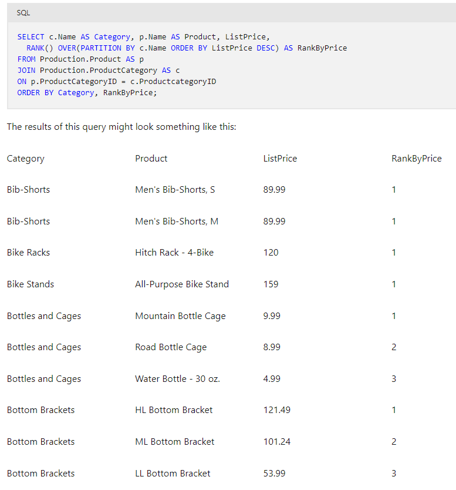
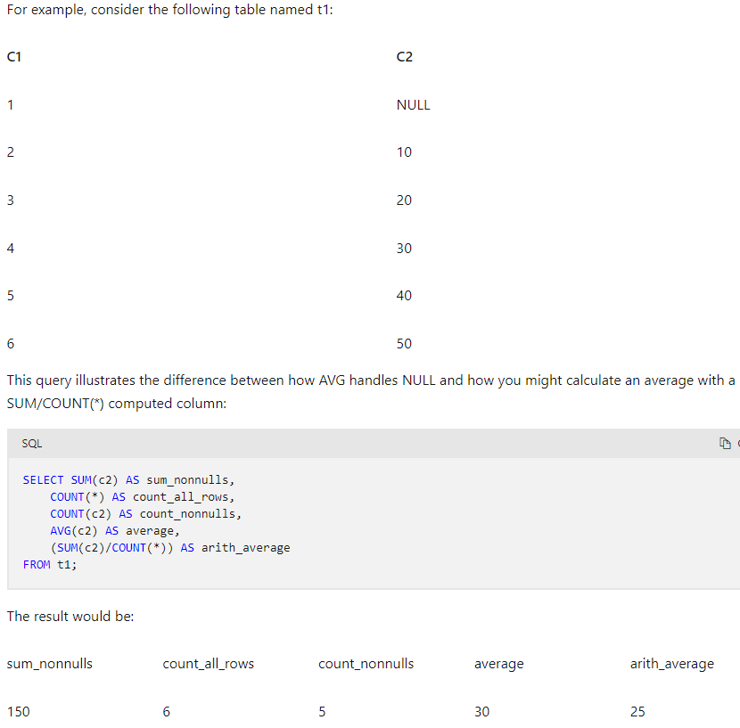

# DP-203 Azure Data Engineering


# [Intro to DEngr on Az](https://learn.microsoft.com/en-us/training/paths/get-started-data-engineering/)

## Concepts

- DEngr integrate, transform & consolidate data from various structured/unstructured data systems into systems suitable for analytics
- ensure data pipelines & stores are HiPerf, efficient, organized, & reliable under biz requirements and org constraints
- **Types of Data**:
  - structured: tables, from RDBMS, or csv where rows/cols are consistent throughout dataset
  - semi-struct: JSON, from NoSQL servers, etc the schema is not strict and can vary
  - unstruct: pictures - typically binary stored files
- **Data Operations**:
  - *Data Integration*: est links between ops & analytical services & data sources to enable secure, reliable access to data
  - *Data Transformation*: transform using ELT|ETL processes to adjust to fit use-cases or storage reqs
  - *Data Consolidation*: process of combining data that has been extracted from multiple data sources into a consistent structure - generally to support analytics|reporting
- **Common Languages**: SQL, Python, PySpark, Scala, R, Java, .NET...

- **Operational vs Analytical Data**:
  - ops data is typically Tx data generated & stored by apps or LOB services typically in a RDBMS
  - analytics data is data optimized for analysis/reporting typically in DW
  - DEngr design, implement & manage solutions to integrate from these sources/systems etc into analytics store so that others can perform analysis
- **Streaming Data**:
  - perpetual source of data that generate data in RT often based on events (IoT & Social Media)
  - DEngr implement solutions to capture, ingest, query and store this data
- **Data Pipelines**:
  - orchestrate activities that transfer & transform data - primary way to organize, manipulate & schedule ETL|ELT activities
- **Data Lakes**:
  - storage repo that can hold large amounts of data (TB or PB) in raw/native formats of struct, semi-struct, unstruct
- **DW**:
  - central repo of integrated data from multiple sources for reporting/analytics use-cases
- **Apache Spark**:
  - in-memory parallel processing framwork that uses distr fs for big data transformation/analysis

### Azure Services that Support DEngr

- Data sources: Azure SQL DB, Azure Cosmos DB, Azure Dataverse, Azure Event Hubs
- Data transformations: Azure Synapse, Azure Stream analytics, AzDF, Azure Databricks, Az HD Insight
- Other storage: Azyre Synapse & DL Storage Gen2
- Reporting & Vizualization: PowerBI

## Az DL Storage (ADLS) Gen2

- Orgs have spent decades building DW & Biz Intelligence solutions on RDBMS - but they can't get insights from semi|unstruct data
- DL are the alternative to DW because it's a distr fs that can massively scale to any data type and feed analytics engines like Spark
- this underpins many analytics tools run in Azure
- "silver bullet" DL solution for all analytics use-cases, cost effective, scalable, secure...

- **Benefits**:
  - can perform tiering and data lifecycle mgt of blob storage, is HA, secure, durable and performant
  - can handle streaming & batch processing
  - Hadoop compatible access through HDFS - to access through Databricks, HDInsight, Synapse analytics without duplication
  - security through ACLs & POSIX (does not have cascading permission sets using POSIX)
    - set at folder/file level and configured through Hive/Spark or Az Storage Explorer
    - data stored is encrypted using MSFT or Customer Managed Keys (CMKs)
  - performant - can use a hierarchy of directories & subdirectories
  - Durability through data redundancy

- **Data Lake Design**: should consider type(s) of data to be stored, how it will be transformed, who will access the data, access patterns...
  - can help plan ACL design and avoid "Data Swamp" anit-pattern

- **ADLS vs Blob Storage**
  - BLOB: you can store large amounts of object data in a flat namespace
    - the '/' within folders can be used as logical separators but do not operate as folders do ~ more like underscores in a VERY long var name
    - accessed through HTTP/HTTPS
  - ADLS Gen2 expands on blob storage functionality
    - uses hierarchical namespace that optimizes I/O inside of directories & stores metadata there
    - folder rename/deletes can be done in one operation vs modifying EVERY file with that name in the "path" of the blob
    - uses APIs to access data

- **Configuring ADLS**
    1. During storage account creation, select the "Enable Hierarchical Namespace" on the Advanced tab
    2. take an existing storage account and use the upgrade button to upgrade it (non-reversible - once hierarchical namespace is enabled it cannot be undone)

### ADLS Use-Cases

- can be used in EDW, Big Data Processing & Analytics, Data Science & AI/ML, RT Streaming
  - **EDW**:
    - Typically ADLS *feeds* EDW inside of DW tool
    - DL can turn into a "lakehouse" where a metadata layer can nbe placed over files in data lake - so it can be used directly for analytical queries/reports
  - **Big Data processing & Analytics (Spark)**:
    - "volume - variety - velocity" of data for Synapse, Databricks, HDInsight for MPP compute/analytical tasks on distr data
  - **RT Analytics (Streaming)**:
    - streaming is a growing use-case for IoT, Logs, Social Media & variety of other producers
    - solution needs to be able to capture a "boundless" stream of events as they occur
    - generally captured in a queue for processing (Az Event Hub/Kafka...) or ADLS file, processed & then output delivered to a "sink" like ADLS
  - **DS & ML**:
    - statistical analysis of large vols of data - using spark, python etc...
    - ML is a subarea of DS that deals with training predictive models on vast amounts of data
    - can use Az ML to code python in nnotebooks
- in general 4 stages:
    1. Ingest: acquire source data from files|logs|unstruct... and you use different services to ingest data as needed
    2. Store: ID where ingested data should be stored (ADLS is a great choice here...)
    3. Prep & Train: perform data prep & model training/scoring for ML - Synapse, Databricks, HDInsight, AzML
    4. Model & Serve: Visualization tools to present data to users through analytical stores or various combinations of tools

## Az Synapse

- Data generated by indv/orgs is growing and can provide basis for descriptive, diagnostic, predictive, prescriptive solutions
- There are many analytical tools available, you can use Azure Synapse for a single simple solution that works for all stakeholders
- [Synapse Documentation Link](https://learn.microsoft.com/en-us/azure/synapse-analytics/overview-what-is)

### Overview

- **Types of Analytics:**
  - Descriptive:  WHAT HAPPENED? - generally historical data in DW that gets reported on
  - Diagnostic:   WHY HAPPENED? - explore info that exists in DW but generally involves wider search for info to support analysis
  - Predictive:   WHAT WILL HAPPEN? - scenario analysis to PREDICT | FORECAST
  - Prescriptive: WHAT SHOULD I DO NEXT? - enables decision making on RT analysis of data to optimize for a particular decision
- all these analytics go through variety of storage, processing etc - and with synapse integration, can use SQL, spark, with central hub & consistent UI

### Using Synapse

- extensible through **linked services** to integrate with data stores, other processing platforms & visualization tools
- **Creating a workspace**
  - *Workspace*: an instance of synapse analytics service where you can manage the services & data resources for analytics
  - can be created in:
    - Az Portal GUI by clicking around
    - auto deploy using az powershell, CLI, ARM Template or Bicep Template
    - you login to perform tasks using *Synapse Studio*: web-based portal for synapse
- **Data Lakes in Synapse**
  - key resource for a workspace is the data lake - where data can be stored/processed at scale
  - workspace generally has a default datalake - implemented as a linked service to an ADLS Gen2 container
    - can add other data lakes or storage platforms as needed
- **Ingesting/Transforming Data**
  - Synapse helps you create, run & manage pipelines to orchestrate activities to pull & transform data and load data into targets
    - these can be scheduled to run at regular intervals using triggers
  - same tech as AzDataFactory
- **SQL in Synapse**
  - Can use 2 kinds of SQL "Pools" that are based on SQL Server RDBMS
    - Serverless pool: optimized for relational SQL semantics to query file-based data in DL
      - great for cheap & basic analysis
    - Dedicated SQL Pool: (this is the DW solution) host relational DW - for enterprise data modeling/reporting
  - uses distr query processing to parallelize SQL ops -> high scalable solution for processing
- **Spark in Synapse**
  - OSS platform for big data anlytics by processing DL files using Py, Scala, Java, SQL & C#
  - Notebooks described "analyze data using ABC coding language combined with text descriptions gained from the analysis" = Markdown in notebooks
  - can create 1+ spark pools and use interactive notebooks to combine code/notes as you build data analytics|ML|data viz notebooks
- **Data Explorer**
  - data processing engine in synapse that's based on Az's regular Data explorer service
  - uses Kusto Query Language KQL to enable HiPerf analysis of batch/streaming data
- **Integrations**
  - *Azure Synapse Link*: near RT synch btw ops data in Az CosmosDB, Az SQL DB, SQL Server, Dataverse, analytical storage...
  - *PowerBI*: enables data analysts to integrate PowerBI workspace into Synapse for data viz building in Synapse studio
  - *Purview*: enables orgs to catalog data assets in synapse - easier for Data Engr to find data, track lineage...
  - *Az ML*: enables data analysts & DS to integrate predictive model training & consumption into analytical solutions

- View the Data page, and note that there are two tabs containing data sources:
  - A Workspace tab containing databases defined in the workspace (including dedicated SQL databases and Data Explorer databases)
  - A Linked tab containing data sources that are linked to the workspace, including Azure Data Lake storage.
- View the Develop page, which is currently empty. This is where you can define scripts and other assets used to develop data processing solutions.
- View the Integrate page, which is also empty. You use this page to manage data ingestion and integration assets; such as pipelines to transfer and transform data between data sources.
- View the Monitor page. This is where you can observe data processing jobs as they run and view their history.
- View the Manage page. This is where you manage the pools, runtimes, and other assets used in your Azure Synapse workspace. View each of the tabs in the Analytics pools section and note that your workspace includes the following pools:
  - SQL pools:
    - Built-in: A serverless SQL pool that you can use on-demand to explore or process data in a data lake by using SQL commands.
    - sqlxxxxxxx: A dedicated SQL pool that hosts a relational data warehouse database.
  - Apache Spark pools:
    - sparkxxxxxxx: that you can use on-demand to explore or process data in a data lake by using programming languages like Scala or Python.
  - Data Explorer pools:
    - adxxxxxxxx: A Data Explorer pool that you can use to analyze data by using Kusto Query Language (KQL).

### Use-cases for Synapse

- Large Scale DW: integrate data for analytics/reporting independent of data loc or struct
- Advanced Analytics: perform predictive analytics with native features/integrations
- Data Exploration & Discovery: use serverless SQL pool to sql explore and do diagnostic analytics, exploratory analytics...
- RT Analytics: using Az Stream Analytics or Data explorer
- Data Integraiton: synapse pipelines for ingesting, prep model & serve data
- Integrated analytics: put services together into 1 cohesive solution by integrating analytics landscape into 1 service without backend IT mgt

# [T-SQL Basics] (https://learn.microsoft.com/en-us/training/paths/get-started-querying-with-transact-sql/)
[T-SQL Examples on how to run queries](./T-SQL%20Examples.md)
## Introduction

- SQL standard was defined by ANSI - but each vendor has added variations & extensions
  - basics like SELECT|INSERT|UPDATE|DELETE are available no matter what the RDBMS - but extension functionality varies
  - MSFT uses T-SQL "Transact-SQL"
- a **DECLARATIVE** language: describe the output you want, and leave details of the steps required up to the execution engine
  - this is opposed to *procedural* where you give the computer instructions on what/how it should do
  - you describe results you want & query processor develops a query plan to retrieve it 
- most often used to query relational dbs, PKs & FKs, composite keys... 
- set-based processing: set-theory is fundamental to rdbms 
  - set: collection of definite, distinct objects considered as a whole
  - for SQL, the customer table represents a "set" and a SELECT statement also forms another set 
  - you operate on the "set" of data and not individual members - your actions/operations occur "all at once" 
  - no concept of "process ordering members" first,second,last row... don't matter for processing logic, just that they are members of a set that NEED to be processed
- Schemas: logical namespace in the database - allows for hierarchical naming system
  - fully qualified name: {DB Name}.{schema name}.{Table name} 
  - generally speaking, you will operate within a particular database, so you only need to specify {schema}.{table}
- Data Manipulation Language (DML) is the set of SQL statements that focuses on querying and modifying data. DML statements include SELECT, the primary focus of this training, and modification statements such as INSERT, UPDATE, and DELETE.
- Data Definition Language (DDL) is the set of SQL statements that handles the definition and life cycle of database objects, such as tables, views, and procedures. DDL includes statements such as CREATE, ALTER, and DROP.
- Data Control Language (DCL) is the set of SQL statements used to manage security permissions for users and objects. DCL includes statements such as GRANT, REVOKE, and DENY.
- Sometimes you may also see TCL listed as a type of statement, to refer to Transaction Control Language.
- In addition, some lists may redefine DML as Data Modification Language, which wouldn't include SELECT statements, but then they add DQL as Data Query Language for SELECT statements.

### SQL Order of Operations 

1. The FROM clause is evaluated first, to provide the source rows for the rest of the statement. A virtual table is created and passed to the next step.
2. The WHERE clause is next to be evaluated, filtering those rows from the source table that match a predicate. The filtered virtual table is passed to the next step.
3. GROUP BY is next, organizing the rows in the virtual table according to unique values found in the GROUP BY list. 
    - A new virtual table is created, containing the list of groups, and is passed to the next step. 
    - From this point in the flow of operations, only columns in the GROUP BY list or aggregate functions may be referenced by other elements.
4. The HAVING clause is evaluated next, filtering out entire groups based on its predicate. The virtual table created in step 3 is filtered and passed to the next step.
5. The SELECT clause finally executes, determining which columns will appear in the query results. 
    - *Because the SELECT clause is evaluated after the other steps, any column aliases (in our example, Orders) created there cannot be used in the GROUP BY or HAVING clause.*
6. The ORDER BY `ORDER BY Category ASC, Price DESC` clause is the last to execute, sorting the rows as determined by its column list.

### SQL Joins

- Without a WHERE clause - the result is a cartesian product ==> combining every row in one table to every row of another table  
- CROSS JOIN == Cartesian product (you get an error if you use the ON clause with cross join)
```sql
SELECT emp.FirstName, prd.Name
FROM HR.Employee AS emp
CROSS JOIN Production.Product AS prd;
-- The above is functionally equivalent to: 
SELECT emp.FirstName, prd.Name
FROM HR.Employee AS emp, Production.Product AS prd;
```


- Using a where caluse will default to an inner join - equivalent to the below: 
```sql
SELECT emp.FirstName, ord.Amount
FROM HR.Employee AS emp 
INNER JOIN Sales.SalesOrder AS ord
    ON emp.EmployeeID = ord.EmployeeID;
-- The above is functionally equivalent to: 
SELECT emp.FirstName, ord.Amount
FROM HR.Employee AS emp, Sales.SalesOrder AS ord
WHERE emp.EmployeeID = ord.EmployeeID;
```
- **High Level Processing** 
  - FROM & JOIN clause(s) pulls in tables & assigns appropriate aliases (emp & ord)
  - SQL Server performs a *logical* cartesian join and passes results as virtual table to next step 
    - NOTE: it may not actually physically create the cartesian product depending on optimizers
  - Using the ON clause - it filter virtual table keeping only rows where emp.EmployeeID = ord.EmployeeID 
    - This can repeat for each table "joined"
  - Filtered rows are passed to select statement and those cols from the rows are returned 

- **General guidelines** 
  - table aliases used in select col list 
  - can join on more than one col 
  - order of tables matters in LEFT|RIGHT joins 
  - presence of NULLs across multiple joins can cause issues & may be kicked out by subsequent joins
    - can use IS NULL after an outer join to catch certain missing 
  - ORDER BY is required to keep order of query consistent - no guarantee it will match order of the input tables 

### SQL SubQueries (Nested queries)
- In general - subqueries are evaluated once & provide results to outer query. They have 2 return types & dependencies
- MUST be enclosed in parentheses - TSQL allows up to 32 layers of subqueries
- You can only return cols from the outer query 
- **Scalar Return Type**: return a single value that the outer query must expect to process a single result 
- Scalar self Contained Example: Give me the details of the latest customer order (returns 1 value) and compare it to avg qty
    ```sql 
    SELECT SalesOrderID
      , ProductID 
      , OrderQty
      , (SELECT AVG(OrderQty)
      FROM SalesLT.SalesOrderDetail) AS AvgQty
    FROM SalesLT.SalesOrderDetail
    WHERE SalesOrderID = 
      (SELECT MAX(SalesOrderID)
      FROM SalesLT.SalesOrderHeader);
    ```

- **multi-value Return Type**: basically a table with n # of cols 
- Multi-Value self Contained Subquery Example: Get me all orders from customers in Canada
    ```sql
    SELECT CustomerID, SalesOrderID
    FROM Sales.SalesOrderHeader
    WHERE CustomerID IN (
        SELECT CustomerID
        FROM Sales.Customer
        WHERE CountryRegion = 'Canada');
    ```

- Dependencies: 
  - *Self Contained Query*: can be written & run stand-alone with no dependencies on outer query
    - processed once and passes results to outer query 
  - *Correlated Subquery*: references 1+ cols from outer query & therefore depends on it 
    - can ONLY be run with outer query and not separately on its own 
    - can complicate troubleshooting and be called multiple times 
- Example Correlated Subquery: Max order from each customer - checks if each row its looking at is the max for a particular customer
    ```sql
    SELECT SalesOrderID, CustomerID, OrderDate
    FROM SalesLT.SalesOrderHeader AS o1
    WHERE SalesOrderID =
        (SELECT MAX(SalesOrderID)
        FROM SalesLT.SalesOrderHeader AS o2
        WHERE o2.CustomerID = o1.CustomerID)
    ORDER BY CustomerID, OrderDate;
    ```
- If the subquery returns no rows (an empty set), the result of the subquery is a NULL. If it is possible in your scenario for no rows to be returned, you should ensure your outer query can gracefully handle a NULL, in addition to other expected results.
- should only return single col, multi col will result in an error without EXISTS keyword 
- To write correlated subqueries, consider the following guidelines:
  - Write the outer query to accept the appropriate return result from the inner query. 
    - If the inner query is scalar, you can use equality and comparison operators, such as =, <, >, and <>, in the WHERE clause. 
    - If the inner query might return multiple values,use an IN predicate. Plan to handle NULL results.
  - Identify the column from the outer query that will be referenced by the correlated subquery. Declare an alias for the table that is the source of the column in the outer query.
  - Identify the column from the inner table that will be compared to the column from the outer table. Create an alias for the source table, as you did for the outer query.
  - Write the inner query to retrieve values from its source, based on the input value from the outer query. For example, use the outer column in the WHERE clause of the inner query.

- **EXISTS|NOT EXISTS** 
> NOTE: If you're converting a subquery using `COUNT(*)` to one using EXISTS, make sure the subquery uses a `SELECT *` and not `SELECT COUNT(*)`. 
> `SELECT COUNT(*)` always returns a row, so the EXISTS will always return TRUE. 

```sql
SELECT CustomerID, CompanyName, EmailAddress 
FROM Sales.Customer AS c 
WHERE
(SELECT COUNT(*) 
  FROM Sales.SalesOrderHeader AS o
  WHERE o.CustomerID = c.CustomerID) > 0;
-- Is equivalent to: 
SELECT CustomerID, CompanyName, EmailAddress 
FROM Sales.Customer AS c 
WHERE EXISTS
(SELECT * 
  FROM Sales.SalesOrderHeader AS o
  WHERE o.CustomerID = c.CustomerID);
```
- EXISTS is a way to check if something is TRUE or FALSE
  - Meaning if a **row** is returned - then continue the outer query 
- This is MUCH less process intensive as above because it is not doing a count AND comparison - it is simply subsetting and evaluating a boolean 

### Built-in Functions to SQL
- **Scalar**: operate on a single row and return a single value  
  - most often used in SELECT or WHERE statements as they return a single value  
  - DETERMINISTIC vs NONDETERMINISTIC: returns the same value for the same input and db state it is called (ROUND) vs GETDATE will return current date & time which is nondeterministic 
  - Collation: Sort order of the input value or sort order of the database
  - Examples: GETDATE, UPPER, ROUND - string manipulation, datatype conversion, datetime, mathematical, metadata, security, system, stats, text/image
    - DateTime F(x)s: YEAR, DATENAME, DAY, DATEDIFF, GETDATE...
    - Mathematical F(x)s: ROUND, FLOOR, CEILING, SQUARE, SQRT, LOG, +/-/^
- **Logical**: Compare multiple values to determine single output (?case?) 
  - `IIF` evaluates a boolean input and returns specified value if true (operates like Excel IF)
    - `IIF(AddressType = 'Main Office', 'Billing', 'Mailing')` - if it is the Main Office, then it is Billing, otherwise its for Mailing 
  - `CHOOSE` ~ from a numeric col, map the #s to your Choose "array"
    - col Status has values [1,2,3] THEN `CHOOSE(Status, 'Ordered', 'Shipped', 'Delivered') AS OrderStatus` ==> 1 = Ordered, 2 = Shipped... 
- **Ranking**: Operate on a partition (set) of rows 
  - Appears to be a way to do a sort and create numeric value rank assignments to data - kind of like the if first & if last logic in SAS on a sorted dataset 
  - There are many other rank functions DENSE_RANK, NTILE, ROW_NUMBER... that can be used to change numeric assignment 
  ```sql 
  -- Order & Rank Highest price items by category 
  SELECT c.Name AS Category
    , p.Name AS Product
    , ListPrice
    , RANK() OVER(PARTITION BY c.Name ORDER BY ListPrice DESC) AS RankByPrice
    -- Just use below to only rank by ListPrice 
    -- , RANK() OVER(ORDER BY ListPrice DESC)
  FROM Production.Product AS p
  JOIN Production.ProductCategory AS c
  ON p.ProductCategoryID = c.ProductcategoryID
  ORDER BY Category, RankByPrice;
  ```


- **Rowset**: Return a virtual table that can be used in a FROM clause in TSQL 
  - Return a virtual table that can be used in the from clause as a data source 
  - Examples: OPENDATASOURCE | OPENQUERY | OPENROWSET | OPENXML | OPENJSON 
  - OPENDATASOURCE | OPENQUERY | OPENROWSET allow you to do sql passthrough and execute the query on remote db server which will return a set of rows 
  - OPENXML & OPENJSON allow you to query data in XML/JSON and pull data into SQL table
  ```sql
  SELECT a.*
  FROM OPENROWSET('SQLNCLI'
      -- This is making a connection to a different db server
      , 'Server=SalesDB;Trusted_Connection=yes;'
      , 'SELECT Name, ListPrice
      FROM AdventureWorks.Production.Product') AS a;
  ```

- **Aggregate**: take one or more input row values, return a single summarizing value 
  - Examples: SUM, MIN, MAX, COUNT, AVG... (COUNT_BIG - returns bigint rather than int)
  - Aggregate functions return a single (scalar) value and can be used in SELECT statements almost anywhere a single value can be used. 
    - For example, these functions can be used in the SELECT, HAVING, and ORDER BY clauses. 
    - *However, they cannot be used in the WHERE clause.*
  - Aggregate functions ignore NULLs, except when using COUNT(*). 
    - MEANING: SUM will add up all non-NULL values
    - COUNT(*) will count ALL rows regardless of NULL or not 
    - AVG will sum populated rows & divide by num of non-Null rows and will be different from SUM(col1)/COUNT(*) if col1 has null values 
    - TIP: can fix null values by using coalesce 
  - Aggregate functions in a SELECT list don't have a column header unless you provide an alias using AS.
  - Aggregate functions in a SELECT list operate on all rows passed to the SELECT operation. 
    - If there is no GROUP BY clause, all rows satisfying any filter in the WHERE clause will be summarized. You will learn more about GROUP BY in the next topic.
  - Unless you're using GROUP BY, you shouldn't combine aggregate functions with columns not included in functions in the same SELECT list.
  - DISTINCT can be useful in removing duplicate rows 



### GROUP BY 
- used with aggregations - to allow you to subset aggregations by different col values 
  - Remember when you use an agg function, you NEED to group by all other cols in the select that don't have an agg 
  ```sql
  SELECT CustomerID, PurchaseOrderNumber, COUNT(*) AS OrderCount
  FROM Sales.SalesOrderHeader
  GROUP BY CustomerID;
  -- Leads to below ERROR:
  Msg 8120, Level 16, State 1, Line 1
  Column 'Sales.SalesOrderHeader.PurchaseOrderNumber' is invalid in the select list because it is not contained in either an aggregate function or the GROUP BY clause.
  -- ERROR Because: This query returns one row for each CustomerID value. But rows for the same CustomerID can have different PurchaseOrderNumber values, so which of the values is the one that should be returned?
  ```
  - ALSO - since GROUP BY is run BEFORE the SELECT statement - it doesn't know the "aliases" you've assigned during select. You must fill it in with original values 

- **HAVING** - a way to subset your agg query
  - WHERE subsets the data fed into the query
  - HAVING subsets the agg rows (customers who've ordered more than 10 times)
  ```sql
  SELECT CustomerID,
        COUNT(*) AS OrderCount
  FROM Sales.SalesOrderHeader
  GROUP BY CustomerID
  HAVING COUNT(*) > 10;
  ```