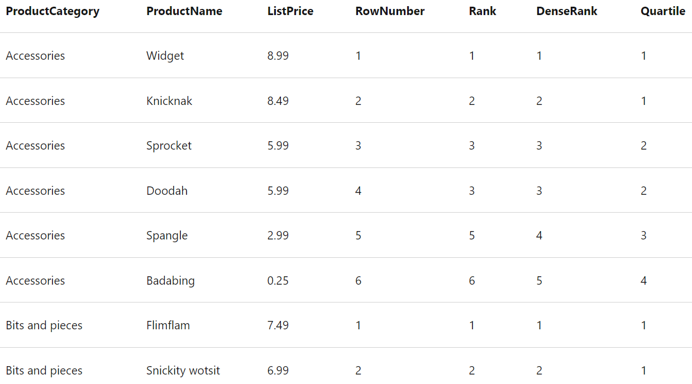
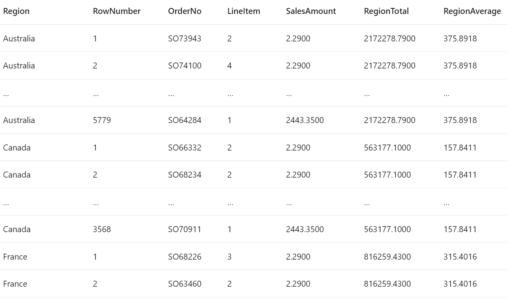
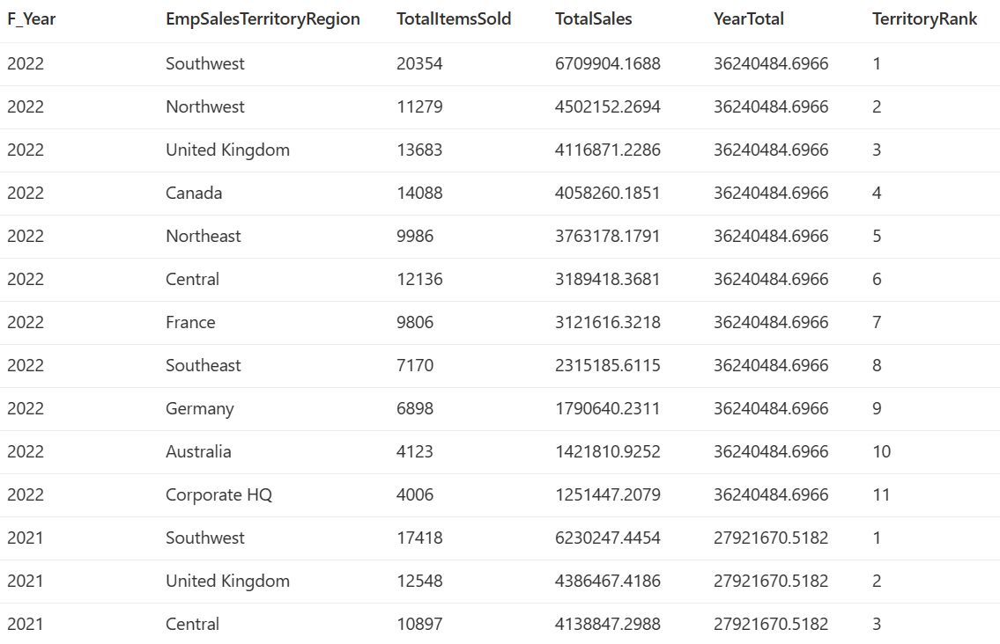
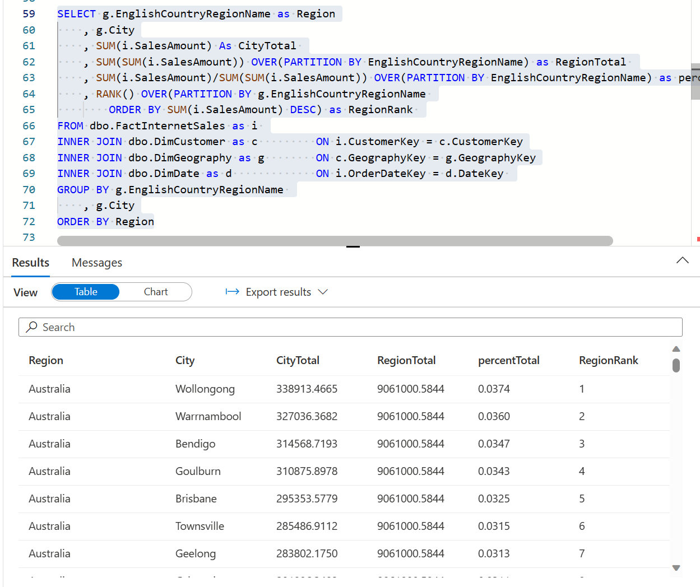

# DP-203 Azure Data Engineering


# [Intro to DEngr on Az](https://learn.microsoft.com/en-us/training/paths/get-started-data-engineering/)

## Concepts

- DEngr integrate, transform & consolidate data from various structured/unstructured data systems into systems suitable for analytics
- ensure data pipelines & stores are HiPerf, efficient, organized, & reliable under biz requirements and org constraints
- **Types of Data**:
  - structured: tables, from RDBMS, or csv where rows/cols are consistent throughout dataset
  - semi-struct: JSON, from NoSQL servers, etc the schema is not strict and can vary
  - unstruct: pictures - typically binary stored files
- **Data Operations**:
  - *Data Integration*: est links between ops & analytical services & data sources to enable secure, reliable access to data
  - *Data Transformation*: transform using ELT|ETL processes to adjust to fit use-cases or storage reqs
  - *Data Consolidation*: process of combining data that has been extracted from multiple data sources into a consistent structure - generally to support analytics|reporting
- **Common Languages**: SQL, Python, PySpark, Scala, R, Java, .NET...

- **Operational vs Analytical Data**:
  - ops data is typically Tx data generated & stored by apps or LOB services typically in a RDBMS
  - analytics data is data optimized for analysis/reporting typically in DW
  - DEngr design, implement & manage solutions to integrate from these sources/systems etc into analytics store so that others can perform analysis
- **Streaming Data**:
  - perpetual source of data that generate data in RT often based on events (IoT & Social Media)
  - DEngr implement solutions to capture, ingest, query and store this data
- **Data Pipelines**:
  - orchestrate activities that transfer & transform data - primary way to organize, manipulate & schedule ETL|ELT activities
- **Data Lakes**:
  - storage repo that can hold large amounts of data (TB or PB) in raw/native formats of struct, semi-struct, unstruct
- **DW**:
  - central repo of integrated data from multiple sources for reporting/analytics use-cases
- **Apache Spark**:
  - in-memory parallel processing framwork that uses distr fs for big data transformation/analysis

### Azure Services that Support DEngr

- Data sources: Azure SQL DB, Azure Cosmos DB, Azure Dataverse, Azure Event Hubs
- Data transformations: Azure Synapse, Azure Stream analytics, AzDF, Azure Databricks, Az HD Insight
- Other storage: Azyre Synapse & DL Storage Gen2
- Reporting & Vizualization: PowerBI

## Az DL Storage (ADLS) Gen2

- Orgs have spent decades building DW & Biz Intelligence solutions on RDBMS - but they can't get insights from semi|unstruct data
- DL are the alternative to DW because it's a distr fs that can massively scale to any data type and feed analytics engines like Spark
- this underpins many analytics tools run in Azure
- "silver bullet" DL solution for all analytics use-cases, cost effective, scalable, secure...

- **Benefits**:
  - can perform tiering and data lifecycle mgt of blob storage, is HA, secure, durable and performant
  - can handle streaming & batch processing
  - Hadoop compatible access through HDFS - to access through Databricks, HDInsight, Synapse analytics without duplication
  - security through ACLs & POSIX (does not have cascading permission sets using POSIX)
    - set at folder/file level and configured through Hive/Spark or Az Storage Explorer
    - data stored is encrypted using MSFT or Customer Managed Keys (CMKs)
  - performant - can use a hierarchy of directories & subdirectories
  - Durability through data redundancy

- **Data Lake Design**: should consider type(s) of data to be stored, how it will be transformed, who will access the data, access patterns...
  - can help plan ACL design and avoid "Data Swamp" anit-pattern

- **ADLS vs Blob Storage**
  - BLOB: you can store large amounts of object data in a flat namespace
    - the '/' within folders can be used as logical separators but do not operate as folders do ~ more like underscores in a VERY long var name
    - accessed through HTTP/HTTPS
  - ADLS Gen2 expands on blob storage functionality
    - uses hierarchical namespace that optimizes I/O inside of directories & stores metadata there
    - folder rename/deletes can be done in one operation vs modifying EVERY file with that name in the "path" of the blob
    - uses APIs to access data

- **Configuring ADLS**
    1. During storage account creation, select the "Enable Hierarchical Namespace" on the Advanced tab
    2. take an existing storage account and use the upgrade button to upgrade it (non-reversible - once hierarchical namespace is enabled it cannot be undone)

### ADLS Use-Cases

- can be used in EDW, Big Data Processing & Analytics, Data Science & AI/ML, RT Streaming
  - **EDW**:
    - Typically ADLS *feeds* EDW inside of DW tool
    - DL can turn into a "lakehouse" where a metadata layer can nbe placed over files in data lake - so it can be used directly for analytical queries/reports
  - **Big Data processing & Analytics (Spark)**:
    - "volume - variety - velocity" of data for Synapse, Databricks, HDInsight for MPP compute/analytical tasks on distr data
  - **RT Analytics (Streaming)**:
    - streaming is a growing use-case for IoT, Logs, Social Media & variety of other producers
    - solution needs to be able to capture a "boundless" stream of events as they occur
    - generally captured in a queue for processing (Az Event Hub/Kafka...) or ADLS file, processed & then output delivered to a "sink" like ADLS
  - **DS & ML**:
    - statistical analysis of large vols of data - using spark, python etc...
    - ML is a subarea of DS that deals with training predictive models on vast amounts of data
    - can use Az ML to code python in nnotebooks
- in general 4 stages:
    1. Ingest: acquire source data from files|logs|unstruct... and you use different services to ingest data as needed
    2. Store: ID where ingested data should be stored (ADLS is a great choice here...)
    3. Prep & Train: perform data prep & model training/scoring for ML - Synapse, Databricks, HDInsight, AzML
    4. Model & Serve: Visualization tools to present data to users through analytical stores or various combinations of tools

## Az Synapse

- Data generated by indv/orgs is growing and can provide basis for descriptive, diagnostic, predictive, prescriptive solutions
- There are many analytical tools available, you can use Azure Synapse for a single simple solution that works for all stakeholders
- [Synapse Documentation Link](https://learn.microsoft.com/en-us/azure/synapse-analytics/overview-what-is)

### Overview

- **Types of Analytics:**
  - Descriptive:  WHAT HAPPENED? - generally historical data in DW that gets reported on
  - Diagnostic:   WHY HAPPENED? - explore info that exists in DW but generally involves wider search for info to support analysis
  - Predictive:   WHAT WILL HAPPEN? - scenario analysis to PREDICT | FORECAST
  - Prescriptive: WHAT SHOULD I DO NEXT? - enables decision making on RT analysis of data to optimize for a particular decision
- all these analytics go through variety of storage, processing etc - and with synapse integration, can use SQL, spark, with central hub & consistent UI

### Using Synapse

- extensible through **linked services** to integrate with data stores, other processing platforms & visualization tools
- **Creating a workspace**
  - *Workspace*: an instance of synapse analytics service where you can manage the services & data resources for analytics
  - can be created in:
    - Az Portal GUI by clicking around
    - auto deploy using az powershell, CLI, ARM Template or Bicep Template
    - you login to perform tasks using *Synapse Studio*: web-based portal for synapse
- **Data Lakes in Synapse**
  - key resource for a workspace is the data lake - where data can be stored/processed at scale
  - workspace generally has a default datalake - implemented as a linked service to an ADLS Gen2 container
    - can add other data lakes or storage platforms as needed
- **Ingesting/Transforming Data**
  - Synapse helps you create, run & manage pipelines to orchestrate activities to pull & transform data and load data into targets
    - these can be scheduled to run at regular intervals using triggers
  - same tech as AzDataFactory
- **SQL in Synapse**
  - Can use 2 kinds of SQL "Pools" that are based on SQL Server RDBMS
    - Serverless pool: optimized for relational SQL semantics to query file-based data in DL
      - great for cheap & basic analysis
    - Dedicated SQL Pool: (this is the DW solution) host relational DW - for enterprise data modeling/reporting
  - uses distr query processing to parallelize SQL ops -> high scalable solution for processing
- **Spark in Synapse**
  - OSS platform for big data anlytics by processing DL files using Py, Scala, Java, SQL & C#
  - Notebooks described "analyze data using ABC coding language combined with text descriptions gained from the analysis" = Markdown in notebooks
  - can create 1+ spark pools and use interactive notebooks to combine code/notes as you build data analytics|ML|data viz notebooks
- **Data Explorer**
  - data processing engine in synapse that's based on Az's regular Data explorer service
  - uses Kusto Query Language KQL to enable HiPerf analysis of batch/streaming data
- **Integrations**
  - *Azure Synapse Link*: near RT synch btw ops data in Az CosmosDB, Az SQL DB, SQL Server, Dataverse, analytical storage...
  - *PowerBI*: enables data analysts to integrate PowerBI workspace into Synapse for data viz building in Synapse studio
  - *Purview*: enables orgs to catalog data assets in synapse - easier for Data Engr to find data, track lineage...
  - *Az ML*: enables data analysts & DS to integrate predictive model training & consumption into analytical solutions

- View the Data page, and note that there are two tabs containing data sources:
  - A Workspace tab containing databases defined in the workspace (including dedicated SQL databases and Data Explorer databases)
  - A Linked tab containing data sources that are linked to the workspace, including Azure Data Lake storage.
- View the Develop page, which is currently empty. This is where you can define scripts and other assets used to develop data processing solutions.
- View the Integrate page, which is also empty. You use this page to manage data ingestion and integration assets; such as pipelines to transfer and transform data between data sources.
- View the Monitor page. This is where you can observe data processing jobs as they run and view their history.
- View the Manage page. This is where you manage the pools, runtimes, and other assets used in your Azure Synapse workspace. View each of the tabs in the Analytics pools section and note that your workspace includes the following pools:
  - SQL pools:
    - Built-in: A serverless SQL pool that you can use on-demand to explore or process data in a data lake by using SQL commands.
    - sqlxxxxxxx: A dedicated SQL pool that hosts a relational data warehouse database.
  - Apache Spark pools:
    - sparkxxxxxxx: that you can use on-demand to explore or process data in a data lake by using programming languages like Scala or Python.
  - Data Explorer pools:
    - adxxxxxxxx: A Data Explorer pool that you can use to analyze data by using Kusto Query Language (KQL).

### Use-cases for Synapse

- Large Scale DW: integrate data for analytics/reporting independent of data loc or struct
- Advanced Analytics: perform predictive analytics with native features/integrations
- Data Exploration & Discovery: use serverless SQL pool to sql explore and do diagnostic analytics, exploratory analytics...
- RT Analytics: using Az Stream Analytics or Data explorer
- Data Integraiton: synapse pipelines for ingesting, prep model & serve data
- Integrated analytics: put services together into 1 cohesive solution by integrating analytics landscape into 1 service without backend IT mgt

# [T-SQL Basics] (https://learn.microsoft.com/en-us/training/paths/get-started-querying-with-transact-sql/)
- [T-SQL Examples on how to run queries](./T-SQL%20Examples.md)
- It is recommended you cover the first header to ensure you know and understand these before continuing forward. 

# Azure Synapse Serverless SQL Pool 

## Synapse Serverless SQL Pool Overview 
- Synapse SQL is a distr query system that offers Serverless & dedicated
  - Serverless SQL Pool: on-demand SQL query processing, generally used to work with DL contents
  - Dedicated SQL Pool: Enterprise Scale RDBMS to host DW 
- Benefits of Serverless SQL Pool: 
  - T-SQL syntax to query data in place without copying data or loading it somewhere else 
  - connectivity to variety of commonly used BI & ad-hoc query tools with popular drivers 
  - distr query processing built for large-scale data & computational functions 
  - query fault-tolerance for high reliability & success rates 
  - no infra to setup or clusters to maintain - built-in endpoint is created with every synapse workspace 
  - charged only for data processed by queries run, not by resources reserved 
- When to use serverless SQL pools 
  - best for querying DL data - so you don't need to manage infra, or connection - you just query and go 
  - best for burstable workloads using an always-on serverless SQL endpoint  
  - Data Exploration: browsing DL data for insights, do basic projections, filtering, grouping, etc... 
  - Data Transformation: perform SQL based data transformations interactively or through pipelines
  - Logical DW: can define external obj like tables & views -> and build a basic abstracted schema on top of DL data 
    - ?? is this the data lake house concept ??

> NOT recommended for OLTP for transactional data or millisecond response times 

## Querying Files using SQL Pool 

### Generic OPENROWSET to read-in files

- Can query text files in DLM (csv, tsv), JSON, Parquet 
- Use `OPENROWSET` to query the files, produces a rowset that *requires an alias - AS rows*
  - has options to determine header, and schema of rowset... 
> NOTE: IRL you may need a server-scoped credential | key | custom identity to access data 
```sql
SELECT TOP 100 *
FROM OPENROWSET(
    BULK 'https://mydatalake.blob.core.windows.net/data/files/*.csv',
    FORMAT = 'csv') AS rows
```
  - BULK parameter includes full URL to data file(s) 
    - `https://mydatalake.blob.core.windows.net/data/files/**`: Selects all files in the files folder, and recursively its subfolders.
    - Can specify multiple file paths in BULK separating each path with a comma
  - FORMAT specifies type of data being queried 

### Common OPENROWSET options for DLM Files (CSV)

- Specific formatting: With and without header row, row to begin on, DLM type, EOL chars, quoted, nonquotes & esc chars 

```sql 
SELECT TOP 100 *
FROM OPENROWSET(
    BULK 'https://mydatalake.blob.core.windows.net/data/files/*.csv',
    FORMAT = 'csv',
    PARSER_VERSION = '2.0',
    HEADER_ROW = TRUE, -- ONLY valid with PARSER_VERSION 2.0
    FIRSTROW = 2) AS rows
```
- `HEADER_ROW`      : reads in first row of data as col name
- `PARSER_VERSION`  : 1.0 is default and supports variety of encoding - but 2.0 is modern, faster & supports extra features (HEADER_ROW)
- `FIRSTROW`        : defines what row to begin reading in data, allows you to skip rows to ignore header lines or col name line 
- `FIELDTERMINATOR` : character used to separate field values (\t, or default is comma)
- `ROWTERMINATOR`   : character used to signify end of a row of data 
  - Windows uses CR & LF [carriage return & line feed - `\n`] 
  - Unix uses single line feed char - indicated by code 0x0a 
- `FIELDQUOTE`      : char used to enclose qutoed str values - by default it is (") 
- **Assigning a schema**
  - can use WITH clause to specify schema of table on read-in
```sql
SELECT TOP 100 *
FROM OPENROWSET(
    BULK 'https://mydatalake.blob.core.windows.net/data/files/*.csv',
    FORMAT = 'csv',
    PARSER_VERSION = '2.0')
WITH ( 
    product_id INT,
    product_name VARCHAR(20) COLLATE Latin1_General_100_BIN2_UTF8,
    list_price DECIMAL(5,2)
) AS rows
```
### OPENROWSET for JSON
- For a list of product files with JSON structure below
```json
{
    "product_id": 123,
    "product_name": "Widget",
    "list_price": 12.99
}
```
- You can use SQL to read it in as a doc - OR parse the JSON in your SQL 
```sql

SELECT  doc  -- {"product_id":123,"product_name":"Widget","list_price": 12.99}
        , JSON_VALUE(doc, '$.product_name') AS product  -- Widget
        , JSON_VALUE(doc, '$.list_price') AS price      -- 12.99
FROM
    OPENROWSET(
        BULK 'https://mydatalake.blob.core.windows.net/data/files/*.json',
        FORMAT = 'csv',
        FIELDTERMINATOR ='0x0b', -- stands for VT Vertical Tab as a delimiter? 
        FIELDQUOTE = '0x0b',
        ROWTERMINATOR = '0x0b'
    ) WITH (doc NVARCHAR(MAX)) as rows

```
### Querying partitioned data (Parquet)


```sql
SELECT *
FROM OPENROWSET(
    BULK 'https://mydatalake.blob.core.windows.net/data/orders/year=*/month=*/*.*',
    FORMAT = 'parquet') AS orders
WHERE orders.filepath(1) = '2020'         -- 2020 AND note the orders. its referencing the read-in data
    AND orders.filepath(2) IN ('1','2');  -- Jan & Feb
```
- The numbered filepath parameters in the WHERE clause reference the wildcards in the folder names in the BULK path -so the parameter 1 is the * in the year=* folder name, and parameter 2 is the * in the month=* folder name.

### Creating External DB Objects 

- you can use OPENROWSET and SQL pool to explore - but you may want to build a structure that allows for easier querying 
- `CREATE DATABASE [db-name] COLLATE [encoding | Latin1_General_100_BIN2_UTF8] ` 
  - can import UTF-8 encoded text data into varchar cols 

```sql 
CREATE DATABASE SCOPED CREDENTIAL sqlcred
WITH
    IDENTITY='SHARED ACCESS SIGNATURE',  
    SECRET = 'sv=xxx...';
GO
-- With SQL Server pools - you can get an error about 'CREATE EXTERNAL DATA SOURCE is not supported in master database'
-- https://learn.microsoft.com/en-us/azure/synapse-analytics/sql/resources-self-help-sql-on-demand?tabs=x80070002#create-statement-isnt-supported-in-the-master-database
-- To get around this, you need to create the database, THEN USE IT (step 2 says to execute the create within the context of your database - but it doesn't explain how)
CREATE DATABASE sales_order1 
    COLLATE Latin1_General_100_BIN2_UTF8;
GO;
Use sales_order1; GO;  -- can use an explicit statement OR dropdown in the top bar with your script 
-- With DB created and you being in it's "context" you can now create an external data source: 
CREATE EXTERNAL DATA SOURCE files
WITH (
    LOCATION = 'https://mydatalake.blob.core.windows.net/data/files/'
    CREDENTIAL = sqlcred  -- NOTE can assign credential
)

SELECT *
FROM
    OPENROWSET(
        BULK 'orders/*.csv',  -- NOTE orders is a subfolder under files folder from DATA_SOURCE
        DATA_SOURCE = 'files',  -- NOTE the files reference here - AND strangely enough, it appears this needs to appear AFTER the BULK stmt
        FORMAT = 'csv',
        PARSER_VERSION = '2.0'
    ) AS orders
```

- Above you see a **Shared Access Signature** (SAS) that you can use to authenticate against DL storage account 
  - Can be assigned to the data source 
- You can query relative to that datasource location ~ path shortcut kind of thing?
- Can also preset other read-in settings: 
```sql 
-- External File Format: 
CREATE EXTERNAL FILE FORMAT CsvFormat
    WITH (
        FORMAT_TYPE = DELIMITEDTEXT,
        FORMAT_OPTIONS(
            FIELD_TERMINATOR = ',',
            STRING_DELIMITER = '"'
        )
    );
GO
-- External Table 
CREATE EXTERNAL TABLE dbo.products
(
    product_id INT,
    product_name VARCHAR(20),
    list_price DECIMAL(5,2)
)
WITH
(
    DATA_SOURCE = files,
    LOCATION = 'products/*.csv',
    FILE_FORMAT = CsvFormat
);
GO
```

- NOW after dbo.products has been created - you can just query it like a normal db table 

### Use CETAS
- SQL can do many things, and using CETAS you can now write back tables to DL storage to integrate with other tools/pipelines 

- You can take basic transformed & structured datasets and store them back down as files in DL with benefits of SQL table
- Create External Table As Select ... (CETAS) can transform data 
  - any valid data source (table, view, openrowset...)
  - can be transformed 
  - then persisted in an external table (metadata obj in DB that provides relational abstraction over data) 
  - that is stored as a file on the file system 
  - ? said another way is this a pointer to a file? with a basic schema?
- Subsequent processing can be done against the table itself OR the underlying data file created 

```sql
CREATE EXTERNAL TABLE SpecialOrders
    WITH (
        -- MUST include details for storing results
        LOCATION = 'special_orders/', -- like an output statement
        DATA_SOURCE = files,          -- data source
        FILE_FORMAT = ParquetFormat   -- specify a format to output the data in 
    )
AS
SELECT OrderID, CustomerName, OrderTotal
FROM
    OPENROWSET(
        -- details for reading source files
        BULK 'sales_orders/*.csv',
        DATA_SOURCE = 'files',
        FORMAT = 'CSV',
        PARSER_VERSION = '2.0',
        HEADER_ROW = TRUE
    ) AS source_data
WHERE OrderType = 'Special Order';

-- To remove the SQL metadata around the file
DROP EXTERNAL TABLE SpecialOrders 
```

- NOTE: DROPping an External Table does NOT remove the underlying files created on file system - just the table object in the database 
- LOCATION is a relative location for target file drop 
- BULK is a relative location for source file intake 20.

#### Encapsulate data transformations in Stored Proc 

- This is best practice to allow for supplying parameters, retrieving output & provide additional logic in a single call 
  - can reduce client/server traffic (you send 1 request rather than multiple)
  - Provides a security boundary - provide an abstraction layer through which other users can do specific manipulations to underlying data 
  - ease of maintenance - abstracting domain logic from environment allows it to be easy to updated & changed, clients calling this don't need to change function name 
  - better perf - they are compiled first time they are executed, then execution plan is held in cache and reused on subsequent runs making them marginally faster
- Below code will create a special orders table based on a given year 
```sql
CREATE PROCEDURE usp_special_orders_by_year @order_year INT
AS
BEGIN
	-- Drop the table if it already exists
  -- NOTE: an ERROR will occur if you don't delete target folder before running stored proc
	IF EXISTS (
                SELECT * FROM sys.external_tables
                WHERE name = 'SpecialOrders'
            )
        DROP EXTERNAL TABLE SpecialOrders

	-- Create external table with special orders
	-- from the specified year
	CREATE EXTERNAL TABLE SpecialOrders
		WITH (
			LOCATION = 'special_orders/',
			DATA_SOURCE = files,  -- NOTE: no quotes here
			FILE_FORMAT = ParquetFormat
		)
	AS
	SELECT OrderID, CustomerName, OrderTotal
	FROM
		OPENROWSET(
			BULK 'sales_orders/*.csv',
			DATA_SOURCE = 'files', -- NOTE: quotes here... odd...
			FORMAT = 'CSV',
			PARSER_VERSION = '2.0',
			HEADER_ROW = TRUE
		) AS source_data
	WHERE OrderType = 'Special Order'
	AND YEAR(OrderDate) = @order_year
END
```

> NOTE: an ERROR will occur if you don't delete target folder before running stored proc
- and YES you do actually need to delete the folder, not just the contents within 
- To get around the error, you can make this code part of a pipeline and add a specific delete activity 
- In addition - the pipeline is an object that can now be scheduled or tied to other events


### Lake Databases

- Combine flexibility of storing data files with advantages of a structured schema in RDBMS
- RDBMS schema has tables with strict data types, referential integrity rules etc... and all queries/data performed through DBMS 
- in DL there is no schema - data is in files in variety of formats & struct|unstruct and can use wide variety of languages to query 
- **Lake Database**: relational metadata layer over 1+ files in DL 
  - table definitions, col names, data types, relationships btw keys across tables... 
  - *stored as parquet or csv files*
  - can use different computes - serverless SQL pool or Apache Spark pool 
- Create in Az Synapse Analytics using a graphical dB design interface to model complex schemas

#### Database Templates & DB Designer

- you can create a lake db from an empty schema, or jumpstart from an existing template 
  - broken out by industry (Agriculture, Auto, Banking, COnsumer Goods, Manufacturing, Healthcare Insurance...)
- DB Designer interface in Synapse provides drag n drop interface to edit tables and relationships between 
  - specify name/storage settings, nullability, data types, relationships... 

- 3 ways to define tables in a Lake Database: 
  1. Create Custom: You can create table metadata from scratch then read in the file 
  2. Create from Template: You can create it from an existing template and tailor it to your needs then read in the file 
  3. Create from File: You can create it from the file/folder by reading it in and then altering the metadata for each col 

#### Basic Access Controls for Serverless SQL Pools

- SQL Pool authentication allows for 2 methods: 
  - **SQL Authc** - username & pass for the SQL pool 
    - can be used for indv who needs to access your sql pool from external org
  - **Az AD Authc** - use Azure AD managed identities, can add MFA... - better option

- Authorization : what a user can do within SQL pool db
  - with SQL Authc - user only exists in SQL pool and perms can't be scoped to obj OUTSIDE SQL pool 
    - meaning sql pool user cannot access Az Storage because it doesn't "exist" there 
  - with Az AD Authc - user can sign in as themselves and all permissions are granted based on their user privs 

- Users that logon to serverless SQL pool must be auth to access & query files in Az Storage - 4 methods:
  - **Anonymous Access**: publicly available files placed on Az storage account
  - **Shared Access Signature (SAS)**: delegated access to resources in a storage account, with a SAS you grant clients access without sharing account keys 
    - grants granular control over type of access you want to grant with validity interval, perms, IP ranges, protocols...
    - can be used by SQL DB user to access azure resources? 
  - **Managed Identity**: Az AD provides services and can be used to authorize request for data access
    - an admin would grant perms to managed identity to access data 
    - ?user who logged into azure?
  - **User Identity**: "pass-through" where ID of AzAD is used to authorize access to data - it's the user that logged into serverless SQL pool 
- !!! need to review what auth types can be used by SQL user or AzureAD user and for what storage types - blob, ADLS gen2

- Can add roles to users, groups, or service principals using Synapse Studio Hub's MANAGE page
- RBAC & ACLs use POSIX like controls 
- This ACL rule can be assigned on a file or dir and checks whether user|group|service principal has access to perform action
  - Access ACLs: Control Access to an object - Files & Directories have Access ACLs
  - Default ACLs: templates of ACLs associated with a directory that determine access ACLs for child items created under that dir
    - *NOTE* files do NOT have default ACLs
- Read / Write for a file allows read or writes
- r-x allows you to list dir, -wx allows you to create child items in a dir 
- AD security groups should be the principal in ACL - using individuals or service principals creates maintenance overhead 
  - create the groups and assign principals/users to them and assign those groups as ACLs on folders
    - OTHERWISE you would have to remove indv ACL from all subdirectories in the dir hierarchy 
- **Roles for Serverless SQL Pool** 
  - read only - will need 'Storage Blob Data Reader' 
  - r/w     - will need 'Storage Blob Data Contributor'
    - allows for creation of CETAS
    - NOTE: ADLS may need additional roles - you may need super role for ADLS 

- SlSQL Pool has commands you can use to create logins based on a SQL DBMS user, the login based on password, assign to roles, etc... 
```sql 
USE databasename1
-- create a login & grant them sysadmin 
CREATE LOGIN [alias@domain.com] FROM EXTERNAL PROVIDER;
ALTER SERVER ROLE sysadmin ADD MEMBER [alias@domain.com];

-- create a username for an alias
CREATE USER alias FROM LOGIN [alias@domain.com];
```

# DEngr with Spark Pools
## Analyzing data with Spark

### Spark Basics

- Spark is OSS MPP & popular for big data 
- Distr data processing framework that enables large scale data analytics by coordinating work across multiple processing nodes in a cluster 
- Spark runs a set of executors on worker nodes of a cluster coordinated by the SparkContext object in the main/driver program 
- *SparkContext* connects to cluster manager which allocates resources across apps with a job scheduler cousin of YARN 
  - once connected, spark gets executors on nodes in the cluster to run your app code 
  - SparkContext runs main function & parallel ops on cluster nodes & collects results of the ops 
  - The nodes r/w data from file system and cache transformed data in RDDs (in-memory obj)
  - SparkContext converts a query into a DAG (Directed Acyclic Graph) which consists of tasks that get executed within executor processes on the nodes 
  - each app gets its own executor process which stay up for duration of whole app & run tasks in multiple threads  
- Synapse Analytics allows you to create a Spark pool that works like SQL pool, they start on demand and stop when idle - MS Az calls this "serverless" 
- You need to specify the configs for a spark pool: 
  - Name
  - Size VM for nodes in the pool (option for GPU enabled nodes)
  - \# of nodes in the pool & autoscaling specs
  - version of spark runtime 

- Spark is generally used for batch or streaming jobs to ingest, clean & transform data - generally as part of a pipeline 
- Interactive sessions to explore, analyze & visualize data 
- rather than SQL scripts, they use notebooks which allow you to combine markdown & code - which can then be plugged into a pipeline 
  - Notebooks contain one or more "cells" containing either code|markdown 
  - syntax highlighting & error support, auto-completion, interactive data viz, export results... 

#### Data sources for Spark:

- DL based on primary storage account for Azure Synapse workspace 
- DL based on storage defined as a *linked service* in the workspace 
- dedicated/serverless SQL pool in the workspace
- AzSQL or SQL Server DBMS using Spark connector for SQL Server 
- Az Cosmos DB Analytical DB defined as *linked service* & configured using *Az Synapse Link for Cosmos DB*
- Az Data Explorer Kusto DB defined as *linked service* in the workspace 
- external Hive metastore defined as *linked service* in the workspace 

#### Dataframe & Basic Data Manipulation
- can use scala or python or java & even a limited SQL library... default is pySpark 
- spark uses RDD under the hood, but you can work with the logical *dataframe* ~ to a python dataframe but optimized for Spark

```python
%%pyspark
from pyspark.sql.types import *
from pyspark.sql.functions import *

productSchema = StructType([
    StructField("ProductID", IntegerType()),
    StructField("ProductName", StringType()),
    StructField("Category", StringType()),
    StructField("ListPrice", FloatType())
    ])

df = spark.read.load('abfss://container@store.dfs.core.windows.net/products.csv',
    format='csv',
    schema=productSchema,
    header=True
)
display(df.limit(10))
# creating a datafrtme with product name & price where its mountain or road bikes
bikes_df = df.select("ProductName", "ListPrice").where((df["Category"]=="Mountain Bikes") | (df["Category"]=="Road Bikes"))
display(bikes_df)
# Can do groupBy and other methods 
counts_df = df.select("ProductID", "Category").groupBy("Category").count()
```

#### Spark Catalog 

- spark catalog is a *metastore* for relational data obj like views & tables
  - a relational abstraction over files that relate to a specific file in DL 
- can use this catalog to integrate pyspark with SQL 
- simplest way is to create a temp view: `df.createOrReplaceTempView("products")`
  - this will get deleted at the end of the session, but you can create tables that persist
- *Managed Tables* are metadata structures that store their underlying data in the storage location associated with the catalog. *Deleting a table also deletes its underlying data.*
- *External tables* define metadata in the catalog but get their underlying data from an external storage location; typically a folder in a data lake. *Deleting an external table does not delete the underlying data.*
  - allows you to do your transformations and explore, then once you've finished building them - you drop the table 

- You can create an empty table by using the `spark.catalog.createTable` method. 
- You can save a dataframe as a table by using its `saveAsTable` method.
- You can create an external table by using the `spark.catalog.createExternalTable` method. 

#### Visualizing Data

- can analyze data queries as charts from notebook that provide basic charting in synapse UI, but you can use python graphics library to create/display data viz
- basic charts is great for adhoc viz: 


- graphics packages like Matplotlib can use code to plot graphs and such more precisely 
  - NOTE matplotlib requires a pandas dataframe rather than spark - may need to use .toPandas() 

### Spark Data Transformations 

- spark provides DF object as primary structure for working with data 
- READING DATA: you use `spark.read` to specify the file format, path & schema of data to be read 
- TRANSFORMING DATA: you can do SQL items such as filter rows & cols, rename, create cols derived from others, replace null/other values 
  - has a set of char manipulation functions like `split` or divide a col based on a delimiter 
- WRITING DATA: you use the `dataframe_name.write` to write output - generally as parquet file (fast and best general use)

> NOTE: when you partion data to a file, it doesn't save the cols you partitioned by on the partitioned file. 
> So if you read in the data fater it was partitioned by year & month, if you don't have order date, you wouldn't know what you "read" back into the session by looking at data.
> BUUUUT it seems to keep those cols if you create an external table??? 

```python
from pyspark.sql.functions import split, year, col
# Read in dataset
order_details = spark.read.csv('/orders/*.csv', header=True, inferSchema=True)
display(order_details.limit(5))
# Create the new FirstName and LastName fields
transformed_df = (order_details.withColumn("FirstName", split(col("CustomerName"), " ").getItem(0))
                  .withColumn("LastName", split(col("CustomerName"), " ").getItem(1))
                  .withColumn("Year", year(col("OrderDate")))
                  .withColumn("Month", month(col("OrderDate")) )
                  .drop("CustomerName")
        )
# Write resulting file to a parquet file partitioned by year
transformed_df.write.partitionBy("Year","Month").mode("overwrite").parquet('/data1')
# creates folder structure with: 
# /data1 
# --Year=2020
# --Year=2021 ...

# can save as an external table so you can access using SQL & then drop them when done
order_details.write.saveAsTable('sales_orders', format='parquet', mode='overwrite', path='/sales_orders_table')
```

## Using Delta Lake
### Basic Features & Capabilities 

- Linux foundation Delta Lake is OSS storage layer for Spark that enables RDBMS capabilities for batch & streaming data 
  - allows you to build a data lakehouse architecture in Spark to support SQL based data manipulation semantics with support for transactions and schema enforcement 
  - result is an analytical data store that offers advantages of rdbms with flexibility of data file storage of DL 
- NOTE: version matters - course covers Delta Lake v1.0 with Spark v3.1
- [Key Features](https://delta.io/) from both MSFT & Delta.io
  - Tables that support CRUD: you can select, insert, update & delete rows of data in the same way in RDBMS 
  - ACID Transactions: transactional data modifications that provide 
    - *A*tomicity:    transactions complete as a single unit of work 
    - *C*onsistency:  transactions leave the DB in a consistent state 
    - *I*solation:    in-process transactions cannot interfere with one another 
    - *D*urabiltiy:   When a transaction completes, changes made are persisted
    - *DeltaL brings this transactional support to Spark by implementing a transaction log & enforcing serializable isolation for concurrent ops*
  - Scalable Metadata - handle large tables with many partitions easily 
  - Data Versioning & Time Travel: access/revert to earlier versions of data for audit/rollbacks or reproduction requests 
    - can track multiple versions of each table row & even use time-travel to retrieve a previous version of a row in a query 
  - OSS & supports standard data formats and can easily interoperate between other DL tools 
  - Unified Batch & Streaming: setup once and can be used for both batch & streaming use-cases
  - Schema Evolution & Enforcement - removes DQ issues 
  - Audit Trail - log all change details providing an audit trail 
  - DML Ops - can use SQL, Scala/Java & python to manipulate data 

### Creating DeltaL formatted tables & Catalog Tables (managed vs external)

- The easiest way - is to save a dataframe in *delta* format specifying a path where the file & metadata should be stored. 
- it will auto create a '_delta_log' folder containing transaction log for the table
  - Transaction log records _ALL_ data modifications to the table, by logging each modification, transactional consistency can be enforced & versioning info for the table can be retained 
- can query prior version using option `versionAsOf` OR `timestampAsOf`

- Catalog Tables are created using the `saveAsTable` operation 
  - saves a table as a managed table (by default) when no filepath has been provided
  - An external table when a filepath has been provided 

```python
# Saving as a DeltaL table 
delta_table_path = "/delta/mydata"
df.write.format("delta").save(delta_table_path)

# Saving an External Table with format Delta - schema defaluts to 'default'
df.write.format("delta").option("path", "/mydata").saveAsTable("<schema-name>.MyExternalTableName")
spark.sql("CREATE OR REPLACE TABLE MyExternalTable USING DELTA LOCATION '/mydata'")
    # CREATE TABLE IF NOT EXISTS - alternative

# Save a dataframe as a managed table with format Delta
df.write.format("delta").saveAsTable("MyManagedTable")

# overwriting 
new_df.write.format("delta").mode("overwrite").save(delta_table_path)
# appending new data to delta table 
new_rows_df.write.format("delta").mode("append").save(delta_table_path)

#
# Conditional updates ~ UPDATE TABLEA, SET XYZ, WHERE 
#
from delta.tables import *
from pyspark.sql.functions import *

### IMPORTANT - need to create a deltaTable object (not a dataframe) in order to do update
deltaTable = DeltaTable.forPath(spark, delta_table_path)

deltaTable.update(
    condition = "Category == 'Accessories'",
    set = { "Price": "Price * 0.9" })

# View the updated data as a dataframe
deltaTable.toDF().show(10)  # notice the .toDF() function so you can display it 

### AUDITING
# Querying a pervious version of a table by specifying version OR timestamp
df = spark.read.format("delta").option("versionAsOf", 0).load(delta_table_path)
df = spark.read.format("delta").option("timestampAsOf", '2022-01-01').load(delta_table_path)
# Show _delta_log changes 
deltaTable.history(10).show(20, False, True)
```

- Depending on how a table was added to the catalog using `saveAsTable` it can auto-create a schema or be created without a schema 
  - When creating a table from a dataframe, the table schema is inherited from the dataframe
  - When creating a new managed table or an external table with an empty location - you can define schema using SQL `CREATE TABLE ... USING DELTA` or pySpark

```python
from delta.tables import *
# creating empty table schema ~ CREATE TABLE 
    # can also use createIfNotExists or createOrReplace
DeltaTable.create(spark) \
  .tableName("default.ManagedProducts") \
  .addColumn("Productid", "INT") \
  .addColumn("ProductName", "STRING") \
  .addColumn("Category", "STRING") \
  .addColumn("Price", "FLOAT") \
  .execute()
```

### Delta Lake n Streaming Data

- stream processing involves reading a stream of data from a source, optionally processing fields, doing aggregations, grouping, minor manipulations and writing results to sink 
- Spark offers native support through Spark Structured Streaming - a boundless dataframe which streaming data is captured for processing 
  - can read from network ports, RT brokering services - Az Event Hubs, Kafka or file system locations 
- can use Delta Lake as a source (report on new data added to table) or sink (query table to see latest streamed data) 
  - similar to dataframe logic but now `readStream` & `writeStream`

```python
from pyspark.sql.types import *
from pyspark.sql.functions import *

# Load a streaming dataframe from the Delta Table
stream_df = spark.readStream.format("delta") \
    .option("ignoreChanges", "true") \
    .load("/delta/internetorders")

# Now you can process the streaming data in the dataframe
# for example, show it:
stream_df.writeStream \
    .outputMode("append") \
    .format("console") \
    .start()

# Create a stream that reads JSON files from a folder
inputPath = '/streamingdata/'
jsonSchema = StructType([
    StructField("device", StringType(), False),
    StructField("status", StringType(), False)
])
stream_df = spark.readStream.schema(jsonSchema).option("maxFilesPerTrigger", 1).json(inputPath)

# Write the stream to a delta table 
table_path = '/delta/devicetable'
checkpoint_path = '/delta/checkpoint'
delta_stream = stream_df.writeStream.format("delta") \
  .option("checkpointLocation", checkpoint_path) \
  .start(table_path)

# can create a Delta Table that then allows you to query it using SQL 
spark.sql("CREATE TABLE DeviceTable USING DELTA LOCATION '/delta/devicetable';")

# Once querying is done - you can stop the writeStream to the Delta Lake Table: 
delta_stream.stop()
```

- When using a Delta Lake table as a streaming source, only append operations can be included in the stream. 
  - Data modifications will cause an error unless you specify the `ignoreChanges` or `ignoreDeletes` option.
- 'checkpointLocation' option writes a checkpoint file that tracks state of stream processing
  - allows you to recover from failure at point where streaming stopped/failed

- [Streaming from Delta Lake](https://docs.delta.io/latest/delta-streaming.html) && [Streaming from Apache Spark](https://docs.delta.io/latest/delta-streaming.html)

### [Delta Lakes n SQL Pools](https://learn.microsoft.com/en-us/azure/synapse-analytics/sql/query-delta-lake-format) 

- YOU CAN ONLY QUERY DATA FROM DELTA LAKE TABLES IN SERVERLESS SQL POOL - you can NOT update, insert or delete data 
- Tip: best practice to create db with UTF-8 collation to ensure string compatibility with parquet files 

```sql
SELECT *
FROM
    OPENROWSET(
        BULK 'https://mystore.dfs.core.windows.net/files/delta/mytable/',
        FORMAT = 'DELTA'
    ) AS deltadata

-- To query a spark catalog table in spark metastore, they go into the database "default" by default 
USE default;

SELECT * FROM MyDeltaTable;
```

# Synapse DWs 
## Analyzing Data in Relational DW 

- relational DW at the center of most BI tools 
- Synapse has a RDBMS optimized for DW, by using dedicated SQL pools in Synapse, you can create DBs capable of hosting & querying large volumes of data 

## Designing a DW Schema 
- DW ~ RDBMS contains tables in which data you want to analyze is stored
- tables are organized in a way that's optimized for querying --> in general fact tables contain metrics and attributes are stored in dimensions 
- **Dimension Tables**: describe biz entities (products, people, places...)
  - customer may have: first name, last name, email, address, etc... 
  - *Surrogate Key*: DW specific key that identifies each row in dim table in DW (typically large incrementing INT)
  - *Alternate Key*: the natural/business key used to ID a specific instance of an entity in transactional source system ~ customerID
  > TWO KEYS BENEFITS: DW can be populated from various source systems leading to risk of duplicate/incompatible keys 
  > simple numeric keys generally perform better on multi-table queries
  > attributes of entities may change over time - customer might change address, etc... if you want to record each inst at point in time - sales that occured when a cust lived at that particular location... 
    >  can use same custID, but different surrogate keys for diff addresses they had at different points in time
  - almost always have a dimension table for time 
- **Fact Tables**: store obsv or events - sales orders, etc... with multiple keys for all dimensions its tied to
- use snowflake when certain dim tables are shared by multiple dimensions (geography - could by used by both store and customer for location)


## Creating & Loading DW Tables

1. Create a Dedicated SQL Pool 
    - Manage Page and provision a NEW SQL pool 
    - provide a unique name for the SQL pool 
    - specify performance that determines cost while its running 
    - start with an empty pool or restore from existing backup 
    - collation of the pool (CANNOT CHANGE after it is set) - determines sort order & string comparison rules for DB 
    > once it is started you can "pause" it so you don't incur compute costs 
2. Create dimension tables 
    - use IDENTITY col to auto generate SK (so table will create SK and you don't have to generate unique keys yourself)
```sql
-- Creating a staging table 
CREATE TABLE dbo.StageProduct (
    ProductID NVARCHAR(10) NOT NULL,
    ProductName NVARCHAR(200) NOT NULL,
    ...
) WITH (
    DISTRIBUTION = ROUND_ROBIN,
    CLUSTERED COLUMNSTORE INDEX
);
```
3. Can create external tables that reference a file location ~ source files so always read in 

4. Loading tables can be done with a COPY INTO statement, or INSERT, UPDATE, MERGE & CREATE TABLE AS SELECT
    - Common way to load DW is transfer data from data lake to staging tables, then use SQL to load data from staging into dim|fact tables 
    - In general - it is a periodic batch which inserts/updates to DW with a process: 
      - ingest data into DL by preloading/cleansing data & transforming
      - load data into staging tables in DW
      - Load Dim tables, update existing rows/insert new & generate SKs as needed 
      - load fact tables - lookup SKs for related dims 
      - perform post-load optimization by updating indexes & table distr stats 

## use SQL Server for small/med DW - use Synapse for large. Why? 

- **Data Integrity Constraints**: Synapse Dedicated SQL Pools don't support FK & Unique key constraints found in RDBMS 
  - this means Synapse relies entirely on YOU to maintain FK & uniqueness when you upload data to it 
  - [users need to make sure all values in those columns are unique.](https://learn.microsoft.com/en-us/azure/synapse-analytics/sql-data-warehouse/sql-data-warehouse-table-constraints) A violation of that may cause the query to return inaccurate result.
- [**Indexes**](https://learn.microsoft.com/en-us/azure/synapse-analytics/sql-data-warehouse/sql-data-warehouse-tables-index): Synapse Dedicated SQL Pools support clustered indexes like SQL server, but it uses a *clustered columnstore* index type by default
  - This is much more performant than clustered index 
  - clustered indexes don't work on these types: varchar(max), nvarchar(max), and varbinary(max) 
  - appears to need a certain scale before performant - Small tables with less than 60 million rows. Consider heap tables.
- **Distribution**: Synapse Dedicated SQL Pools use MPP arch rather than SMP 
  - Data is distr across pool of nodes for processing using 
    - *Hash*: hash value calculated to partition col & assign row to compute node 
    - *Round robin*: rows distr evenly across all compute nodes 
    - *replicated*: copy of each table is stored in compute node 
  - Dimension tables should be replicated if they are small to avoid data shuffling when joining fact tables 
    - if it is too large to store on each node, use hash distr
  - Fact tables should use hash distr with clustered columnstore index to distr fact tables across compute nodes 
  - staging tables, you can use round robin to distr evenly across compute nodes 

- **ROW_NUMBER** returns the ordinal position of the row within the partition. For example, the first row is numbered 1, the second 2, and so on.
- **RANK** returns the ranked position of each row in the ordered results. For example, in a partition of stores ordered by sales volume, the store with the highest sales volume is ranked 1. If multiple stores have the same sales volumes, they'll be ranked the same, and the rank assigned to subsequent stores reflects the number of stores that have higher sales volumes - including ties. 
  - If it is rank 5, there are 4 rows above
- **DENSE_RANK** ranks rows in a partition the same way as RANK, but when multiple rows have the same rank, subsequent rows are ranking positions ignore ties. 
  - If it is rank 5, there are 4 higher metrics (there could be 6 rows, because there might be duplicates)
- **NTILE** returns the specified percentile in which the row falls. For example, in a partition of stores ordered by sales volume, NTILE(4) returns the quartile in which a store's sales volume places it.



```sql
SELECT g.EnglishCountryRegionName as Region 
    , ROW_NUMBER() OVER(
        PARTITION BY g.EnglishCountryRegionName 
        ORDER BY i.SalesAmount ASC ) As RowNumber 
    , i.SalesOrderNumber as OrderNo
    , i.SalesOrderLineNumber as LineItem
    , i.SalesAmount as SalesAmount 
    -- this is like a shortcut subquery to create a sum of sales by region and tie it to each row 
    , SUM(i.SalesAmount) OVER(PARTITION BY g.EnglishCountryRegionName) as RegionTotal
    , AVG(i.SalesAmount) OVER(PARTITION BY g.EnglishCountryRegionName) as RegionAverage
FROM dbo.FactInternetSales as i
INNER JOIN dbo.DimCustomer as c         ON i.CustomerKey = c.CustomerKey
INNER JOIN dbo.DimGeography as g        ON c.GeographyKey = g.GeographyKey
INNER JOIN dbo.DimDate as d             ON i.OrderDateKey = d.DateKey
WHERE d.CalendarYear = 2022
ORDER BY Region 
```

```sql 
SELECT d.FiscalYear as F_Year
    , st.SalesTerritoryRegion as EmpSalesTerritoryRegion 
    , SUM(rs.OrderQuantity) as TotalItemsSold 
    , SUM(rs.SalesAmount) as TotalSales
    -- NOTE the sum of the sum to get total sales for the year
    , SUM(SUM(rs.SalesAmount)) OVER(PARTITION BY d.FiscalYear) as YearTotal 
    -- This is what allows you to rank within a Fiscal Year the sales  
    -- Because you already have sales territory grouped by, it will inherently rank by FYear & territory 
    , RANK() OVER(PARTITION BY d.FiscalYear
            ORDER BY SUM(rs.SalesAmount) DESC) as TerritoryRank
FROM dbo.FactResellerSales as rs
INNER JOIN DimEmployee as e             ON rs.EmployeeKey = e.EmployeeKey
INNER JOIN DimSalesTerritory as st      ON e.SalesTerritoryKey = st.SalesTerritoryKey
INNER JOIN dbo.DimDate as d             ON rs.OrderDateKey = d.DateKey 
GROUP BY d.FiscalYear 
    , st.SalesTerritoryRegion 
ORDER BY F_Year desc  
    , TerritoryRank 
```



## [Load data into Relational DW](https://learn.microsoft.com/en-us/training/modules/load-optimize-data-into-relational-data-warehouse/)

### Loading Staging tables: 
- can create separate schemas between stage and "live" data 
- `COPY INTO` --> generally used to load staging tables due to high throughput
```sql 
COPY INTO dbo.StageProduct
    (ProductID, ProductName, ...)
FROM 'https://mydatalake.../data/products*.parquet'
WITH
(
    FILE_TYPE = 'PARQUET',
    MAXERRORS = 0,
    IDENTITY_INSERT = 'OFF'
);
```
- Or you can use external tables, so that your queries pull from the source file rather than the in-DB copy 
```sql 
CREATE EXTERNAL TABLE dbo.ExternalStageProduct
(
    ProductID NVARCHAR(10) NOT NULL,
    ProductName NVARCHAR(10) NOT NULL,
...
)
WITH
(
    DATE_SOURCE = StagedFiles,
    LOCATION = 'folder_name/*.parquet',
    FILE_FORMAT = ParquetFormat
);
GO
```

### Load Dimension Tables
- Use CREATE TABLE AS 
  - allows you to use ROW_NUMBER() function to assign unique int value for SK
  - using CTAS with UNION - but it doesn't allow you to simultaneously generate a SK 
  - INSERT - only works for NEW rows, not updates to existing
    - assumes existing table has a SK defined with IDENTITY attribute so it autogenerates SK for you 
- TIME Dimension table: 
  - store a record for each time interval based on grain by which you want to agg data over time, and you may need to extend range of dates periodically 
- **Slowly Changing Dimensions**
  - 
