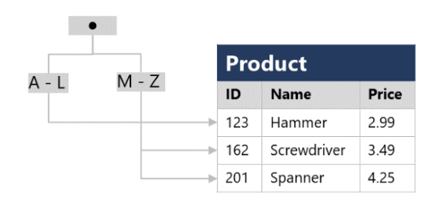

# DP-900 Azure Data Fundamentals
# Explore Data Concepts 

## Common Data Formats
- Data is a set of info (#s, obsv, desc, pics, graphics...) used to record information 
- data structures in which data is organized typically represent **ENTITIES** such as customers, products, sales... 
- Each entity typically has one or more **ATTRIBUTES** or characteristics (name, tyupe, address...)
- Comes in 3 general forms: Structured, Semi-Structured, Unstructured 

**Structured Data** : data that adheres to a fixed schema - all data has the same fields/properties and is tabular 
- data is stored in 1+ tables where rows represent instannces of the data entity & columns represent attributes of the entity 
- Generally this is stored in a database where a relational model is used with keys to relate different tables 

**Semi-Structured Data** : Information that has some structure - but allows for variation between entity instances (JSON)
- could have a customer with 1 or multiple addresses 

**Unstructured Data** : Text, pictures, video, audio, binary files... 

- **Data Stores** : store data in a format to record these details/events/info for further analysis 
    - generally stored in File Stores or Databases

## File Storage for data
- File storage is typically a specific file system, generally a centralized shared file system (often in the cloud) 
- File format is important and usually determined based off of: 
    - Type of data being stored (structured, semi, unstruct)
    - apps & services that need to r/w & process data
    - need for data to be readable by humans 
    - optimized for storage 
    - optimized for processing 
    - ?not mentioned - but security? 

### Common File Formats
- **Delimited Text Files** (csv)
    - plain text file with field delimiters & row terminators
    - TSV, space delimited, fixed width... 
    - most versatile and commonly used 
- **JSON** (JavaScript Object Notation)
    - hierarchical document schema used to define data entities (objects) that have multiple attributes 
    - each attribute may itself be an object (or collection of objects) making JSON flexible for structured & semi-struct data 
- **XML** (eXtensible Markup Language) 
    - human readable data formatting that JSON was designed to optimize
    - uses an html tagging system to define elements & attributes
- **BLOB** (Binary Large OBject) 
    - bytes of binary data are mapped to printable characters through encoding scheme (unicode, ascii...)
    - BLOBs are often the catchall term to describe image, video, audio and app specific docs 
- **Optimized File Formats** (Avro, ORC & Parquet) 
    - These enable compression, indexing, efficient storage and faster processing... 
    - **Avro** : row-based format created by Apache 
        - each record contains a header (in JSON) that describes the structure of the data in the record 
        - the data itself is stored as binary info 
        - the app will read the header and then parse binary data to grab what it needs 
        - Best used for compressing data and minimizing storage & network bandwidth 
    - **ORC** (Optimized Row Columnar format) : organizes data into columns rather than rows 
        - Designed by HortonWorks for optimizing r/w in Apache Hive (a data warehouse that supports fast SQL queries) 
        - ORC contains *stripes* of data : data for a column (or set of columns) that contains 
            - an index into the rows in each stripe 
            - the data for each row 
            - a footer with basic stats (count, min, max, sum...)
    - **Parquet** : another columnar data format 
        - created by Cloudera & Twitter 
        - it contains *row groups* ~ partitions of the block of data
        - data for each column is stored together in the same row group 
        - each row group contains one or more chunks of data 
        - a parquet file includes metadata that describes the set of rows found in neach chunk 
        - an application will browse the metadata, and then only read in the row group chunks of data AND the needed columns from those chunks it needs for processing 
        - it can store & process nested data types efficiently and has efficient compression & encoding

## Database Storage 
- Database is a central system in which data can be stored & queried - a dedicated system for managing data records rather than files
    - while technically it uses file system storage and an organized file system could be a "database" - it is built around data records and not file management 

### Relational & Non-relational DB
- **Relational Databases**: used to store & query structured data 
    - Each instance of an entity is assigned a primary key (PK) that uniquely identifies it and these can be stored in other tables to reference each other (customer bought which product...)
    - Can *normalize* a set of tables so that there is elimination of duplicate data values - degree of normalization depends on occurrence of duplicate values 
    - tables managed using SQL, typically based on ANSI std 
- **Non-relational Databases**: data management systems that don't apply a relational schema to the database - AKA NoSQL database, even if they do support some variant of SQL. Come in 4 types:
    - *Key-Value Databases*: key & value, where value is anything 
    - *Document Databases*: key-value where value is a JSON that system can parse & query 
    - *Column Family Databases*: store tabular data of rows & cols, but columns are in groups known as column-families that store innfo that's logically related 
    - *Graph Database*: store entities as nodes with links to define relationships between them 

## Transactional data processing solutions 
- records transactions that are specific events and info around the event that the org wants to track (purchases/payments, etc...)
- These often need to run and perform at scale with high-volume and sometimes handling millions of Tx per day 
- this work is often called OLTP (OnLine Transactional Processing)

- They often rely on a database where data storage is optimized for r/w operations where data is CRUD (created, retrieved/read, updated, deleted)
- To ensure integrity of the data, it needs to follow **ACID**: 
    - *Atomicity*: each transaction is treated as a single unit which succeeds or fails completely 
        - For example to transfer funds, it must debit one and credit the other. If either one fails, the entire action should fail.
    - *Consistency*: transactions can only take data in the db from one valid state to another 
        - Transfer funds example - there is a "before" funds transferred and "after" funds transferred 
    - *Isolation*: concurrent transactions cannot interfere and must remain independent 
        - while transfer funds is occurring, when user looks at account balance the value retrieved must reflect the action !!! Better example here
    - *Durability*: when a transaction has been committed, it will remain committed 
        - after transfer complete, if DB restarts the transaction should remain completed and not retry, or be forgotten 
- OLTP that support live apps & process biz data are called: *LOB apps*

## Analytical data processing solutions 
- generally uses mostly read-only systems that store vast volumes of historical data or biz metrics 
- analytics can be performed for data at a given point in time, or across a time-series of snapshots 

- Common Enterprise flow: 
    - Data files stored in data lake
    - ETL process copies files & OLTP db biz metrics into a DW that's optimized for read 
    - DW schema is based on fact tables that contain numeric values & dimensions for classifications 
    - DW is aggregated and loaded into OLAP for aggregated views of sales by customer/product, etc... 
    - data is queried at various points to generate reports, dashboards and other visualizations 

- Data Lakes: large volume of file-based data must be collected & analyzed 
- DW: Est way to store data in a relational schema that is optimized for read operations (often) to support reporting & data viz
    - may require some denormalization (introducing duplication of data) for faster queries/reads 
- OLAP model: an aggregated type of data storage that's optimized for analytical workloads 
    - predefined aggregations that allow quick hierarchical views of data 

- Different users work at different stages: 
    - Data scientists may work with files in datalake to explore/model data
    - data analysts may query tables in DW to create reports & visualizations 
    - business users may consume data from OLAP, dashboards or reports 

## Data Professional Roles & User Types
- Many roles involved in managing, controlling & using data. It's important to understand common division of tasks & responsibilities 
    - in the real world things are not as clear, and sometimes a person might perform multiple roles 
    - various roles orgs apply to data professionals, the tasks and responsibilities and the MSFT azure services they might use

- **DB Admins** : manage db, assign permissions to users, store backup copies of data & restore during failure/recovery 
    - responsible for design, implementation, maintenance and operation of on-prem/cloud databases 
    - responsible for avail, performance, & health of db - and setup DR/HA with RTO/RPO 
    - manage security of data by granting privileges or denying access as appropriate 
- **Data Engineers** : manage infra & processes for data integration across org, applying data cleaning, data govn and implementing pipelines to transfer & transform data btw systems 
    - collaborates with stakeholders to design & implement data-related workloads (ingestion pipelines, cleansing & transformation, data stores for workloads...) 
    - because data is stored in so many places - they often work with SQL, NoSQL dbs, file stores, data streams... from a variety of software vendors & types 
    - reponsible for ensuring privacy of data is maintained and management & operation of data pipelines to ensure data accuracy & lineage
- **Data analysts** : explore and analyze data to create visualizations & charts that enable orgs to make informed decisions 
    - enables businesses to maximize value from data assets by researching questions or looking for insights to take action on 
    - explore data to ID trends & relationships
    - design & build analytical models
    - enable analytics through reports/visualizations 
- Honorable mentions: *data scientist* *data architect* *application developer* *software engineer* 

## Data Services in Azure 
- as a cloud platform it has many commonly used data services for a variety of use-cases. Here are the most commonly used ones: 
- **Azure SQL** (MS SQL for the cloud) 
    - collective name for a family of db solutions basesd on the MSFT SQ Server db engine:
        - *Azure SQL Database* - fully managed PaaS db hosted in Azure 
        - *Azure SQL Managed Instance* - hosted instance of SQL server with automated maintenance, but with more flexible config than Azure SQL db and admin responsibility
        - *Azure SQL VM* - a VM with SQL server installed, allowing the owner to have full admin nresponsibility & configurability 
    - DB admins typically provision & manage SQL db systems to support LOB apps that need to store Tx data 
    - Data Eng may use SQL database systems as sources for data pipelines that ingest this Tx data into an analytical system 
    - Data analysts may query these db to create reports - but it is often combined with other sources to perform a comprehensive enterprise analytics 
- **Azure DB for OSS Relational DB** (MySQL, MariaDB, PostgreSQL)
    - ~ AWS RDS managed instances, persona usage follows Azure SQL
    - *Azure Db for MySQL* - simple OSS dbms used commonly in LAMP stacks (Linux, Apache, MySQL & PHP) 
    - *Azure db for MariaDB* - a new dbms created by original devs of MySQL, it has been rewritten & optimized for perf, and offers compatibility with Oracl DBMS
    - *Azure db for PostgreSQL* - a hybrid relational-object db, can store relational tables, and can store custom data types with their own non-relational properties 
        - best overall pick 
- **Azure Cosmos DB** ~ AWS DynamoDB 
    - a global scale NoSQL (non-relational) db that supports multiple APIs that allow you to store & manage data as JSON docs, key-value pairs, column families & graphs 
    - In some orgs - cosmosDB instances may be provisioned and managed by db admin, it is typically managed by software devs as part of overall app arch 
    - Data engineers often integrate with this as a data source into enterprise analytics tools that support modeling & reporting 
- **Azure Storage** (storage accounts)
    - a core Azure service that allows you to store data in BLOB containers, file shares & tables (key-value storage for apps that need to r/w values quickly)
    - data engineers use azure storage to host data lakes using special BLOB storage with hierarchical namespace that enables files to be organized folders in a distr file system 
- **Azure Data Factory** 
    - can build/define & schedule data pipelines to transfer & transform data 
    - can integrate with other Azure services, used by data engineers to ETL 
- **Azure Synapse Analytics**  
    - comprehensive, unified data anlytics solution that provides a single service interface for: 
        - pipelines using data factory tech
        - SQL db engine for DW workloads 
        - Apache Spark (java, scala, python & sql)
        - Azure Synapes data explorer: High Perf data anlytics optimized for RT log queries and telemtry data using Kusto Query Language (KQL) 
- **Azure Databricks** 
    - Azure integrated version of Databricks platform which combines apache spark data processing, with SQL db semantics and an integrated management interface to enable large-scale data analytics 
    - used by data eng for analytical data stores for data scientists & allows data analysts to use their notebook to visualize and do basic queries 
- **Azure HDInsight** (Apache ecosystem - hadoop, spark, HBase & Kafka)
    - provides azure hosted clusters for apache OSS data processing tech
    - Apache Spark: distr data processing system
    - Apache Hadoop: distr system that uses MapReduce to process large volumes of data efficiently across multiple cluster nodes - can be written in Java or through Hive SQL API 
    - Apache HBase - OSS for NoSQL data storage & queries
    - Apache Kafka - message broker for data stream processing  
    - primarily used by data engineers to support large analytics workloads using a variety of Apache software
- **Azure Stream Analytics** 
    - RT streaming engine that catpures stream of data from an input, applies a query to extract & manipulate data from the stream & writes output for analysis or further processing 
    - Data Eng can use this into data archs that capture streaming data for ingestion or RT visuals/reports 
- **Azure Data Explorer** 
    - stand alone service that offers same high perf queries of log & telemetry data as Azure synapse data explorer 
    - can be used by analysts to query & analyze data that includes timestamps... 
- **Microsoft Purview** 
    - enterprise-wide data govn and discoverability 
    - creat a *MAP* of data and track data lineage across multiple data sources & systems enabling trustworthy data for analysis & reporting 
    - Data Eng used to enforce data govn across enterprise and ensure integrity of data
- **Microsoft Power BI** 
    - platform for analytical data modeling and reporting used by data anlysts to create & share interactive data visualizations & reports 
    - can be created through desktop app, and published through web reports and even Mobile 


# Explore Relational Data in Azure
- data was often in its own unique structure that was inefficient, hard to maintain and hard to optimize for app performance or use for analytics 
- Relational database model was designed to solve the problem of arbitrary data structures 
- relational model provides a way of representing & querying data that can be used by any app
    - key advantage is use of tables, an intuitive, efficient and flexible way to store and access structured info 
- simple, yet powerful is used for all sorts of needs - tracking inventories, mission critical systems... etc 

## Relational Data 
- Model collections of entities from the real world as tables - generally objects & events
    - each row is a particular instance of an object or event
    - each column is an attribute or piece of information that describes or provides context around the obj/event 
- Sometimes info can be missing (NULL) 
- columns are often a particular datatype (date, integer, string, decimal, ...)
- **Normalization** is a term used by db professionals for schema design process that minimizes data duplication & enforce data integrity 
    - while there are many complex rules that go into refactoring the various forms of normalization it boils down to: 
    1. separate each entity into its own table 
    2. separate each discrete attribute into its own column 
    3. uniquely identify each entity instance (row) using a PK 
    4. Use FK cols to link related entities 
- Now, when you update a customer address you update 1 row in 1 table, and not multiple times across multiple tables... 
    - can also filter based on a particular column of info - like address or city or state - can't do that if they are all jumbled together 
- RDBMS generally assists in enforcing referential integrity
- can setup a composite key (a combo of multiple unique columns) to create a unique "PK" 

### SQL 
- Structured Query Language to read, add, update, delete, create, drop info from database 
    - originally standardized by ANSI in '86 and ISO in '87 - but many vendors now have their own flavors 
        - Transact SQL (TSQL) used by MSFT SQL server & azure sql services
        - pgSQL for postgresql 
        - PL/SQL used by oracle for procedural language SQL 
- DBMS have additional proprietary extensions to handle specs of their unique DBMS and have extended the language 
- SQL has several statement types DDL, DCL & DML
- **Data Definition Language DDL** 
    - create schemas before you add data to them - create, modify table or other db objects (stored procs, views...)
    - create tables/views, alter table to add a new col, drop table (no CTL+Z here!), rename obj
    - can create columns with specific data types (int, decimal, varchar), add labels and specify whethery they are nullable 
- **Data Control Language DCL** 
    - Grant : grant permission to perform specific actions
    - Deny : deny permission to perform specific actions 
    - Revoke : remove a previously granted permission
```sql
GRANT SELECT, INSERT, UPDATE
ON Product
TO user1;
``` 
- **Data Manipulation Language DML** (query language)
    - DML manipulates rows in tables - to retrieve/query data, insert new rows, modify existing, or delete rows 
    - SELECT/INSERT/UPDATE/DELETE 
    - insert does 1 row at a time, the others apply to the ENTIRE table - use where clauses to segment data your update/select/delete action is performed on
    
### Database Objects (Views, Stored Procs, Indexes)
- **View** - virtual table based on results of select query - a "window" on specified rows or underlying tables 
    - access this as a "table" and it runs the query behind the scenes to generate a table that you can then use 
- **Stored Procedure** - defines SQL statements that can be run on command (a program)
    - store program logic in a db for actions that apps need to perform when working with data 
    - (change name of product name of given ID) - you pass the ID and the new product name and it does the change!
```sql
CREATE PROCEDURE RenameProduct
	@ProductID INT,
	@NewName VARCHAR(20)
AS
UPDATE Product
SET Name = @NewName
WHERE ID = @ProductID;

EXEC RenameProduct 201, 'Spanner';
```
- **Indexes** : help search for data in a table ~ back of a book with shortlist of references and the page you need to go to, makes it much faster to find info needed 
    - you specify a column from the table and the index contains a copy of this data in a sorted order with pointers to the corresponding rows in the table 
    - when you run a query with WHERE - it can fetch data faster using the index rather than scanning row by row 



# Explore Non-Relational Data in Azure 

# Explore Data Analytics in Azure 
