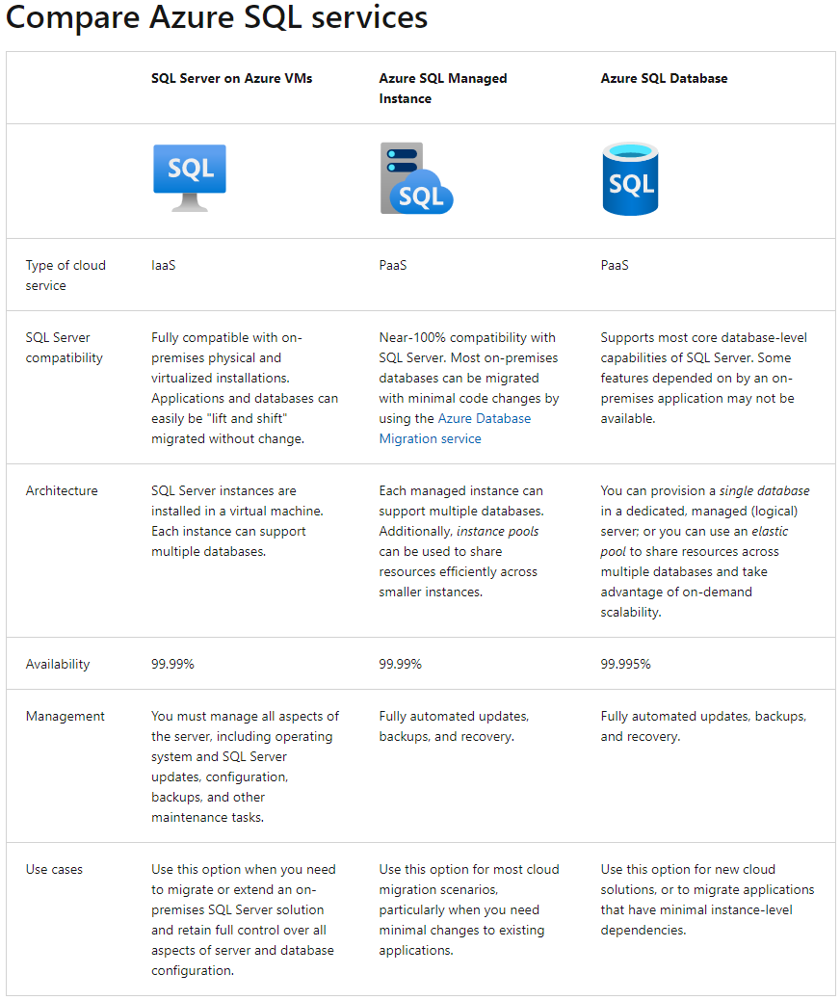
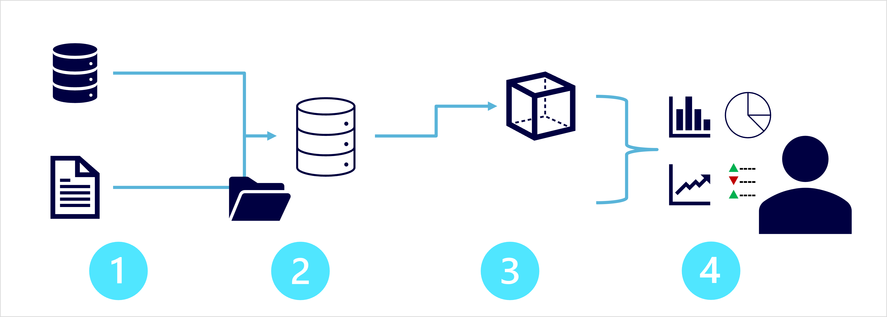

# DP-900 Azure Data Fundamentals
# Explore Data Concepts 

## Common Data Formats
- Data is a set of info (#s, obsv, desc, pics, graphics...) used to record information 
- data structures in which data is organized typically represent **ENTITIES** such as customers, products, sales... 
- Each entity typically has one or more **ATTRIBUTES** or characteristics (name, tyupe, address...)
- Comes in 3 general forms: Structured, Semi-Structured, Unstructured 

**Structured Data** : data that adheres to a fixed schema - all data has the same fields/properties and is tabular 
- data is stored in 1+ tables where rows represent instannces of the data entity & columns represent attributes of the entity 
- Generally this is stored in a database where a relational model is used with keys to relate different tables 

**Semi-Structured Data** : Information that has some structure - but allows for variation between entity instances (JSON)
- could have a customer with 1 or multiple addresses 

**Unstructured Data** : Text, pictures, video, audio, binary files... 

- **Data Stores** : store data in a format to record these details/events/info for further analysis 
    - File Storage (object/block/file system) 
        - data lakes
        - file system (NFS)
        - block (BLOB) storage 
        - optimized Blob for Data Lake Gen2
    - Databases
        - relational DBMS
        - NoSQL Databases
        - Analytical Databases 

## File Storage for data
- File storage is typically a specific file system, generally a centralized shared file system (often in the cloud) 
- File format is important and usually determined based off of: 
    - Type of data being stored (structured, semi, unstruct)
    - apps & services that need to r/w & process data
    - need for data to be readable by humans 
    - optimized for storage 
    - optimized for processing 
    - ?not mentioned - but security? 

### Common File Formats
- **Delimited Text Files** (csv)
    - plain text file with field delimiters & row terminators
    - TSV, space delimited, fixed width... 
    - most versatile and commonly used 
- **JSON** (JavaScript Object Notation)
    - hierarchical document schema used to define data entities (objects) that have multiple attributes 
    - each attribute may itself be an object (or collection of objects) making JSON flexible for structured & semi-struct data 
- **XML** (eXtensible Markup Language) 
    - human readable data formatting that JSON was designed to optimize
    - uses an html tagging system to define elements & attributes
- **BLOB** (Binary Large OBject) 
    - bytes of binary data are mapped to printable characters through encoding scheme (unicode, ascii...)
    - BLOBs are often the catchall term to describe image, video, audio and app specific docs 
- **Optimized File Formats** (Avro, ORC & Parquet) 
    - These enable compression, indexing, efficient storage and faster processing... 
    - **Avro** : row-based format created by Apache 
        - each record contains a header (in JSON) that describes the structure of the data in the record 
        - the data itself is stored as binary info 
        - the app will read the header and then parse binary data to grab what it needs 
        - Best used for compressing data and minimizing storage & network bandwidth 
    - **ORC** (Optimized Row Columnar format) : organizes data into columns rather than rows 
        - Designed by HortonWorks for optimizing r/w in Apache Hive (a data warehouse that supports fast SQL queries) 
        - ORC contains *stripes* of data : data for a column (or set of columns) that contains 
            - an index into the rows in each stripe 
            - the data for each row 
            - a footer with basic stats (count, min, max, sum...)
    - **Parquet** : another columnar data format 
        - created by Cloudera & Twitter 
        - it contains *row groups* ~ partitions of the block of data
        - data for each column is stored together in the same row group 
        - each row group contains one or more chunks of data 
        - a parquet file includes metadata that describes the set of rows found in neach chunk 
        - an application will browse the metadata, and then only read in the row group chunks of data AND the needed columns from those chunks it needs for processing 
        - it can store & process nested data types efficiently and has efficient compression & encoding

## Database Storage 
- Database is a central system in which data can be stored & queried - a dedicated system for managing data records rather than files
    - while technically it uses file system storage and an organized file system could be a "database" - it is built around data records and not file management 

### Relational & Non-relational DB
- **Relational Databases**: used to store & query structured data 
    - Each instance of an entity is assigned a primary key (PK) that uniquely identifies it and these can be stored in other tables to reference each other (customer bought which product...)
    - Can *normalize* a set of tables so that there is elimination of duplicate data values - degree of normalization depends on occurrence of duplicate values 
    - tables managed using SQL, typically based on ANSI std 
- **Non-relational Databases**: data management systems that don't apply a relational schema to the database - AKA NoSQL database, even if they do support some variant of SQL. Come in 4 types:
    - *Key-Value Databases*: key & value, where value is anything 
    - *Document Databases*: key-value where value is a JSON that system can parse & query 
    - *Column Family Databases*: store tabular data of rows & cols, but columns are in groups known as column-families that store innfo that's logically related 
    - *Graph Database*: store entities as nodes with links to define relationships between them 

## Transactional data processing solutions 
- records transactions that are specific events and info around the event that the org wants to track (purchases/payments, etc...)
- These often need to run and perform at scale with high-volume and sometimes handling millions of Tx per day 
- this work is often called OLTP (OnLine Transactional Processing)

- They often rely on a database where data storage is optimized for r/w operations where data is CRUD (created, retrieved/read, updated, deleted)
- To ensure integrity of the data, it needs to follow **ACID**: 
    - *Atomicity*: each transaction is treated as a single unit which succeeds or fails completely 
        - For example to transfer funds, it must debit one and credit the other. If either one fails, the entire action should fail.
    - *Consistency*: transactions can only take data in the db from one valid state to another 
        - Transfer funds example - there is a "before" funds transferred and "after" funds transferred 
    - *Isolation*: concurrent transactions cannot interfere and must remain independent 
        - while transfer funds is occurring, when user looks at account balance the value retrieved must reflect the action !!! Better example here
    - *Durability*: when a transaction has been committed, it will remain committed 
        - after transfer complete, if DB restarts the transaction should remain completed and not retry, or be forgotten 
- OLTP that support live apps & process biz data are called: *LOB apps*

## Analytical data processing solutions 
- generally uses mostly read-only systems that store vast volumes of historical data or biz metrics 
- analytics can be performed for data at a given point in time, or across a time-series of snapshots 

- Common Enterprise flow: 
    - Data files stored in data lake
    - ETL process copies files & OLTP db biz metrics into a DW that's optimized for read 
    - DW schema is based on fact tables that contain numeric values & dimensions for classifications 
    - DW is aggregated and loaded into OLAP for aggregated views of sales by customer/product, etc... 
    - data is queried at various points to generate reports, dashboards and other visualizations 

- Data Lakes: large volume of file-based data must be collected & analyzed 
- DW: Est way to store data in a relational schema that is optimized for read operations (often) to support reporting & data viz
    - may require some denormalization (introducing duplication of data) for faster queries/reads 
- OLAP model: an aggregated type of data storage that's optimized for analytical workloads 
    - predefined aggregations that allow quick hierarchical views of data 

- Different users work at different stages: 
    - Data scientists may work with files in datalake to explore/model data
    - data analysts may query tables in DW to create reports & visualizations 
    - business users may consume data from OLAP, dashboards or reports 

## Data Professional Roles & User Types
- Many roles involved in managing, controlling & using data. It's important to understand common division of tasks & responsibilities 
    - in the real world things are not as clear, and sometimes a person might perform multiple roles 
    - various roles orgs apply to data professionals, the tasks and responsibilities and the MSFT azure services they might use

- **DB Admins** : manage db, assign permissions to users, store backup copies of data & restore during failure/recovery 
    - responsible for design, implementation, maintenance and operation of on-prem/cloud databases 
    - responsible for avail, performance, & health of db - and setup DR/HA with RTO/RPO 
    - manage security of data by granting privileges or denying access as appropriate 
- **Data Engineers** : manage infra & processes for data integration across org, applying data cleaning, data govn and implementing pipelines to transfer & transform data btw systems 
    - collaborates with stakeholders to design & implement data-related workloads (ingestion pipelines, cleansing & transformation, data stores for workloads...) 
    - because data is stored in so many places - they often work with SQL, NoSQL dbs, file stores, data streams... from a variety of software vendors & types 
    - reponsible for ensuring privacy of data is maintained and management & operation of data pipelines to ensure data accuracy & lineage
- **Data analysts** : explore and analyze data to create visualizations & charts that enable orgs to make informed decisions 
    - enables businesses to maximize value from data assets by researching questions or looking for insights to take action on 
    - explore data to ID trends & relationships
    - design & build analytical models
    - enable analytics through reports/visualizations 
- Honorable mentions: *data scientist* *data architect* *application developer* *software engineer* 

## Data Services in Azure 
- as a cloud platform it has many commonly used data services for a variety of use-cases. Here are the most commonly used ones: 
- **Azure SQL** (MS SQL for the cloud) 
    - collective name for a family of db solutions basesd on the MSFT SQ Server db engine:
        - *Azure SQL Database* - fully managed PaaS db hosted in Azure 
        - *Azure SQL Managed Instance* - hosted instance of SQL server with automated maintenance, but with more flexible config than Azure SQL db and admin responsibility
        - *Azure SQL VM* - a VM with SQL server installed, allowing the owner to have full admin nresponsibility & configurability 
    - DB admins typically provision & manage SQL db systems to support LOB apps that need to store Tx data 
    - Data Eng may use SQL database systems as sources for data pipelines that ingest this Tx data into an analytical system 
    - Data analysts may query these db to create reports - but it is often combined with other sources to perform a comprehensive enterprise analytics 
- **Azure DB for OSS Relational DB** (MySQL, MariaDB, PostgreSQL)
    - ~ AWS RDS managed instances, persona usage follows Azure SQL
    - *Azure Db for MySQL* - simple OSS dbms used commonly in LAMP stacks (Linux, Apache, MySQL & PHP) 
    - *Azure db for MariaDB* - a new dbms created by original devs of MySQL, it has been rewritten & optimized for perf, and offers compatibility with Oracl DBMS
    - *Azure db for PostgreSQL* - a hybrid relational-object db, can store relational tables, and can store custom data types with their own non-relational properties 
        - best overall pick 
- **Azure Cosmos DB** ~ AWS DynamoDB 
    - a global scale NoSQL (non-relational) db that supports multiple APIs that allow you to store & manage data as JSON docs, key-value pairs, column families & graphs 
    - In some orgs - cosmosDB instances may be provisioned and managed by db admin, it is typically managed by software devs as part of overall app arch 
    - Data engineers often integrate with this as a data source into enterprise analytics tools that support modeling & reporting 
- **Azure Storage** (storage accounts)
    - a core Azure service that allows you to store data in BLOB containers, file shares & tables (key-value storage for apps that need to r/w values quickly)
    - data engineers use azure storage to host data lakes using special BLOB storage with hierarchical namespace that enables files to be organized folders in a distr file system 
- **Azure Data Factory** 
    - can build/define & schedule data pipelines to transfer & transform data 
    - can integrate with other Azure services, used by data engineers to ETL 
- **Azure Synapse Analytics**  
    - comprehensive, unified data anlytics solution that provides a single service interface for: 
        - pipelines using data factory tech
        - SQL db engine for DW workloads 
        - Apache Spark (java, scala, python & sql)
        - Azure Synapes data explorer: High Perf data anlytics optimized for RT log queries and telemtry data using Kusto Query Language (KQL) 
- **Azure Databricks** 
    - Azure integrated version of Databricks platform which combines apache spark data processing, with SQL db semantics and an integrated management interface to enable large-scale data analytics 
    - used by data eng for analytical data stores for data scientists & allows data analysts to use their notebook to visualize and do basic queries 
- **Azure HDInsight** (Apache ecosystem - hadoop, spark, HBase & Kafka)
    - provides azure hosted clusters for apache OSS data processing tech
    - Apache Spark: distr data processing system
    - Apache Hadoop: distr system that uses MapReduce to process large volumes of data efficiently across multiple cluster nodes - can be written in Java or through Hive SQL API 
    - Apache HBase - OSS for NoSQL data storage & queries
    - Apache Kafka - message broker for data stream processing  
    - primarily used by data engineers to support large analytics workloads using a variety of Apache software
- **Azure Stream Analytics** 
    - RT streaming engine that catpures stream of data from an input, applies a query to extract & manipulate data from the stream & writes output for analysis or further processing 
    - Data Eng can use this into data archs that capture streaming data for ingestion or RT visuals/reports 
- **Azure Data Explorer** 
    - stand alone service that offers same high perf queries of log & telemetry data as Azure synapse data explorer 
    - can be used by analysts to query & analyze data that includes timestamps... 
- **Microsoft Purview** 
    - enterprise-wide data govn and discoverability 
    - creat a *MAP* of data and track data lineage across multiple data sources & systems enabling trustworthy data for analysis & reporting 
    - Data Eng used to enforce data govn across enterprise and ensure integrity of data
- **Microsoft Power BI** 
    - platform for analytical data modeling and reporting used by data anlysts to create & share interactive data visualizations & reports 
    - can be created through desktop app, and published through web reports and even Mobile 


# Explore Relational Data in Azure
- data was often in its own unique structure that was inefficient, hard to maintain and hard to optimize for app performance or use for analytics 
- Relational database model was designed to solve the problem of arbitrary data structures 
- relational model provides a way of representing & querying data that can be used by any app
    - key advantage is use of tables, an intuitive, efficient and flexible way to store and access structured info 
- simple, yet powerful is used for all sorts of needs - tracking inventories, mission critical systems... etc 

## Relational Data Concepts 
- Model collections of entities from the real world as tables - generally objects & events
    - each row is a particular instance of an object or event
    - each column is an attribute or piece of information that describes or provides context around the obj/event 
- Sometimes info can be missing (NULL) 
- columns are often a particular datatype (date, integer, string, decimal, ...)
- **Normalization** is a term used by db professionals for schema design process that minimizes data duplication & enforce data integrity 
    - while there are many complex rules that go into refactoring the various forms of normalization it boils down to: 
    1. separate each entity into its own table 
    2. separate each discrete attribute into its own column 
    3. uniquely identify each entity instance (row) using a PK 
    4. Use FK cols to link related entities 
- Now, when you update a customer address you update 1 row in 1 table, and not multiple times across multiple tables... 
    - can also filter based on a particular column of info - like address or city or state - can't do that if they are all jumbled together 
- RDBMS generally assists in enforcing referential integrity
- can setup a composite key (a combo of multiple unique columns) to create a unique "PK" 

### SQL 
- Structured Query Language to read, add, update, delete, create, drop info from database 
    - originally standardized by ANSI in '86 and ISO in '87 - but many vendors now have their own flavors 
        - Transact SQL (TSQL) used by MSFT SQL server & azure sql services
        - pgSQL for postgresql 
        - PL/SQL used by oracle for procedural language SQL 
- DBMS have additional proprietary extensions to handle specs of their unique DBMS and have extended the language 
- SQL has several statement types DDL, DCL & DML
- **Data Definition Language DDL** 
    - create schemas before you add data to them - create, modify table or other db objects (stored procs, views...)
    - create tables/views, alter table to add a new col, drop table (no CTL+Z here!), rename obj
    - can create columns with specific data types (int, decimal, varchar), add labels and specify whethery they are nullable 
- **Data Control Language DCL** 
    - Grant : grant permission to perform specific actions
    - Deny : deny permission to perform specific actions 
    - Revoke : remove a previously granted permission
```sql
GRANT SELECT, INSERT, UPDATE
ON Product
TO user1;
``` 
- **Data Manipulation Language DML** (query language)
    - DML manipulates rows in tables - to retrieve/query data, insert new rows, modify existing, or delete rows 
    - SELECT/INSERT/UPDATE/DELETE 
    - insert does 1 row at a time, the others apply to the ENTIRE table - use where clauses to segment data your update/select/delete action is performed on
    
### Database Objects (Views, Stored Procs, Indexes)
- **View** - virtual table based on results of select query - a "window" on specified rows or underlying tables 
    - access this as a "table" and it runs the query behind the scenes to generate a table that you can then use 
- **Stored Procedure** - defines SQL statements that can be run on command (a program)
    - store program logic in a db for actions that apps need to perform when working with data 
    - (change name of product name of given ID) - you pass the ID and the new product name and it does the change!
```sql
CREATE PROCEDURE RenameProduct
	@ProductID INT,
	@NewName VARCHAR(20)
AS
UPDATE Product 
SET Name = @NewName
WHERE ID = @ProductID;

EXEC RenameProduct 201, 'Spanner';
```
- **Indexes** : help search for data in a table ~ back of a book with shortlist of references and the page you need to go to, makes it much faster to find info needed 
    - you specify a column from the table and the index contains a copy of this data in a sorted order with pointers to the corresponding rows in the table 
    - when you run a query with WHERE - it can fetch data faster using the index rather than scanning row by row 
    - best used on LARGE tables where a particular column is regularly queried 
    - BUT indexes are updated upon insert, update & delete operations, if you have too many it can slow those operations down 
    - need to strike a balance between indexing for query speed and write speed 


## Relational DBMS in Azure 
- in Azure, they can offer DBMS as PaaS so you can pay for Azure to manage security, tuning, perf, scalability, HA... 

### Azure SQL Services 
- Azure SQL is a collective term for a family of MSFT SQL based dbms
- SQL Server on VM & Managed Instance have same availability 
- for Azure SQL Database - you can re-use your existing enterprise license for SQL server

- **SQL Server on Azure VMs**: IaaS solution that virtualizes hardware as a VM running in Azure with installation of SQL server 
    - you pick the SQL Server edition (Enterprise, Standard, Web... free license on a particular OS)
    - *Use-cases*: Great for lift n shift migrations OR when you need FULL control over all aspects of server & db config OR rapid dev & test of ideas without on-prem, non-prod SQL server 
    - *Compatibility*: Fully compatible with on-prem MS SQL enabling lift n shift without changes 
    - *Tech Stack*: MS SQL DBMS installed on a single VM - can run multiple DB on that VM 
    - *Owner Responsibility*: you MUST manage all aspects from OS on up - all dbms updates, configs, backups etc... 
    - mimics on-prem MSFT SQL - just running in Azure 
        - can be used to extend to a hybrid cloud model by extending apps & databases into the cloud 
        - you have full admin rights over DBMS & OS 
        - easy vertical scaling add memory, CPU, disk... 
    - can use same set of server products, dev tools & expertise across envm 

- [**Azure SQL Managed Instance**](https://learn.microsoft.com/en-us/azure/azure-sql/managed-instance/sql-managed-instance-paas-overview?view=azuresql): PaaS middle option that provides with middle option between IaaS & full PaaS
    - *Use-cases*: general cloud migration to Azure with minimal app changes
        - if you used linked servers, service broker (message system to distr work across servers), or db mail - should use managed instance
        - can be deployed on-prem or in another cloud using Azure Arc
    - *Compatibility*: near 100% compatibility & most on-prem dbs can be migrated with minimal code changes using Azure DB Migration service 
        - can install Data Migration Assistant to check compatibility with this 
        - uses Az AD to perform logins with a user/pass and can use Az AD so your computer is trusted and you only need to login once 
    - *Tech Stack*: Managed Instance can support multiple dbs, can use instance pools to share resources across smaller instances 
    - *Owner Responsibility*: Azure will perform auto software updates, backups, recovery, db monitoring and other general tasks. You control security & resource allocation for db
    - managed instances rely on Azure services for the automated tasks it performs: Azure Storage for backups, Azure Event Hubs for telemetry, Azure AD for authc, Azure Key Vault for data encryption... 
        - all comms are encrypted using signed certs, they validate trustworthiness of servers talking to them through cert lists and has a revokation/black list
    - enables sys admin to spend less time on admin tasks as service performs or simplifies those tasks for you 
        - OS & DBMS software install, patching, instance vertical scale up/down, config, backups, DB replication, HA config & monitoring/health 
    
- **Azure SQL Database**: full PaaS designed for cloud
    - *Use-cases*: best for new app dev in the cloud that needs latest stable SQL Server features, apps that require HA, systems with variable load that need to scale up/down, migrate apps that have low impact on db adjustments... 
    - *Compatibility*: supports core db capabilities, some features of on-prem are not available 
    - *Tech Stack*: can be setup as a *single* db in dedicated server, or an *elastic pool* to share resources across multiple dbs and take advantage of on-demand scalability 
    - *Owner Responsibility*: ?just write queries? 
    - you create a managed dbms and then deploy your databases on that server - SQL database is a construct that acts as central admin point for single or pooled dbs, logins, firewall, audit, threat detection & failover... 
        - Single Database: quickly setup & run a SQL server DB - create a db server and access db through this server 
            - since azure manages the server, all you do is configure db, create tables and fill with data
            - can vertically scale 
            - can be setup as a "serverless" config - where MSFT creates its own server which might be shared with other tenants and scales up/down as needed 
        - Elastic Pool: now runs multiple databases on the same resources (memory, data storage space and processing power - a "pool" of resources) 
            - cost effective way of managing multiple dbs with varied usage
        - Database server:  a way to manage groups of single dbs & elastic pools 
    - best option for low cost with minimal admin - not fully compatible with on-prem installs, but you can run Data Migration Assistant to see 
    - Az auto updates & patches SQL server software so you are always running latest
        - Az allows easy scale up/down of server without upgrade... 
        - service provides HA guarantees 99.995% with point-in-time restore and DR replication to other AZ regions 
        - advanced threat protection and security with vulnerability assessments, can detect anomalous activities and monitor db for suspicious activities... 
        - auditing tracking with extensive logs for reg compliance, and tracking db activities
        - securely encrypt data at rest or when transferred 
- **Azure SQL Edge**: SQL engine optimized for IOT that needs to work with streaming time-series data 

### Azure DBMS for OSS (MySQL, MariaDB & PostgreSQL)
- popular OSS rdbms - hosting in Azure you get these benefits: 
    - HA config by default 
    - predictive performance 
    - pay as you go pricing 
    - easy vertical scaling up/down 
    - securing data at rest/in-motion 
    - auto backup & point-in-time restore for 35 days 
    - enterprise grade security and compliance 

- **Azure DB for MySQL** : a PaaS implementation of the community edition
    - MySQL itself began as simple OSS DBMS that got used in LAMP stack - popularized by Facebook & has community, std & enterprise editions
    - includes HA config at no additional cost, scalability as needed, automated backups with point-in-time recovery, & you only pay for what you use 
    - provides connection security for firewall, SSL, and can set max # of connections, timeouts, lock modes, etc 
    - just like Az SQL Db - don't have to do hardware, network, VM, OS or dbms patching... 
        - you WON'T be able to perform certain security & admin features as Azure performs those on your behalf 
- **Azure DB for MariaDB** : a PaaS implementation of the community edition 
    - MariaDB itself is newer dbms from MySQL creators that's been rewritten to optimize performance and compatibility with Oracle 
    - one added capability is temporal data - table can hold several versions of data allowing an app to query data as it appeared sometime in the past 
    - Azure does full management and controlling of the dbms - requiring next to 0 admin
- **Azure DB for PostgreSQL** : a PaaS implementation of Postgresql 
    - PostgreSQL itself is hybrid relational-object db, can use relational tables or custom data types - uses pgsql
    - dbms is extensible and you can add code modules, and can store and manipulate geometric data such as lines, circles & polygons
    - *some features aren't available* - primarily with extensions to db: writing stored procs in languages other than pgsql and interacting with OS 
        - core set is available 
    - Deployment options: 
        - single server - default 1 dbms on a VM
        - Azure DB for PosstgreSQL Flexible server - is a more flexible PaaS offering with high config/customization controls 
        - Azure ARC enabled PSQL 
    - Azure Cosmos DB for PSQL - a doc db store for PSQL
    - pgAdmin can be used to manage/monitor PSQL db, and can be used to connect to Azure DB for PSQL - but you can't do backup/restore as that's managed by Az now
    - stores audit trail of querires run in db called `azure_sys` and can query the `query_store.qs_view` table to view it and monitor queries run 

 

# Explore Non-Relational Data in Azure 
- many software apps need to store data, when not in relational databases using SQL, there are many options
## Azure Blob Storage 

- a service that enables you to store massive amounts of unstructured data as BLOBs in the cloud 
    - efficient way to store data files in a format optimized for cloud based storage that apps can r/w to them using APIs
- Blobs are stored in containers - they are a convenient way of grouping related blobs together and assigning ACLs 
- Within a container, you can organize blobs in a hierarchy of virtual folders 
    - but really it's just a long text name with '/' as an arbitrary delimiter ! Spelling Matters ! 
    - because these are not true "folders" you cannot perform bulk actions on these or control access to these "folders" 
### Types of Blobs
- **Block Blobs**: handled as a set of blocks that range in size up to 100MB sized blocks 
    - can contain up to 50k blocks, providing max size of over 4.7 TB 
    - block is smallest amount of data that can be r/w as a indv unit 
    - used for discrete, large binary obj that change infrequently 
- **Page Blobs**: a collection of fixed size 512 byte pages 
    - optimized to support random r/w ops and can fetch and store data for a single page if necessary 
    - can hold a max of 8 TB of data
    - can be used as virtual disk storage for VMs 
- **Append Blobs**: block blob optimized for appends
    - you can only add blocks to the end of an append blob, updating or deleting existing blocks isn't supported 
    - blocks can vary in size up to 4 MB, max size is 195 GB 

- Storage tiers of Hot, Cool & Archive... 
- can create lifecycle mgt policies for blobs within a storage account to automatically move from Hot -> Cool -> Archive as it is used.
    - can even set a delete policy 

## Azure DataLake Storage Gen2 
- Gen1 is a separate service for hierarchical data storage for analytical data lakes that allows you to work with struct, semi-struct & unstruct data in files
- Gen2 is integrated into azure storage -> now can use blob storage and cost control policies of storage tiers and hierarchical file system capabilities 
- Hadoop, Azure DB, Synapse analytics can mount a distr file system in Az Data Lake Store Gen2 and use it to process huge volumes of data 
- to create it, you MUST enable **Hierarchical Namespace** option & create a blob container in the azure storage account either upon creation, or "upgrading" the storage account 
    - upgrading/altering a storage account to support hierarchical namespace is NOT reversible, once done, you are stuck with it 
    - from [hierarchical namespace](https://learn.microsoft.com/en-us/azure/storage/blobs/data-lake-storage-namespace): appears to enable file system setup of directories UNDER a container - unlike standard blob storage 


> NOTE THE HIERARCHICAL NAMESPACE - DIFFERENT FROM PLAIN BLOB STORAGE 


## Azure Files 
- file shares enable you to store file on one computer and grant access to that file to users & apps running on other machines 
    - works great for LAN, but doesn't scale well if users are spread out across geography 
- Azure Files creates a cloud-based NFS to make files available to a broad set of users 
    - NOT to be confused with File Synch which extends Azure File Storage so that on-prem files can be shared more easily with users at other sites 
    - hosting in Azure allows you to eliminate hardware costs, maintenance overhead and benefit from HA & scalable cloud storage 
- File storage is one of the types of storage accounts & data can be distr across any # of file shares
- max limit is 100 TB per storage account, max size of a single file is 1 TB (can set quota limits below that), max 2000 connections per shared file 
- after you've created a storage account, you can upload through Az Portal, AzCopy or Az File Synch 
- **Standard Tier**: HDD hardware **Premium Tier**: SSDs - higher throughput for extra $
- NFS Protocol used by linux/macOS -> requires Premium tier storage and VNET through which access can be controlled 
- SMB (server message block) for common connections

## Azure Tables 
- a NoSQL storage solution that uses tables containing key/value data items - *NOT like a relational db table*
- enables storage of semi-struct data
- The unique KEY in the table is: (Partition key & row key) 
    - items in partition are stored in row key order 
    - allows an app to perform point queries that ID a single row & range queries that fetch a block of rows in a partition 
- when you modify data, a timestamp col records dttm of modification made - after that, any other columns needed are entirely up to the user
- No concept of FKs, relationships, stored procs, views... that come with relational db 
    - this is just pure denormalized data
- To enable fast access - az table splits table into partitions - grouping related rows on a common property or partition key  
    - partitions are indp of one another, and can grow/shrink as indv units
    - no limit to # of partitions 
    - searching data can involve partition key - allows you to narrow down vol of data to be reviewed and can reduce I/O to locate data 


## Cosmos DB Fundamentals 

- relational database restrictions can be a PITA - so can use NoSQL db for more flexibility and store a variety of info
    - store documents, graphs, key-values, and column family
- CosmosDB is the HA, globally scalable NoSQL DBMS 

### Basics of Cosmos DB
- supports multiple APIs that allow devs to use semantics of many kinds of data store to work with it 
    - internal data structure is abstracted allowing for simpler & more familiar store/query APIs 
- uses indexes & partitioning to provide fast r/w perf and can scale to massive volumes 
- *enable multi-region writes* so that you can globally distr your data and users can each work with data in their local replica 
    - need to adding regions to your choice so CosmosDB 
- By default - Cosmos DB
    - allocates space in a container for your partitions that can be max 10 GB each 
    - indexes are created & maintained automatically 
    - foundational service that is regularly used by MSFT and mission critical 

- **Use-cases**: [highly scalable global NoSQL DBMS](https://learn.microsoft.com/en-us/azure/cosmos-db/use-cases)
    - IOT & Telematics: systems usually dump data at regular intervals => Cosmos DB can handle big volume writes 
        -  Data can be then fed to downstream analytics (ML, Azure HDInsight & PowerBI)
        - can process data in RT using Azure Functions as it arrives 
    - Retail & Marketing: MSFT uses Cosmos DB for its own e-commerce platforms for Windows Stores & XBox Live
        - storing catalog data & event sourcing for processing pipelines 
    - Gaming: db tier is crucial for gaming - graphics processing done locally, but use cloud to deliver customized content 
        - in-game stats, social media integration, leaderboards... and need millisecond latencies for r/w with high vol spikes for releases/specials.. 
    - Web & Mobile Apps: storing & modeling social interactions, integrating with 3rd party, enriching UI... 

### Cosmos DB APIs 
- can support both relational / non-relational workloads & you can migrate PSQL, MongoDB & Apache Cassandra to it 
- when you create Cosmos DB, you select a db engine you want to use
- **Cosmos DB for NoSQL**: MSFT native non-relational service - manages data in JSON doc format and allows SQL syntax to manage data 
    - fast, flexible dev with SQL & client libraries for .NET, javascript, python & java
- **Cosmos DB for MongoDB**: popular OSS db which data is stored in Binary JSON (BSON) 
    - great for migrating from MongoDB 
    - can use MQL: compact, obj oriented syntax where devs use objects to call methods (dot operators like js `db.products.find({id: 123})`)
- **Cosmos DB for PSQL**: native PSQL globally distr db that auto shards data so you can build highly scalable apps  
    - as you grow - this automatically can scale up 
    - can even run as a relational dbms
- **Cosmos DB for Table**: Work with Azure Table Storage using the key-value stores 
    - can enhance scalability & perf from a traditional table  
- **Cosmos DB for Apache Cassandra**: OSS db with column family struct where each row doesn't have to have the same cols
    - great for migrating apache cassandra over to azure
- **Cosmos DB for Apache Gremlin**: data in a graph structure
    - entities are defined as vertices that form nodes in a connected graph 
    - includes functions to operate on vertices & edges allowing you to CRUD graph data 

- When creating Cosmos DB you need to pick between Provisioned Throughput or Serverless 
    - **Provisioned Throughput** 
        - this is your global traffic and guaranteed performance - best for sustained traffic requiring predictable perf
        - billing is done through Request Units (RUs) a throughput that you set (this is autoscalable)
        - Billed per HOUR on the RUs you reserved, regardless of how many consumed 
        - NO limit of storage per container
    - **Serverless** 
        - budget option for intermittent/unpredictable traffic that stays within normal bounds
        - runs db ops against containters so you don't dedicate provisioned capacity 
        - ONLY runs in ONE region, has 1 TB limit of storage per container 
        - slower reads & writes
        - *billed only on RUs consumed* 
- to enable globally distr users their own local replica of cosmost

# Explore Data Analytics in Azure 

## Data Warehousing - BI & Analytics
- large scale DW support BI, usually moving data from transactional data stores into RDBMS with a designed big schema optimized for queries & model dev 
- Big Data processing involves large volumes of data in multiple formats - which is batch loaded and stored in a data lake where distr processing engines (Apache Spark) are used to process it 

### DW Arch & Process



1. **Data Ingestion & Processing** 
    - reading data from transactional data stores, file, RT streams, etc... all get loaded into data lake or DW 
    - typically performs ETL or ELT so that landed data is optimized for analytical queries 
    - large scale data ingestion best done using pipelines created through Azure Data Factory or Synapse Analytics 
    - one or more activities that operate on data reading from input through combinations, manipulations etc... to create final output 
    - pipeline activities can use built-in or use *linked services* to load and process data - so you can use right tech for each step fo the workflow: 
        - use Blob store to ingest, then SQL database to run a stored proc, then do data processing in Databricks or HDInsight... 

2. **Analytical Data Store - DW or DL** 
    - the relational DW itself, filesystem based data lakes, or hybrid arch data lakehouse 
    - DW is relational DB where data is stored in a schema that's optimized for analytics rather than transactional workloads 
        - generally stored in star schema format with fact & dimension tables... or expanded into a "snowflake" schema 
        - great for structured data and SQL analysis 
    - DL data lake is typically a distr file store with Hi Perf data access 
        - usually Spark/Hadoop is used to query these stored files for reporting/analytics 
        - "schema-on-read" where semi-struct data is read for analysis, but doesn't matter the format once stored 
        - can handle full mix of data without schema write constraints 
    - Data Lakehouse tries to bring the best of both worlds 
        - raw data stored as files in DL, and relational storage layer abstracts underlying files exposing them as tables which can be accessed through SQL 
            - I.E.: SQL Pools in Azure Synapse analytics includ *PolyBase* - allow you to define external tables based on files in a data lake and query them using SQL 
            - Synapse analytics supports a Lake Database approach where you can use DB Templates to define relational schema of DW - while storing in Data lake 
        - Delta Lake (databricks approach) adds relational storage capabilities to spark : define tables that enforce schema & transactional consistency... 
            - it can batch load or handle streaming services & provides a SQL API for queries 
    - Azure Synapse Analytics: 
        - e2e solution for data analytics (analytics platform) combining data integrity, scalable HiPerf SQL server with relational DW flexibility of data lake and apache spark 
        - native support for log & telemetry analytics with Data explorer pools, data pipelines for data ingestion & transformation
        - through a single UI called Studio - create interactive notebooks with spark code/markdown content... 
        - can use SQL or Apache Spark to query data
        - single UNIFIED analytics solution on Azure 
    - Azure Databricks: 
        - azure implementation of databricks a comprehensive data analytics solution built on Apache Spark with native SQL capabilities & workload optimized spark clusters for analytics & data science 
        - interactive UI and cloud extensibility as it runs on multi-cloud
    - Azure HDInsight: 
        - OSS framework support for Hadoop etc... Can take more admin work 

3. Analytical Data Model 
    - while analysts & data scientists can work with data directly in the data store - it's easier to aggregate
    - Common aggregation of data is "cubes" metrics aggregated across predefined hierarchical dimensions that allow you to drill down/up
    - relate data values & dimensional entities... 
4. Data Visualization 
    - analysts consume data from analytical models & analytical stores to create reports/dashboards etc... 
    - either self service reports, or go to common dashboard view 
    - shows trends, comparisons, KPIs, etc.. all with security controls and ability to export & share and explore 

## RT Analytics 

## Data Visualization