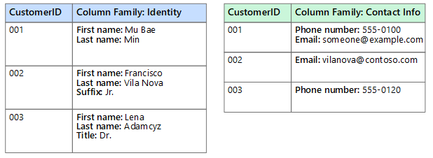
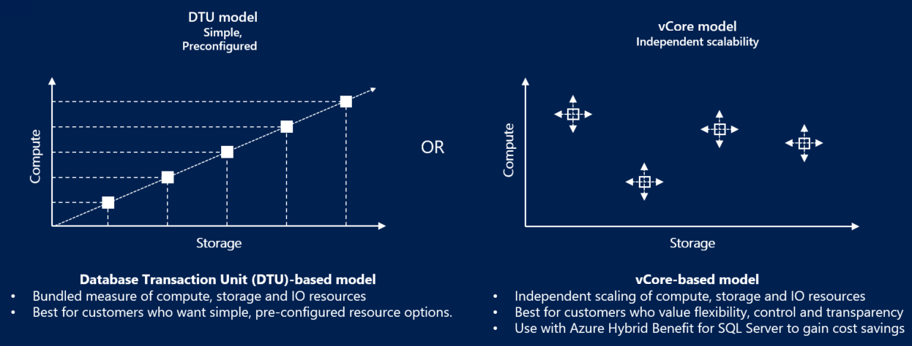
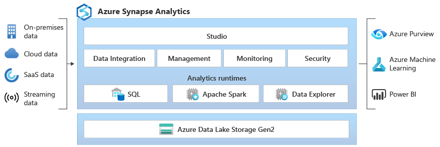
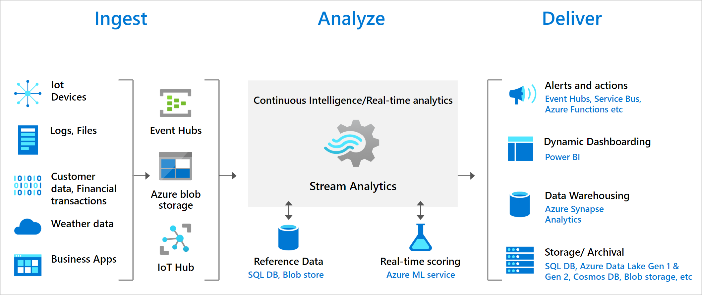
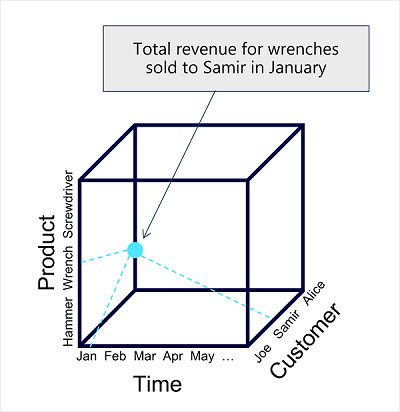
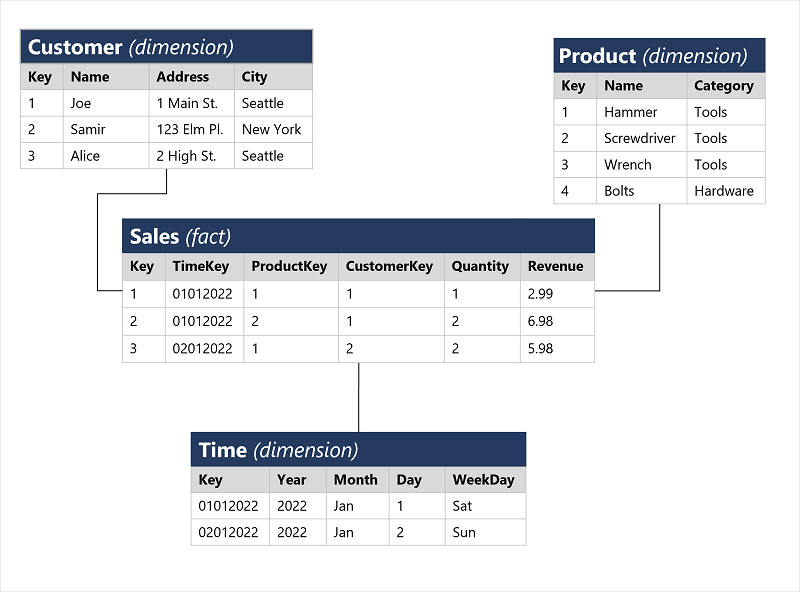

# DP-900 Azure Data Fundamentals
# Explore Data Concepts 

## Common Data Formats
- Data is a set of info (#s, obsv, desc, pics, graphics...) used to record information 
- data structures in which data is organized typically represent **ENTITIES** such as customers, products, sales... 
- Each entity typically has one or more **ATTRIBUTES** or characteristics (name, tyupe, address...)
- Comes in 3 general forms: Structured, Semi-Structured, Unstructured 

**Structured Data** : data that adheres to a fixed schema - all data has the same fields/properties and is tabular 
- data is stored in 1+ tables where rows represent instannces of the data entity & columns represent attributes of the entity 
- Generally this is stored in a database where a relational model is used with keys to relate different tables 

**Semi-Structured Data** : Information that has some structure - but allows for variation between entity instances (JSON)
- could have a customer with 1 or multiple addresses 
    - Key-Value, Documents (JSON), graph db... 
- structure is not strict - often stored in noSQL dbs

**Unstructured Data** : Text, pictures, video, audio, binary files... 
    - pretty much can only be stored in file storage 
    - block storage of data on disk through Azure Disks 
    - File Share through Azure Files (NFS) to share across multiple VMs
    - Object storage to access data via API through Azure Blob Storage 

- **Data Stores** : store data in a format to record these details/events/info for further analysis 
    - File Storage (object/block/file system) 
        - data lakes
        - file system (NFS)
        - block (BLOB) storage 
        - optimized Blob for Data Lake Gen2
    - Databases
        - relational DBMS
        - NoSQL Databases
        - Analytical Databases 

## File Storage for data
- File storage is typically a specific file system, generally a centralized shared file system (often in the cloud) 
- File format is important and usually determined based off of: 
    - Type of data being stored (structured, semi, unstruct)
    - apps & services that need to r/w & process data
    - need for data to be readable by humans 
    - optimized for storage 
    - optimized for processing 
    - ?not mentioned - but security? 

### Common File Formats
- **Delimited Text Files** (csv)
    - plain text file with field delimiters & row terminators
    - TSV, space delimited, fixed width... 
    - most versatile and commonly used 
- **JSON** (JavaScript Object Notation)
    - hierarchical document schema used to define data entities (objects) that have multiple attributes 
    - each attribute may itself be an object (or collection of objects) making JSON flexible for structured & semi-struct data 
- **XML** (eXtensible Markup Language) 
    - human readable data formatting that JSON was designed to optimize
    - uses an html tagging system to define elements & attributes
- **BLOB** (Binary Large OBject) 
    - bytes of binary data are mapped to printable characters through encoding scheme (unicode, ascii...)
    - BLOBs are often the catchall term to describe image, video, audio and app specific docs 
- **Optimized File Formats** (Avro, ORC & Parquet) 
    - These enable compression, indexing, efficient storage and faster processing... 
    - **Avro** : row-based format created by Apache 
        - each record contains a header (in JSON) that describes the structure of the data in the record 
        - the data itself is stored as binary info 
        - the app will read the header and then parse binary data to grab what it needs 
        - Best used for compressing data and minimizing storage & network bandwidth 
    - **ORC** (Optimized Row Columnar format) : organizes data into columns rather than rows 
        - Designed by HortonWorks for optimizing r/w in Apache Hive (a data warehouse that supports fast SQL queries) 
        - ORC contains *stripes* of data : data for a column (or set of columns) that contains 
            - an index into the rows in each stripe 
            - the data for each row 
            - a footer with basic stats (count, min, max, sum...)
    - **Parquet** : another columnar data format 
        - created by Cloudera & Twitter 
        - it contains *row groups* ~ partitions of the block of data
        - data for each column is stored together in the same row group 
        - each row group contains one or more chunks of data 
        - a parquet file includes metadata that describes the set of rows found in neach chunk 
        - an application will browse the metadata, and then only read in the row group chunks of data AND the needed columns from those chunks it needs for processing 
        - it can store & process nested data types efficiently and has efficient compression & encoding

## Database Storage 
- Database is a central system in which data can be stored & queried - a dedicated system for managing data records rather than files
    - while technically it uses file system storage and an organized file system could be a "database" - it is built around data records and not file management 

### Relational & Non-relational DB
- **Relational Databases**: used to store & query structured data 
    - Each instance of an entity is assigned a primary key (PK) that uniquely identifies it and these can be stored in other tables to reference each other (customer bought which product...)
    - Can *normalize* a set of tables so that there is elimination of duplicate data values - degree of normalization depends on occurrence of duplicate values 
    - predefined schema with relationships & constraints 
    - tables managed using SQL, typically based on ANSI std 
> Below has been enhanced with Udemy & info from [data store overview](https://learn.microsoft.com/en-us/azure/architecture/guide/technology-choices/data-store-overview)
- **Non-relational Databases**: data management systems that don't apply a relational schema to the database - AKA NoSQL database, even if they do support some variant of SQL. Come in 4 types:
    - *Key-Value Databases*: key & value, where value is anything 
        - ~ Hash Map - where you have a key (unique ID) and a value - string, complex obj or JSON file... 
        - *simple lookups* using query by keys (NOT optimized for query by values) - basically you MUST use a key to store/retrieve your value
        - generally used for session info or caching data  
        - Best for Azure Cosmos Table DB API or Azure Table Storage 
    - *Document Databases*: key-value where value is a JSON that system can parse & query 
        - optimized for retrieval
        - can have a root object with attributes, child attributes and arrays that can hold sets of information for a particular attribute 
        - unique ID (key) is usually very important as it is how they are retrieved - as these are often indexed 
        - app defined schema: allows application to handle variations in data 
        - definition of "denormalized data" - where all info relating to a particular entity is in ONE table - but multi address could lead to duplication... 
        - think Azure Cosmos DB NoSQL & MongoDB => you CAN query based on document attributes (customer name...)
            - product catalog, profile, shopping cart... HIGH Tx entities 
    - *Column Family Databases*: store tabular data of rows & cols, but columns are in groups known as column-families that store info that's logically related 
        - you have a number of set of col families ~ relational databases 
        - best for structured, volatile data -> col family 
        - rows can be sparse, and don't need value for each column 
        - Use CosmosDB Cassandra: best for IOT, RT analytics, Fin data, transaction history... 
    - *Graph Database*: store entities as nodes with links to define relationships between them 
        - Made up of nodes & edges - edge is the relationship between 2 nodes, and can store info about the node or edge on that node or edge (username on the node, or relationship = friend on the edge)
        - CosmosDB Apache Gremlin for: fraud detection, org charts, people & relationships for social media...
    - this allows for the schema to be setup however your application needs it - making it VERY flexible and can easily evolve over time 
        - often very scalable - CosmosDB 



## Transactional data processing solutions 
- records transactions that are specific events and info around the event that the org wants to track (purchases/payments, etc...)
- These often need to run and perform at scale with high-volume and sometimes handling millions of Tx per day 
    - Transaction: small, discrete unit of work 
        - In general, the workloads are: heavy writes & moderate reads with quick processing 
    - generally store data as row storage for processing small transactions
- this work is often called OLTP (OnLine Transactional Processing)
- uses highly normalized, CRUD optimized relational databases

- They often rely on a relational database where data storage is optimized for r/w operations where data is CRUD (created, retrieved/read, updated, deleted)
- To ensure integrity/transactional integrity of the data, it needs to follow **ACID**: (generally supported by RDBMS)
    - *Atomicity*: each transaction is treated as a single unit which succeeds or fails completely 
        - For example to transfer funds, it must debit one and credit the other. If either one fails, the entire action should fail.
    - *Consistency*: transactions can only take data in the db from one valid state to another 
        - Transfer funds example - there is a "before" funds transferred and "after" funds transferred 
    - *Isolation*: concurrent transactions cannot interfere and must remain independent - if you read during a transaction - you see a valid state
        - while transfer funds is occurring, when user looks at account balance the value retrieved must reflect the action !!! Better example here
    - *Durability*: when a transaction has been committed, it will remain committed 
        - after transfer complete, if DB restarts the transaction should remain completed and not retry, or be forgotten 
- OLTP that support live apps & process biz data are called: *LOB apps*

## Analytical data processing solutions 
- generally uses mostly read-only systems that store vast volumes of historical data or biz metrics 
- analytics can be performed for data at a given point in time, or across a time-series of snapshots 
- data is often consolidated or transformed into an analytics store & then queried 
    - can have VERY large datasets 
    - generally recommend Synapse for this 
- because it is queried en-masse, data is often stored by columns rather than rows 
    - this enables high compression (efficient use of space) AND the ability to partition/distribute data across multiple nodes => parallel processing 
- uses denormalized read-optimized storage systems

- Common Enterprise flow: 
    - Data files stored in data lake
    - ETL process copies files & OLTP db biz metrics into a DW that's optimized for read 
    - DW schema is based on fact tables that contain numeric values & dimensions for classifications 
    - DW is aggregated and loaded into OLAP for aggregated views of sales by customer/product, etc... 
    - data is queried at various points to generate reports, dashboards and other visualizations 

- Data Lakes: large volume of file-based data must be collected & analyzed 
- DW: Est way to store data in a relational schema that is optimized for read operations (often) to support reporting & data viz
    - may require some denormalization (introducing duplication of data) for faster queries/reads 
- OLAP model: an aggregated type of data storage that's optimized for analytical workloads 
    - predefined aggregations that allow quick hierarchical views of data 

- Different users work at different stages: 
    - Data scientists may work with files in datalake to explore/model data
    - data analysts may query tables in DW to create reports & visualizations 
    - business users may consume data from OLAP, dashboards or reports 

## Data Professional Roles & User Types
- Many roles involved in managing, controlling & using data. It's important to understand common division of tasks & responsibilities 
    - in the real world things are not as clear, and sometimes a person might perform multiple roles 
    - various roles orgs apply to data professionals, the tasks and responsibilities and the MSFT azure services they might use

- **DB Admins** : install, upgrade, manage db, assign permissions (auth) to users, store backup copies of data & restore during failure/recovery 
    - responsible for design, implementation, maintenance and operation of on-prem/cloud databases 
    - responsible for avail, performance, & health of db - and setup DR/HA with RTO/RPO 
    - manage security of data by granting privileges or denying access as appropriate 
- **Data Engineers** : manage infra & processes for data integration across org, applying data cleaning, data govn and implementing pipelines to transfer & transform data btw systems 
    - collaborates with stakeholders to design & implement data-related workloads (ingestion pipelines, cleansing & transformation, data stores for workloads...) 
    - because data is stored in so many places - they often work with SQL, NoSQL dbs, file stores, data streams... from a variety of software vendors & types 
    - reponsible for ensuring privacy of data is maintained and management & operation of data pipelines to ensure data accuracy & lineage
- **Data analysts** : explore and analyze data to create visualizations & charts that enable orgs to make informed decisions 
    - enables businesses to maximize value from data assets by researching questions or looking for insights to take action on 
    - explore data to ID trends & relationships
    - design & build analytical models
    - enable analytics through reports/visualizations 
- Honorable mentions: *data scientist* *data architect* *application developer* *software engineer* 

## Data Services in Azure 
- as a cloud platform it has many commonly used data services for a variety of use-cases. Here are the most commonly used ones: 
- **Azure SQL** (MS SQL for the cloud) 
    - collective name for a family of db solutions basesd on the MSFT SQ Server db engine:
        - *Azure SQL Database* - fully managed PaaS db hosted in Azure 
        - *Azure SQL Managed Instance* - hosted instance of SQL server with automated maintenance, but with more flexible config than Azure SQL db and admin responsibility
        - *Azure SQL VM* - a VM with SQL server installed, allowing the owner to have full admin nresponsibility & configurability 
    - DB admins typically provision & manage SQL db systems to support LOB apps that need to store Tx data 
    - Data Eng may use SQL database systems as sources for data pipelines that ingest this Tx data into an analytical system 
    - Data analysts may query these db to create reports - but it is often combined with other sources to perform a comprehensive enterprise analytics 
- **Azure DB for OSS Relational DB** (MySQL, MariaDB, PostgreSQL)
    - ~ AWS RDS managed instances, persona usage follows Azure SQL
    - *Azure Db for MySQL* - simple OSS dbms used commonly in LAMP stacks (Linux, Apache, MySQL & PHP) 
    - *Azure db for MariaDB* - a new dbms created by original devs of MySQL, it has been rewritten & optimized for perf, and offers compatibility with Oracl DBMS
    - *Azure db for PostgreSQL* - a hybrid relational-object db, can store relational tables, and can store custom data types with their own non-relational properties 
        - best overall pick 
- **Azure Cosmos DB** ~ AWS DynamoDB 
    - a global scale NoSQL (non-relational) db that supports multiple APIs that allow you to store & manage data as JSON docs, key-value pairs, column families & graphs 
    - In some orgs - cosmosDB instances may be provisioned and managed by db admin, it is typically managed by software devs as part of overall app arch 
    - Data engineers often integrate with this as a data source into enterprise analytics tools that support modeling & reporting 
- **Azure Storage** (storage accounts)
    - a core Azure service that allows you to store data in BLOB containers, file shares & tables (key-value storage for apps that need to r/w values quickly)
    - data engineers use azure storage to host data lakes using special BLOB storage with hierarchical namespace that enables files to be organized folders in a distr file system 
- **Azure Cache for Redis** - in-memory data cache 

# Explore Relational Data in Azure
- data was often in its own unique structure that was inefficient, hard to maintain and hard to optimize for app performance or use for analytics 
- Relational database model was designed to solve the problem of arbitrary data structures 
- relational model provides a way of representing & querying data that can be used by any app
    - key advantage is use of tables, an intuitive, efficient and flexible way to store and access structured info 
- simple, yet powerful is used for all sorts of needs - tracking inventories, mission critical systems... etc 
- schema on WRITE 

## Relational Data Concepts 
- Model collections of entities from the real world as tables - generally objects & events
    - each row is a particular instance of an object or event
    - each column is an attribute or piece of information that describes or provides context around the obj/event 
- Sometimes info can be missing (NULL) 
- columns are often a particular datatype (date, integer, string, decimal, ...)
- **Normalization** is a term used by db professionals for schema design process that minimizes data duplication (efficient storage) & enforce data integrity & optimize updates
    - while there are many complex rules that go into refactoring the various forms of normalization it boils down to: 
    1. separate each entity into its own table 
    2. separate each discrete attribute into its own column 
    3. uniquely identify each entity instance (row) using a PK 
    4. Use FK cols to link related entities 
    - 1NF: single atomic valued cols (address would be bad, street name, city, etc is better)
    - 2NF: Eliminate redundant data 
    - 3NF: Move cols not directly dependent on PK 
- Now, when you update a customer address you update 1 row in 1 table, and not multiple times across multiple tables... 
    - can also filter based on a particular column of info - like address or city or state - can't do that if they are all jumbled together 
- RDBMS generally assists in enforcing referential integrity & keeping data integrity 
- can setup a composite key (a combo of multiple unique columns) to create a unique "PK" 

### SQL 
- Structured Query Language to read, add, update, delete, create, drop info from database 
    - originally standardized by ANSI in '86 and ISO in '87 - but many vendors now have their own flavors 
        - Transact SQL (TSQL) used by MSFT SQL server & azure sql services
        - pgSQL for postgresql 
        - PL/SQL used by oracle for procedural language SQL 
- DBMS have additional proprietary extensions to handle specs of their unique DBMS and have extended the language 
- SQL has several statement types DDL, DCL & DML
- **Data Definition Language DDL** 
    - create schemas before you add data to them - create, modify table or other db objects (stored procs, views...)
    - create tables/views, alter table to add a new col, drop table (no CTL+Z here!), rename obj
    - can create columns with specific data types (int, decimal, varchar), add labels and specify whethery they are nullable 
- **Data Control Language DCL** 
    - Think ACLs ~ DCL - it's controlling access & authorization 
    - Grant : grant permission to perform specific actions
    - Deny : deny permission to perform specific actions 
    - Revoke : remove a previously granted permission
```sql
GRANT SELECT, INSERT, UPDATE
ON Product
TO user1;
``` 
- **Data Manipulation Language DML** (query language)
    - DML manipulates rows in tables - to retrieve/query data, insert new rows, modify existing, or delete rows 
    - SELECT/INSERT/UPDATE/DELETE 
    - insert does 1 row at a time, the others apply to the ENTIRE table - use where clauses to segment data your update/select/delete action is performed on
    - below example copies data from one table to another in MSFT T-SQL
```sql
SELECT c.FirstName, c.LastName, e.JobTitle, a.AddressLine1, a.City,   
    sp.Name AS [State/Province], a.PostalCode  
INTO dbo.EmployeeAddresses  
FROM Person.Person AS c  
    JOIN HumanResources.Employee AS e   
    ON e.BusinessEntityID = c.BusinessEntityID  
    JOIN Person.BusinessEntityAddress AS bea  
    ON e.BusinessEntityID = bea.BusinessEntityID  
    JOIN Person.Address AS a  
    ON bea.AddressID = a.AddressID  
    JOIN Person.StateProvince as sp   
    ON sp.StateProvinceID = a.StateProvinceID;  
GO
```
- **Transaction Control Language TCL** (from Udemy course)
    - Controls transactions within a DB - COMMIT/ROLLBACK 

### Database Objects (Views, Stored Procs, Indexes) 

- **View** - virtual table based on results of select query - a "window" on specified rows or underlying tables 
    - access this as a "table" and it runs the pre-defined query behind the scenes to generate a table that you can then use
    - great way to add calc cols, join multi tables, or filter unnecessary cols 
- **Stored Procedure** - defines SQL statements that can be run on command (a program/function)
    - store program logic in a db for actions that apps need to perform when working with data 
    - (change name of product name of given ID) - you pass the ID and the new product name and it does the change!
```sql
CREATE PROCEDURE RenameProduct
	@ProductID INT,
	@NewName VARCHAR(20)
AS
UPDATE Product 
SET Name = @NewName
WHERE ID = @ProductID;

EXEC RenameProduct 201, 'Spanner';
```
- **Indexes** : help search for data in a table ~ back of a book with shortlist of references and the page you need to go to, makes it much faster to find info needed 
    - you specify column(s) from the table and the index contains a copy of this data in a sorted order with pointers to the corresponding rows in the table 
        - it is AUTO created with PK, and you can build as many indexes as you want 
    - when you run a query with WHERE - it can fetch data faster using the index rather than scanning row by row 
    - best used on LARGE tables where a particular column is regularly queried 
    - BUT indexes are updated upon insert, update & delete operations, if you have too many it can slow those operations down 
    - need to strike a balance between indexing for query speed and write speed 
    - 2 kinds of Indexes
        - clustered index: data in table is stored in the order of index key values ==> adds an additional constraint that there can only be ONE clustered index per table to ensure data can be sorted properly (avoiding conflicting sorts with multiple clustered indexes)
        - non-clustered index: stored separately with pointers to the data rows 


## Relational DBMS in Azure 
- in Azure, they can offer DBMS as PaaS so you can pay for Azure to manage security, tuning, perf, scalability, HA... 

### Azure SQL Services 
- Azure SQL is a collective term for a family of MSFT SQL based dbms
- SQL Server on VM & Managed Instance have same availability 
- for Azure SQL Database - you can re-use your existing enterprise license for SQL server

- **SQL Server on Azure VMs**: IaaS solution that virtualizes hardware as a VM running in Azure with installation of SQL server 
    - you pick the SQL Server edition (Enterprise, Standard, Web... free license on a particular OS) & it deploys
    - *Use-cases*: Great for lift n shift migrations OR when you need FULL control over all aspects of server OS & db config OR rapid dev & test of ideas without on-prem, non-prod SQL server 
    - *Compatibility*: Fully compatible with on-prem MS SQL enabling lift n shift without changes 
        - if you run the VM on linux, there are limited features. Only windows has FULL support of all features. 
    - *Tech Stack*: MS SQL DBMS installed on a single VM - can run multiple DB on that VM 
    - *Owner Responsibility*: you MUST manage all aspects from OS on up - all dbms updates, configs, backups etc... 
    - mimics on-prem MSFT SQL - just running in Azure 
        - can be used to extend to a hybrid cloud model by extending apps & databases into the cloud 
        - you have full admin rights over DBMS & OS 
        - easy vertical scaling add memory, CPU, disk... 
    - can use same set of server products, dev tools & expertise across envm 

- [**Azure SQL Managed Instance**](https://learn.microsoft.com/en-us/azure/azure-sql/managed-instance/sql-managed-instance-paas-overview?view=azuresql): PaaS middle option that provides with middle option between IaaS & full PaaS
    - can create single instance or an Azure Arc managed instance
    - *Use-cases*: general cloud migration to Azure with minimal app changes
        - if you used linked servers, service broker (message system to distr work across servers), or db mail - should use managed instance
        - can be deployed on-prem or in another cloud using Azure Arc
    - *Compatibility*: near 100% compatibility & most on-prem dbs can be migrated with minimal code changes using Azure DB Migration service 
        - can install Data Migration Assistant to check compatibility with this
        - uses Az AD to perform logins with a user/pass and can use Az AD so your computer is trusted and you only need to login once 
        - NO SQL Server Analysis Services SSAS - run complex analytic queries 
        - NO SQL Server Reporting Services SSRS - generate complex reports in SQL server 
        - NO Polybase - connect to external data sources and run SQL queries (allows you to join dataq from a SQL server instance using T-SQL with external sources like other SQL servers, Oracle, Teradata, MongoDB & hadoop...)
    - *Tech Stack*: Managed Instance can support multiple dbs, can use instance pools to share resources across smaller instances 
    - *Owner Responsibility*: Azure will perform auto software updates, backups, recovery, db monitoring and other general tasks. You control security & resource allocation for db
    - managed instances rely on Azure services for the automated tasks it performs: Azure Storage for backups, Azure Event Hubs for telemetry, Azure AD for authc, Azure Key Vault for data encryption... 
        - all comms are encrypted using signed certs, they validate trustworthiness of servers talking to them through cert lists and has a revokation/black list
    - enables sys admin to spend less time on admin tasks as service performs or simplifies those tasks for you 
        - OS & DBMS software install, patching, instance vertical scale up/down, config, backups, DB replication, HA config & monitoring/health 
    - *Configuration & Cost Model* vCore ONLY - NO DTUs 
        - can setup as General Purpose or Biz Critical (no hyperscale)
        - you only setup instance (db server) you don't setup the database name 
        - quite a bit more expensive than Azure SQL Db options 
    
- **Azure SQL Database**: full PaaS designed for cloud
    - *Use-cases*: best for *new* app dev in the cloud that needs latest stable SQL Server features, apps that require HA, systems with variable load that need to scale up/down, migrate apps that have low impact on db adjustments... 
    - *Compatibility*: supports core db capabilities, some features of on-prem are not available (see below)
        - NO cross-database queries & transactions within a single sql server instance (can run transactions that affect multi-db)
        - NO database mail
        - NO SQL Server Agent: executes scheduled admin tasks 
        - NO Native VNet support: only managed instance/VM can be attached to VNet
    - *Tech Stack*: can be setup as a *single* db in dedicated server, or an *elastic pool* to share resources across multiple dbs and take advantage of on-demand scalability 
    - *Owner Responsibility*: ?just write queries? 
    - you create a managed dbms and then deploy your databases on that server - SQL database is a construct that acts as central admin point for single or pooled dbs, logins, firewall, audit, threat detection & failover... 
        - Single Database: quickly setup & run a SQL server DB 
            - reference a db server (create brand new or existing) and access db through this server 
            - since azure manages the server, all you do is configure db, create tables and fill with data
        - Elastic Pool: now runs multiple databases on the same resources (memory, data storage space and processing power - a "pool" of resources) 
            - cost effective way of managing multiple dbs with varied usage 
        - Database server:  a way to manage groups of single dbs & elastic pools - the "VM" that hosts your database
    - best option for low cost with minimal admin - not fully compatible with on-prem installs, but you can run Data Migration Assistant to see 
    - Az auto updates & patches SQL server software so you are always running latest
        - Az allows easy scale up/down of server without upgrade... and 100TB max storage
        - service provides HA guarantees 99.995% with point-in-time restore and DR replication to other AZ regions 
        - advanced threat protection and security with vulnerability assessments, can detect anomalous activities and monitor db for suspicious activities... 
        - auditing tracking with extensive logs for reg compliance, and tracking db activities
        - securely encrypt data at rest or when transferred 
            - auto encrypts data at rest 
        - uses SQL Server Authc or Az AD authc which can be combined with MFA
    
- **Azure SQL Edge**: SQL engine optimized for IOT that needs to work with streaming time-series data 

### Azure SQL Database Config & Cost 
- [Reference](https://learn.microsoft.com/en-us/azure/azure-sql/database/purchasing-models?view=azuresql) 


- can change your DB from vCore to DTU at anytime without bringing offline
- The below applies for both elastic pools or Single DB: 
- **vCore** : has high compute, memory I/O & storage limits and can be setup as a provisioned or serverless 
    -  Cost depends on service tier (3 levels below), hardware config, compute resources, reserved db storage, actual backup storage
        - General Purpose: budget oriented, balanced, scaled compute (512GB max storage)
        - HyperScale: meant for highly variable workloads & storage with high resilience (100 TB storage max) ==> *Once set here - CANNOT convert to another service tier* 
        - Biz Critical: Highest resilience to failures by using HA replicas & provides best I/O perf
            - can setup read replicas for "read scale out" to offload certain queries processing 
    - Provisioned - you pre-allocate vCores, RAM & space you are billed for what you provisioned (CPU & storage)
        - backup storage depends on backup config, but generally billed on what you use
        - *You can BYOLicense to save cost*        
    - Serverless Compute - db is paused during inactive periods, only billed for storage during inactive periods - you set a MAX vCore & RAM & space
        - if there's any activity, the database is automatically resumed and you get billed for that usage
        - "serverless" config - where MSFT creates its own server which might be shared with other tenants and scales up/down as needed 
- **DTU (Database Transaction Unit)**: bundled compute & storage package that balance CPU, memory, IO... 
    - if you want to keep things simple and keep fixed payments - use DTU, you are billed on your allocated DTUs (no cost for CPU ) - for small/medium dbs 
        - Basic - budget option & very small options for size of storage (2GB max)
        - Standard - has flexible choice in CPU configs & storage (3000 DTUs & 1024 GB)
        - Premium - faster and more powerful  
        - you can linearly scale (CPU, RAM, IO) as a group, but NOT independently 
        - 10 years LT retention avail

### Connecting to your SQL Database
1. DB should allow connections from your IP - firewall rules, NSGs 
2. User should be created so you can authc 
3. User should have sufficient auth to perform queries, etc 

 

### Azure DBMS for OSS (MySQL, MariaDB & PostgreSQL)
- popular OSS rdbms - hosting in Azure you get these benefits: 
    - HA config by default for Single/Multi zone (99.99% avail)
    - predictive performance 
    - pay as you go pricing 
    - easy vertical scaling up/down 
    - securing data at rest/in-motion 
    - auto backup & point-in-time restore for 35 days 
    - enterprise grade security and compliance 

- **Azure DB for MySQL** : a PaaS implementation of the community edition
    - MySQL itself began as simple OSS DBMS that got used in LAMP stack - popularized by Facebook & has community, std & enterprise editions
    - includes HA config (single zone or multi zone) at no additional cost, scalability as needed, automated backups with point-in-time recovery, & you only pay for what you use 
    - provides connection security for firewall, SSL, and can set max # of connections, timeouts, lock modes, etc 
    - just like Az SQL Db - don't have to do hardware, network, VM, OS or dbms patching... 
        - you WON'T be able to perform certain security & admin features as Azure performs those on your behalf 
- **Azure DB for MariaDB** : a PaaS implementation of the community edition 
    - MariaDB itself is newer dbms from MySQL creators that's been rewritten to optimize performance and compatibility with Oracle 
    - one added capability is temporal data - table can hold several versions of data allowing an app to query data as it appeared sometime in the past 
    - Azure does full management and controlling of the dbms - requiring next to 0 admin
- **Azure DB for PostgreSQL** : a PaaS implementation of Postgresql 
    - PostgreSQL itself is hybrid relational-object db, can use relational tables or custom data types - uses pgsql
    - dbms is extensible and you can add code modules, and can store and manipulate geometric data such as lines, circles & polygons
    - *some features aren't available* - primarily with extensions to db: writing stored procs in languages other than pgsql and interacting with OS 
        - core set is available 
    - Deployment options: 
        - single server - default 1 dbms on a VM
        - Azure DB for PosstgreSQL Flexible server - is a more flexible PaaS offering with high config/customization controls 
        - Azure ARC enabled PSQL 
    - Azure Cosmos DB for PSQL - a doc db store for PSQL
    - pgAdmin can be used to manage/monitor PSQL db, and can be used to connect to Azure DB for PSQL - but you can't do backup/restore as that's managed by Az now
    - stores audit trail of querires run in db called `azure_sys` and can query the `query_store.qs_view` table to view it and monitor queries run 

### Database Tools
- **Azure Data Studio** - DBeaver, database dekstop tool that can access Azure SQL family & Postgresql
- **MySQL Workbench** - desktop tool for MySQL & Maria DB
- **SQL Server Mgt Studio** - Admin GUI for SQL Server - meant for DBAs - can access SQL Server, Azure SQL DB & Managed Instance
- **SQL Server Data Tools** - build relational dbs, analysis services, reporting... 
- **sqlcmd** - cmd line for SQL

# Explore Storage Account Data in Azure 
- many software apps need to store data, when not in relational databases using SQL, there are many options 
- need a storage account for Disks, Queues, Blob, Files, Tables or DL storage 
- durability comes from duplicating data across an AZ, across several AZs and across Regions 
- can reuse storage account for blobs with File Share without creating a new storage account 

## Azure Disks 
- BLO*CK* storage for Azure VMs 
- HDD for your computer - in general one block storage per VM
- one VM can be setup to multiple block storage disks 
- Types: 
    - Standard HDD, Standard SSD, Premium SSD & Ultra SSD 
- Managed disks are the default - az handles storage and takes care of HA & durability 
- Unmanaged disks: you manage storage & storage account (can be complicated) 
    - unmanaged disks go into "containers" - NOT to be confused with blob/docker containers 

## Azure Queues
- decouple apps using messaging queues 

## Azure Blob Storage 

- a service that enables you to store massive amounts of unstructured data as BLOBs in the cloud 
    - efficient way to store data files in a format optimized for cloud based storage that apps can r/w to them using APIs
- Blobs are stored in containers - they are a convenient way of grouping related blobs together and assigning ACLs 
- Within a container, you can organize blobs in a hierarchy of virtual folders 
    - but really it's just a long text name with '/' as an arbitrary delimiter ! Spelling Matters ! 
    - because these are not true "folders" you cannot perform bulk actions on these or control access to these "folders" 
### Types of Blobs
- **Block Blobs**: handled as a set of blocks that range in size up to 100MB sized blocks (complete file as a whole)
    - can contain up to 50k blocks, providing max size of over 4.7 TB 
    - block is smallest amount of data that can be r/w as a indv unit 
    - used for discrete, large binary obj that change infrequently (you upload once and it doesn't get modified very often - pics vids, backups, archives)
- **Page Blobs**: a collection of fixed size 512 byte pages 
    - optimized to support random r/w ops and can fetch and store data for a single page if necessary 
    - can hold a max of 8 TB of data
    - can be used as virtual disk storage for VMs 
    - backbone of Az Disks - VHDs (Virtual Hard Disks)
- **Append Blobs**: block blob optimized for appends
    - you can only add blocks to the end of an append blob
    - updating or deleting existing blocks (the file itself) isn't supported 
    - blocks can vary in size up to 4 MB, max size is 195 GB 

- Storage tiers of Hot, Cool & Archive... 
- can create lifecycle mgt policies for blobs within a storage account to automatically move from Hot -> Cool -> Archive as it is used.
    - can even set a delete policy 

## Azure DataLake Storage Gen2 
- Gen1 is a separate service for hierarchical data storage for analytical data lakes that allows you to work with struct, semi-struct & unstruct data in files
- Gen2 is integrated into azure storage -> now can use blob storage and cost control policies of storage tiers and hierarchical file system capabilities 
- Hadoop, Azure DB, Synapse analytics can mount a distr file system in Az Data Lake Store Gen2 and use it to process huge volumes of data (exabytes) in a hierarchical structure
- to create it, you MUST enable **Hierarchical Namespace** option & create a blob container in the azure storage account either upon creation, or "upgrading" the storage account 
    - upgrading/altering a storage account to support hierarchical namespace is NOT reversible, once done, you are stuck with it 
    - from [hierarchical namespace](https://learn.microsoft.com/en-us/azure/storage/blobs/data-lake-storage-namespace): appears to enable file system setup of directories UNDER a container - unlike standard blob storage 
- because it has hierarchical "folders" you can put RBAC ACL on the files/folders 
- Gen2 is also compatible with HDFS and Apache hadoop workloads 
    - can feed Data Factory, Databricks, HDInsight, DL analytics, Stream analytics... 


> NOTE THE HIERARCHICAL NAMESPACE - DIFFERENT FROM PLAIN BLOB STORAGE 

## Azure Files 
- file shares enable you to store file on one computer and grant access to that file to users & apps running on other machines 
    - works great for LAN, but doesn't scale well if users are spread out across geography \
    - can also be good for media (videos/pictures) to share in a secure & organized way 
- Azure Files creates a cloud-based NFS to make files available to a broad set of users 
    - NOT to be confused with File Synch which extends Azure File Storage so that on-prem files can be shared more easily with users at other sites 
    - hosting in Azure allows you to eliminate hardware costs, maintenance overhead and benefit from HA & scalable cloud storage 
- File storage is one of the types of storage accounts & data can be distr across any # of file shares
- max limit is 100 TB per storage account, max size of a single file is 1 TB (can set quota limits below that), max 2000 connections per shared file 
- after you've created a storage account, you can upload through Az Portal, AzCopy or Az File Synch 
- **Standard Tier**: HDD hardware **Premium Tier**: SSDs - higher throughput for extra $
- NFS Protocol used by linux/macOS -> requires Premium tier storage and VNET through which access can be controlled 
- SMB (server message block) for common connections 

## Azure Tables 
- a NoSQL storage solution that uses tables containing key/value data items - *NOT like a relational db table*
- enables storage of semi-struct data ==> in general cosmosDB is preferred over this 
- by default only supports read replicas in other regions, use cosmosdb for multi-region writes
- The unique KEY in the table is: (Partition key & row key) 
    - *items in partition are stored in row key order* 
    - They do NOT use indexes 
    - allows an app to perform simple & point queries that ID a single row & range queries that fetch a block of rows in a partition 
- when you modify data, a timestamp col records dttm of modification made - after that, any other columns needed are entirely up to the user
- No concept of FKs, relationships, stored procs, views... that come with relational db 
    - this is just pure denormalized data
- To enable fast access - az table splits table into partitions - grouping related rows on a common property or partition key  
    - partitions are indp of one another, and can grow/shrink as indv units
    - no limit to # of partitions 
    - searching data can involve partition key - allows you to narrow down vol of data to be reviewed and can reduce I/O to locate data 

# Explore Non-Relational DB Storage 

## Cosmos DB Fundamentals 

- relational database restrictions can be a PITA - so can use NoSQL db for more flexibility and store a variety of info
- Best for semi-structued data stored as: documents, graphs, key-values, and column family 
- CosmosDB is the fully managed, HA (99.999% avail), globally scalable (serverless capabilities, no need to configure server) NoSQL DBMS 

### Basics of Cosmos DB
- supports multiple APIs that allow devs to use semantics of many kinds of data store to work with it 
    - internal data structure is abstracted allowing for simpler & more familiar store/query APIs 
- uses indexes & partitioning to provide fast r/w perf and can scale to massive volumes 
- *enable multi-region writes* so that you can globally distr your data and users can each work with data in their local replica 
    - to enable globally distr users their own local replica of cosmost
    - need to adding regions to your choice so CosmosDB with a click
- By default - Cosmos DB
    - allocates space in a container for your partitions that can be max 10 GB each 
    - indexes are created & maintained automatically 
    - foundational service that is regularly used by MSFT and mission critical 


- **Use-cases**: [highly scalable global NoSQL DBMS](https://learn.microsoft.com/en-us/azure/cosmos-db/use-cases)
    - let your structure evolve over time 
    - IOT & Telematics: systems usually dump data at regular intervals => Cosmos DB can handle big volume writes 
        -  Data can be then fed to downstream analytics (ML, Azure HDInsight & PowerBI)
        - can process data in RT using Azure Functions as it arrives 
    - Retail & Marketing: MSFT uses Cosmos DB for its own e-commerce platforms for Windows Stores & XBox Live
        - storing catalog data & event sourcing for processing pipelines 
    - Gaming: db tier is crucial for gaming - graphics processing done locally, but use cloud to deliver customized content 
        - in-game stats, social media integration, leaderboards... and need millisecond latencies for r/w with high vol spikes for releases/specials.. 
    - Web & Mobile Apps: storing & modeling social interactions, integrating with 3rd party, enriching UI... 

### Cosmos DB APIs 
- can support both relational / non-relational workloads & you can migrate PSQL, MongoDB & Apache Cassandra to it 
- when you create Cosmos DB, you select a db engine you want to use 
    - NOTE: *Second instance of MongoDB requires a second cosmos DB account* - you need a cosmos DB account for each one 
    - NOTE: API cannot be changed after account creation
- **Cosmos DB for NoSQL/CoreSQL**: MSFT native non-relational service 
    - manages data in JSON doc format and *allows SQL syntax to manage/query data* 
    - fast, flexible dev with SQL & client libraries for .NET, javascript, python & java
    - Structure:  Azure Cosmos DB Account >> Databases >> Containers >> Items 
        - Database ~ RDBMS schema
        - Container ~ table - BUT it has you specify a *partition key* 
            - this is how cosmos DB get's its global distr by breaking up table across many machines all over - this tells you how to break the table apart 
        - Item ~ Rows - your key:document 
    - document databases are optimized for retrieval
- **Cosmos DB for MongoDB**: popular OSS db which data is stored in Binary JSON (BSON) 
    - great for migrating from MongoDB 
    - can use MQL: compact, obj oriented syntax where devs use objects to call methods (dot operators like js `db.products.find({id: 123})`) 
        - this is NOT similar to SQL
    - split your data on multiple "shards" rather than partitions, and they use "collections" rather than containers 
    - Database >> Collection >> Document
- **Cosmos DB for PSQL**: native PSQL globally distr db that auto shards data so you can build highly scalable apps  
    - as you grow - this automatically can scale up, using Citus distributed tables 
    - can even run as a relational dbms
- **Cosmos DB for Table**: Work with Azure Table Storage using the key-value stores 
    - can enhance scalability & perf from a traditional table ==> using cosmosDB allows multi-region read/writes
    - you can create a Table 
    - Entities are "rows" with a partition key & row key 
- **Cosmos DB for Apache Cassandra**: OSS db with column family struct where each row doesn't have to have the same cols
    - great for migrating apache cassandra over to azure 
    - uses a syntax similar to SQL
    - they have a Keyspace >> Table >> Row
- **Cosmos DB for Apache Gremlin**: data in a graph structure
    - entities are defined as vertices that form nodes in a connected graph 
    - includes functions to operate on vertices & edges allowing you to CRUD graph data 
    - create a new Graph Database (~schema), and then create a "Graph" (~table) and then you can create nodes & relationships

### Configuration & Cost of Cosmos DB
- When creating Cosmos DB you need to pick between Provisioned Throughput or Serverless 
- **Provisioned Throughput** 
    - this is your global traffic and guaranteed performance - best for sustained traffic requiring predictable perf
    - billing is done through Request Units (RUs) a throughput that you set (this is autoscalable)
    - Billed per HOUR on the RUs you reserved, regardless of how many consumed + Storage 
    - NO limit of storage per container
    - Multi-region support
- **Serverless** 
    - budget option for intermittent/unpredictable traffic that stays within normal bounds
    - runs db ops against containters so you don't dedicate provisioned capacity 
    - ONLY runs in ONE region, has 1 TB limit of storage per container 
        - 50 GB storage limit per container
    - slower reads & writes
    - *billed only on RUs consumed* + Storage
    - SINGLE REGION ONLY 

### Cosmos DB Consistency 
- Single-Digit ms response even with petabytes of data with Millions of Tx/s ==> immense horizontal scalability 
- Consistency Levels:
    - Strong: (only applies to SINGLE region) linearized guarantee ~ serving requests concurrently
        - *reads are guaranteed to return most recent committed version of an item*
        - clients never see an uncommitteed or partial write
    - Bounded Staleness: (single region write with data replicated to other regions)  
        - because of lag between regions, you pick a limit for data "staleness" either # of versions/updates behind for items or a Time interval that reads can lag behind the writes 
        - writes to the main will get throttled if the other regions are not within the "staleness" bounds 
    - Session Consistency: within a single client session, reads are guaranteed to honor the "read your writes" & "writes follows reads" guarantees
        - assumes a single "writer" session or sharing that session token among a group of "writers" 
        - within a session - your writes/reads all line up
        - writes replicated to a min of 3x in local region and asynch to the others 
    - Consistent Prefix: writes are replicated a min of 3x in the local region, with asynch to other regions
        - updates made as one see eventual consistency - but maintain order
    - Eventual Consistency: all data is asynch to other regions, but order is not guaranteed 

### Cosmos DB Partitioning 
- Each container is horizontally partitioned in an azure region 
- items in a container divided into logical partitions based on partition key, that then get grouped into physical partitions on infra
- cosmosDB handles the logical/physical partitioning for you 
    - also ensures HA & Durability 

# Explore Data Analytics in Azure 

- **Analytics Categories**
    - Descriptive analytics: What is happening? 
    - Diagnostic analytics: WHY is this happening? 
    - Predictive analytics: What *will* happen? 
    - Prescriptive analytics: Optimize - What action should we take? 
    - Cognitive analytics: Deep Learning, ML, NLG, LLMs, Image/Video generation 
- Volume, Variety, Velocity 

## Data Warehousing - BI & Analytics
- large scale DW support BI, usually moving data from transactional data stores into RDBMS with a designed big schema optimized for queries & model dev 
- Big Data processing involves large volumes of data in multiple formats - which is batch loaded and stored in a data lake where distr processing engines (Apache Spark) are used to process it 
- MPP is about separating storage from compute - so that you have your data in one spot, and you can scale your compute servers to as many as you want to perform processing on demand

### Big Data Ecosystem
- **Apache Hadoop**: create datasets with variety of data 
    - use HDFS to store your data 
    - use MapReduce jobs in Java/Python etc... - MPP distr compute across multiple servers all running in parallel
    - HIVE: Query using SQL 
    - Spark: Process in memory - can be 10x + faster than mapreduce
        - can become very popular and can handle analytics, dataprocessing & ML... 
        - language to use spark API is python or Scala
- **Databricks**: private company for Apache Spark 
    - automated cluster management and make it easy to run spark with enhancements 

- **Apache Parquet**: Open source columnar format which allows high compression (efficient storage) & fast reads
    - supported in general by data factory, DL storage, Blob storage, synapse... 

### DW Arch & Process
<div style="width:1024px"> 


</div>

1. **Data Ingestion & Processing** 
    - reading data from transactional data stores, file, RT streams, etc... all get loaded into data lake or DW 
    - typically performs ETL or ELT so that landed data is optimized for analytical queries (cleaned, filtered, agg, transformed...)
    - large scale data ingestion best done using pipelines created through Azure Data Factory or Synapse Analytics 
    - one or more activities that operate on data reading from input through combinations, manipulations etc... to create final output 
    - pipeline activities can use built-in or use *linked services* to load and process data - so you can use right tech for each step fo the workflow: 
        - use Blob store to ingest, then SQL database to run a stored proc, then do data processing in Databricks or HDInsight... 

2. **Analytical Data Store - DW or DL** 
    - the relational DW itself, filesystem based data lakes, or hybrid arch data lakehouse 
    - DW is relational DB where data is stored in a schema that's optimized for analytics rather than transactional workloads 
        - generally stored in star schema format with fact (quant/measures) & dimension (qual/classification) tables... or expanded into a "snowflake" schema 
        - great for structured data and SQL analysis typically around particular use-case 
        - often has compute power built in with the storage feature (BigQuery, Teradata, Redshift, Synapse...)
    - DL data lake is typically a distr file store with Hi Perf data access (typically obj storage)
        - usually Spark/Hadoop is used to query these stored files for reporting/analytics 
        - "schema-on-read" where semi-struct data is read for analysis, but doesn't matter the format once stored 
        - can handle full mix of data without schema write constraints 
    - Data Lakehouse tries to bring the best of both worlds 
        - raw data stored as files in DL, and relational storage layer abstracts underlying files exposing them as tables which can be accessed through SQL 
            - I.E.: SQL Pools in Azure Synapse analytics includ *PolyBase* - allow you to define external tables based on files in a data lake and query them using SQL 
            - Synapse analytics supports a Lake Database approach where you can use DB Templates to define relational schema of DW - while storing in Data lake 
        - Delta Lake (databricks approach) adds relational storage capabilities to spark : define tables that enforce schema & transactional consistency... 
            - it can batch load or handle streaming services & provides a SQL API for queries 
    - Azure offers: *Azure Synapse Analytics*: Data ingestion, DW & Data analytics, *Azure Databricks*: vendor for Spark, *Azure HDInsight*: OSS framework support for Hadoop etc... Can take more admin work 

3. Analytical Data Model 
    - while analysts & data scientists can work with data directly in the data store - it's easier to aggregate
    - Common aggregation of data is "cubes" metrics aggregated across predefined hierarchical dimensions that allow you to drill down/up
    - relate data values & dimensional entities...  

4. Data Visualization 
    - analysts consume data from analytical models & analytical stores to create reports/dashboards etc... 
    - either self service reports, or go to common dashboard view 
    - shows trends, comparisons, KPIs, etc.. all with security controls and ability to export & share and explore 

### Analytics Azure Tools & Services 
<div style="width:1024px"> 


</div>

- **Azure Data Factory** 
    - fully managed serverless service to build complex data pipelines - can ingest data from over 90 built-in connectors 
    - can build/define & schedule data pipelines to transfer & transform data 
    - can integrate with other Azure services, CI/CD and used by data engineers to ETL 
    - can also manage SSIS (SQL Server Integration Services packages) 
    - can run Polybase 
- **Components of Data Factory**
- Pipelines: group of activities that can be scheduled
    - you chain these activities together 
    - activities can be boiled down to 3 things:
        - data movement (copy data, etc)
        - data transformation
        - control flow (filter... loops, controls, switches...) 
- Data Flow: create & manage data transformation logic 
    - often executres logic on spark cluster which spins up and runtime and cleans itself up once the job is done 
- Linked Service: created/existing connections to external sources - needs to be created first
- Dataset: representation of data structure within data store  
- Integration runtime - the compute infra behind data factory that "runs" the queries you are submitting 
    - can either do azure, self hosted, or azure SSIS - using existing SSIS packages to execute 
- Triggers - can define triggering events/times for pipelines to run


- **Azure Synapse Analytics**  
    - e2e solution for data integration, EDW & Data analytics
    - analytics (analytics platform) combining data integrity, scalable HiPerf SQL server with relational DW flexibility of data lake and apache spark
    - comprehensive, unified data anlytics solution that provides a single service interface for: 
        - pipelines using data factory tech
        - SQL db engine for DW workloads 
        - Apache Spark (java, scala, python & sql)
        - Azure Synapse data explorer: High Perf data anlytics optimized for RT log queries and telemtry data using Kusto Query Language (KQL) 
    - native support for log & telemetry analytics with Data explorer pools, data pipelines for data ingestion & transformation
        - single UNIFIED analytics solution on Azure - with integration with cosmosDB, PowerBI & Azure ML 
    - through a single UI called Studio you can create SQL or Apache Spark pools to query data
    - can use SQL Pools (Dedicated vs serverless) 
        - can use Polybase here for T-SQL complex reporting or data ingestion for cross-queries, etc 
            - makes external data sources appear like tables 
        - can pause the SQL pool to reduce compute costs
    - can use apache spark pools: create interactive notebooks with spark code/markdown content... or running batch spark jobs 
        - best for data prep & ML 
        - Azure Synapse Analytics Spark pools do not directly support graph or relational databases.
        - can work with column-family databases
    - stored data in DL Gen2 storage in parquet, csv, JSON 
    - can only mount Blob storage & DL Gen2
        - cannot mount az file shares or az table storage
    

- **Azure Databricks** 
    - Azure integrated version of Databricks platform which combines apache spark data processing, with SQL db semantics and an integrated management interface to enable large-scale data analytics 
    - used by data eng for analytical data stores for data scientists & allows data analysts to use their notebook to visualize and do basic queries 
    - can consume data from SQL database, event hubs & cosmos DB 
    - azure implementation of databricks a comprehensive data analytics solution built on Apache Spark with native SQL capabilities & workload optimized spark clusters for analytics & data science 
    - interactive UI and cloud extensibility as it runs on multi-cloud (can be used for compatibility on multi-cloud)
- **Azure HDInsight** (Apache ecosystem - hadoop, spark, HBase & Kafka)
    - provides azure hosted clusters for apache OSS data processing tech
    - Apache Spark: distr data processing system
    - Apache Hadoop: distr system that uses MapReduce to process large volumes of data efficiently across multiple cluster nodes - can be written in Java or through Hive SQL API 
    - Apache HBase - OSS for NoSQL data storage & queries
    - Apache Kafka - message broker for data stream processing  
    - primarily used by data engineers to support large analytics workloads using a variety of Apache software
- **Azure Stream Analytics** 
    - RT streaming engine that catpures stream of data from an input, applies a query to extract & manipulate data from the stream & writes output for analysis or further processing 
    - Data Eng can use this into data archs that capture streaming data for ingestion or RT visuals/reports 
- **Azure Data Explorer** 
    - stand alone service that offers same high perf queries of log & telemetry data as Azure synapse data explorer 
    - on-demand analysis of large volumes of data from text logs, websites & IoT devices using a common query language for all data sources 
    - can be used by analysts to query & analyze data that includes timestamps...
- **Microsoft Purview** 
    - enterprise-wide data govn and discoverability 
    - creat a *MAP* of data and track data lineage across multiple data sources & systems enabling trustworthy data for analysis & reporting 
    - Data Eng used to enforce data govn across enterprise and ensure integrity of data
- **Microsoft Power BI** 
    - platform for analytical data modeling and reporting used by data anlysts to create & share interactive data visualizations & reports 
    - can be created through desktop app, and published through web reports and even Mobile 

## RT/Streaming Analytics 
- much data can be processed as a *stream* of data - enabling systems that reveal RT insights/trends or respond immediately 

### Batch vs Streaming
- data processing is conversion of data to meaningful info and typically occurs through batch or streaming 

- **Batch Processing**: multiple data records are collected & stored before being processed together in a single operation 
    - buffering & processing data in groups - often set on a particular schedule or based on events/actions
    - if data records were cars - batch processing is like getting cars into a parking lot and then running counts on them 
    - great for "bulk" jobs, grouping many small jobs into one big one that can often be scheduled during off-hours 
    - because its typically processing a LARGE amount of info all at once 
        - needs to wait until ALL data is available prior to processing - cannot do piecemeal or one bit at a time to "get ahead" 
        - it can take awhile to get results 
        - error iterations can take a LOOOONG time and be painful to resolve 
    - typically begins when certain conditions are met (all data is present, event/action or time/schedule) 
        - Azure Data Factory & Synapse Analytics can build pipelines that help you respond to conditions/events

- **Streaming Processing**: source of data is constantly monitored and processed in RT as new data events occur 
    - if data records were cars - streaming processing is like counting as the cars go by 
    - each new piece/unit of data is processed when it arrives
    - great for when dynamic data is generated on a continual basis & need for RT responses
        - stock market VaR calc auto rebalance ptf 
        - online gaming company analyzes data and provides offers & experiences in RT 
        - RT property recommendations based on mobile geo-loc 

- **Key Differences btw batch & streaming** 
    - *Data Scope*: batch processing can process all data in the dataset so you can get a true "average" 
        - Streaming only has access to most recent data (within 30 sec window) so you may only be able to get a "current avg" or at best "rolling avg" 
    - *Data size*: batch processing can handle HUGE datasets efficiently 
        - Streaming is designed for indv records or micro-batches
    - *Perf*: Latency is the time taken for the data to be recieved & processed - for batch it can be hours, for streaming it can be ms 
    - *Analysis*: Batch processing can perform complex analytics
        - Streaming is used for simple functions, aggregations & calculations  

- **Combining Batch & Streaming** 
    - many large-scale apps include a mix of both batch & streaming for historical and RT analysis 
        - great for monthly accumulation of sales (stream) compared with last year's sales (batch)
    - streamed data is often stored for future batch processing - either in analytical data store (DW), or in data lakes... 

### Streaming Architecture 
<div style="width:1536px"> 


</div>

1. An Event Generates data (log file, message, etc... )
2. Generated data is captured in a streaming *source* for processing 
    - folder in cloud data store, table in DB, or a queue that ensures Exactly-once processing
3. Event data is processed - often by a perpetual query that operates on the event data 
    - filters data, projects/forecasts, aggregates over temporal (time-based) periods/windows 
4. Results of stream process are written to an output (sink) which may be a file, db talbe, RT dashboard, or another queue for subsequent downstream process 

- **Sources for Stream processing**
    - *Azure Event Hubs*: data ingestion service you can use to manage queues of event data, ensuring each event is processed FIFO, Exactly Once 
    - *Az IoT Hub*: data ingestion service similar to Event Hubs but optimized for IoT events
    - *Az DL Store Gen2*: storage that is often used for batch but can also be used as a source/sink for streaming 
    - *Apache Kafka*: OSS data ingestion that's commonly used with Apache Spark - can use Az HDInsight to create a Kafka cluster
- **Streaming Analytics in Azure** 
    - *Azure Stream Analytics*: PaaS that allows you to define streaming jobs that ingest data from a streaming source, apply a perpetual query & write results to an output 
    - *Spark Structured Streaming*: OSS that enables you to develop complex streaming solutions on Apache Spark based services - (Synapse, Databricks & Az HDInsight) 
    - *Azure Data Explorer*: HiPerf Database & Analytics service that's optimized for ingesting and querying batch or streaming data with a time series element 
        - can run standalone or in Synapse workspace
- **Sinks for Stream Processing**
    - *Az Event Hubs*: can queue data for further processing 
    - *Az DL Store Gen2 or Az Blob Storage*: can persist processed results as a file 
    - *Az SQL DB, Synapse or Az Databricks*: persist processed results in a db table for query & analysis 
    - *PowerBI*: generate RT data viz in reports/dashboards 

### Az Stream Analytics 
<div style="width:1280px"> 


</div>

- service for complex event processing & analysis of streaming data. It can: 
    - ingest data from input (Az Event Hub, Az IoT Hub or Az Storage blob container)
    - process data by using a query to seslect, project & agg data values 
    - write results to an output (Az DL Gen2, Az SQL DB, Az Synapse, Az Functions, Az Event Hub, PowerBI...) 
- [Documentation Link](https://learn.microsoft.com/en-us/azure/stream-analytics/stream-analytics-introduction)
- Once started the query will run perpetually, processing new data as it arrives in the input and storing results in the output 
- Great choice for continuous capture of data from a streaming source, filter/agg and send results to a data store or downstream process for analysis/reporting 

- You need to define all 3 parts (input, query & output) in Az Stream analytics to create a *Stream Analytics **job*** 
    - query is in SQL syntax, and can use static reference data from other sources to combine with streaming data 
    - if stream jobs are resource intensive - you can make a *Stream Analysis **Cluster*** which uses the same process engine as the *job* but in a dedicated tenant with scalability 

### Az Apache Spark 
- distr processing famework for large scale data analytics - it's available in Synapse, Databricks & HDInsight 
- it runs code in parallel across multiple cluster nodes enabling processing of large volumes of data efficiently 
- can be used for batch and stream processing 

- **Spark Structured Streaming** 
    - use the Spark Structured Streaming Library - which provides an API for ingesting, processing & outputting results from perpetual streams of data 
    - built on the *dataframe* a "table" of data 
    - can read from Kafka hub, file store, network port, a "boundless dataframe" that is continuously populated... 
    - can define a query on that dataframe that filter/selects, projects/forecasts, or agg/calcs data in temporal windows  
    - best for RT analytics when you need to incorporate streaming data into a spark based DL or analytical data store 
- **Delta Lake**
    - OSS Storage layer that adds support for transactional consistency, schema enforcement & other common DW features to DL storage 
    - unifies storage for streaming & batch 
    - can be used in Spark to define relational tables for both batch/stream processing 
    - DL table can be used as streaming source or a sink 
    - can ONLY be used in Synapse & Databricks 
    - MORE details: 
        - ACID transactions to protect against data integrity issues as you read from a file that's being processed by a different process 
        - Scalable metadata handling - uses spark to manage metadata 
        - Versioning & "TimeTravel" - go back in time or do rollbacks for auditing or experimentation 
        - Open Format - uses parquet files as baseline 
        - unified batch & streaming source/sink - all in 1 data source/output target 
        - schema enforcement - data types are correct & req cols are present - preventing bad data & data inconsistency 
        - audit history - tracks data changes 
        - updates & deletes - from scala, java, python & SQL 
        - compatible with Apache Spark API - can use existing data pipelines on this new source 
- DL + Spark Structured Streaming is a good tool when you need to abstract batch & stream processed data in a DL behind a relational schema for SQL analysis 

## Data Visualization
- Data modeling & visualization is at the heart of BI workloads that feed reporting & decision making that helps orgs succeed 

### Power BI Overview

- Many data visualization tools out there like Excel, widgets in notebooks... 
- If you need enterprise-scale biz analytics, and an integrated tool that can support complex data modeling, interactive reporting and secured sharing... then you need POWER BI

- **PowerBI** : suite of tools & services that data analysts can use to build interactive data viz for biz users 
- Generally begins with **Power BI desktop** (only works on Windows)
    - you can import data from a range of data sources, combine & org data from all sources into an analytics data model & create reports that contain interactive viz of the data 
    - can do reporting & do basic data modeling and supports more data sources (SQL DB, Spark, etc...)
- With reports created, you publish them to **Power BI Service** - a [SaaS cloud service](app.powerbi.com) where reports can then be consumed by biz users in browser or *Power BI mobile app* 
    - Full functionality for viewing reports is within the desktop app 
    - Report visuals within your PowerBI reports can be published to a particular dashboard, so that your different users with different reports can all feed and create a comprehensive dashboard
- Power BI Service can be set to refresh the data on regular intervals, share reports with others, and define dashboards/apps that combine related reports into a single, easy to consume location 
- **PowerBI Report Builder** - standalone tool to author reports - for pdfs or printed reports 

1. Create a report with PowerBI Service/Desktop or Report Builder 
2. Share it to PowerBI service 
3. View & interact with report and create dashboards using PowerBI service 
4. can access from PowerBI Mobile as needed 

### Data Modeling Concepts 
> NOTE: This is not the analytics and statistical analysis of data modeling - this is reporting data structure


- PowerBI can define an OLAP cube from tables of data if you feed it the data sources 
    - they have a data modeling interface on the *Model* tab of Power BI Desktop to define the analytical model (OLAP CUBE) by creating relationships between fact/dimension tables and defining hierarchies 
    - can set data types, display formats for fields and perform other data mgt that enriches reports 

- **OLAP Cubes ("Analytical models")** 
    - enable you to structure data to support analysis 
    - based on related tables of data & define numeric values (measures) you want to analyze/report on by entities you want to aggregate on (dimensions) 
    - can have MANY many dimensions like products, customers, time... 


- **Tables & Schema** 
    - can organize into a set of dimension tables (entities by which you want to agg numeric measures) that each have a key value 
        - remaining cols are attributes of the entity
    - numerics to be aggregated by are in the FACT table - typically a recorded event with metrics (sales) 
    - Star Schema is very common - if it gets extended its called a "snowflake" 
    - this typically feeds the OLAP cube so that report data can be quickly agg & displayed on reports 


- **Attribute Hierarchies** 
    - OLAP cubes are best with creation of attribute hierarchies (drill-down) so that you can have Product Category, sub-category... or Year, Month, Week, Day type of analysis 
    - OLAP cube can pre-agg by all these so you can expand into each one and see details 

### Designing Reports/Dashboards with common Charts 
- **Tables & Text(card)** - simplest way to communicate data
    - tables are useful when numerous values must be displayed 
    - text values can be used to highlight important figures/metrics  
- **Bar & Column Charts** - Visually compare numeric values for discrete categories 
- **Line Charts** - compare categorized values and useful to examine trends over time 
- **Pie Charts** - show proportions of a total 
- **Scatter Plots** - compare 2 numeric measures to determine relationship/correlation 
- **Maps** - Geographic comparison 
- Interactive reports in PowerBI 
    - visual elements are linked together and provide interactivity - auto highlighting, filtering, etc 

### Power BI Usage 
- 3 views - a report view, table/data view & model 
    - model is for OLAP
- **Workspace**: container for dashboards, reports, workbooks, datasets... 
- **Datasets**: collection of data - csv, database, etc... can be reused across different reports 
- **Report**: One or more pages of visualizations 
    - must come from at least ONE dataset (every report you create is associated with underlying data)
    - single report can feed multi dashboards
- **Paginated Reports**: pixel-perfect multi-page reports for printing/archival  
    - created in PowerBI report builder 
- **Dashboard**: Single page visualizations from various reports 
    - canvas page with multiple tiles 
    - meant for info at a glance 