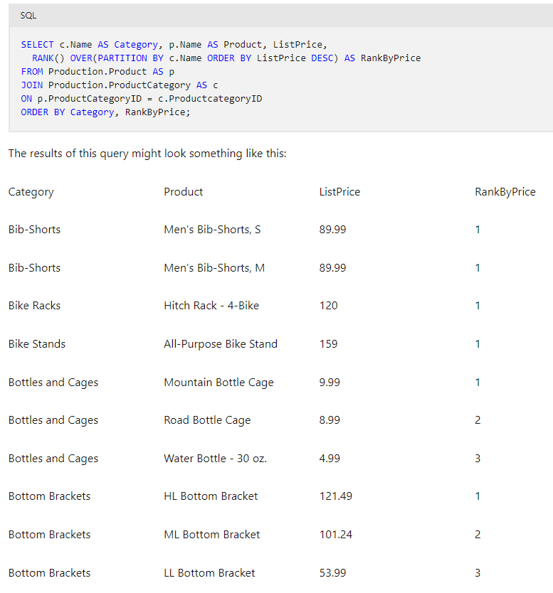

# [Get Started with T-SQL](https://learn.microsoft.com/en-us/training/paths/get-started-querying-with-transact-sql/)


## Introduction & DQL - Table Reads

- SQL standard was defined by ANSI - but each vendor has added variations & extensions
  - basics like SELECT|INSERT|UPDATE|DELETE are available no matter what the RDBMS - but extension functionality varies
  - MSFT uses T-SQL "Transact-SQL"
- a **DECLARATIVE** language: describe the output you want, and leave details of the steps required up to the execution engine
  - this is opposed to *procedural* where you give the computer instructions on what/how it should do
  - you describe results you want & query processor develops a query plan to retrieve it 
- most often used to query relational dbs, PKs & FKs, composite keys... 
- set-based processing: set-theory is fundamental to rdbms 
  - set: collection of definite, distinct objects considered as a whole
  - for SQL, the customer table represents a "set" and a SELECT statement also forms another set 
  - you operate on the "set" of data and not individual members - your actions/operations occur "all at once" 
  - no concept of "process ordering members" first,second,last row... don't matter for processing logic, just that they are members of a set that NEED to be processed
- Schemas: logical namespace in the database - allows for hierarchical naming system
  - fully qualified name: {DB Name}.{schema name}.{Table name} 
  - generally speaking, you will operate within a particular database, so you only need to specify {schema}.{table}
- Data Manipulation Language (DML) is the set of SQL statements that focuses on querying and modifying data. DML statements include SELECT, the primary focus of this training, and modification statements such as INSERT, UPDATE, and DELETE.
- Data Definition Language (DDL) is the set of SQL statements that handles the definition and life cycle of database objects, such as tables, views, and procedures. DDL includes statements such as CREATE, ALTER, and DROP.
- Data Control Language (DCL) is the set of SQL statements used to manage security permissions for users and objects. DCL includes statements such as GRANT, REVOKE, and DENY.
- Sometimes you may also see TCL listed as a type of statement, to refer to Transaction Control Language.
- In addition, some lists may redefine DML as Data Modification Language, which wouldn't include SELECT statements, but then they add DQL as Data Query Language for SELECT statements.

### SQL Order of Operations 

1. The FROM clause is evaluated first, to provide the source rows for the rest of the statement. A virtual table is created and passed to the next step.
2. The WHERE clause is next to be evaluated, filtering those rows from the source table that match a predicate. The filtered virtual table is passed to the next step.
3. GROUP BY is next, organizing the rows in the virtual table according to unique values found in the GROUP BY list. 
    - A new virtual table is created, containing the list of groups, and is passed to the next step. 
    - From this point in the flow of operations, only columns in the GROUP BY list or aggregate functions may be referenced by other elements.
4. The HAVING clause is evaluated next, filtering out entire groups based on its predicate. The virtual table created in step 3 is filtered and passed to the next step.
5. The SELECT clause finally executes, determining which columns will appear in the query results. 
    - *Because the SELECT clause is evaluated after the other steps, any column aliases (in our example, Orders) created there cannot be used in the GROUP BY or HAVING clause.*
6. The ORDER BY `ORDER BY Category ASC, Price DESC` clause is the last to execute, sorting the rows as determined by its column list.

## Data Query|Manipulation Language 

### Example Case where Title, MiddleName or Suffix could be NULL
- CASE is like the if/then/else structure that allows you to build multi-stage conditional expressions

```sql
SELECT TOP (1000) [CustomerID]
  ,[CompanyName] 
  , CAST(CustomerID AS varchar(8)) + ': ' + CompanyName  
  ,[Title]    
  ,[FirstName]    
  ,[MiddleName]    
  ,[LastName]    
  ,[Suffix]    
  , CASE         
    WHEN (Title IS NULL and MiddleName IS NULL and Suffix IS NULL)    THEN FirstName + ' ' + LastName        
    WHEN (Title IS NULL and MiddleName IS NULL)                     THEN FirstName + ' ' + LastName + ' ' + Suffix         
    WHEN (Title IS NULL and Suffix IS NULL)                         THEN FirstName + ' ' + MiddleName + ' ' + LastName        
    WHEN (MiddleName IS NULL and Suffix IS NULL)                    THEN Title + ' ' + FirstName + ' ' + LastName         
    WHEN (Title IS NULL)                                            THEN FirstName + ' ' + MiddleName + ' ' + LastName + ' ' + Suffix         
    WHEN (MiddleName IS NULL)                                       THEN Title + ' ' + FirstName + ' ' + LastName + ' ' + Suffix        
    WHEN (Suffix IS NULL)                                           THEN Title + ' ' + FirstName + ' ' + MiddleName + ' ' + LastName        
    ELSE Title + ' ' + FirstName + ' ' + MiddleName + ' ' + LastName + ' ' + Suffix     
  END as CustomerName    
  ,[SalesPerson]    
  , Phone    
  , EmailAddress    
  , COALESCE(EmailAddress, Phone) as ContactInfo  
FROM [adventureworks].[SalesLT].[Customer]
```

### Data Types in SQL

- SELECT clauses can perform calculations & manipulations which use operators to combine cols/values, etc through string or numeric functions *depending on col data type* 

**[SQL Server Data Types](https://learn.microsoft.com/en-us/sql/t-sql/data-types/data-types-transact-sql)**
| Exact   Numeric |     Approximate   Numeric |     Character |     Date/Time  |     Binary    |     Other          |
|-----------------|---------------------------|---------------|----------------|---------------|--------------------|
|     tinyint     |     float                 |     char      |     date       |     binary    |     cursor         |
|     smallint    |     real                  |     varchar   |     time       |     varbinary |     hierarchyid    |
| int             |                           | text          | datetime       | image         | sql_variant        |
| bigint          |                           | nchar         | datetime2      |               | table              |
| bit             |                           | nvarchar      | smalldatetime  |               | timestamp          |
| decimal/numeric |                           | ntext         | datetimeoffset |               | uniqueidentifier   |
| numeric         |                           |               |                |               | xml                |
| money           |                           |               |                |               | geography          |
| smallmoney      |                           |               |                |               | geometry           |

- Data type conversion can be explicit or implicit (SQL will try to fix it for you)
  - [View docs](https://learn.microsoft.com/en-us/sql/t-sql/data-types/decimal-and-numeric-transact-sql) for details on round up or truncate when you need certain precision level

- CAST & TRY_CAST: convert a value to a specified data type if value is compatible with target data type
  - CAST will fail if conversion doesn't fully work on all values, TRY_CAST will best effort convert what it can and leave failures as *NULL*
  - CONVERT & TRY_CONVERT are T-SQL only `CONVERT(nvarchar(30), SellStartDate, 126) AS ISO8601FormatDate`
    - *CONVERT includes an additional parameter that can be useful for formatting date and time values when converting them to text-based data.*

  ```sql
  -- size col contains values such as: (58, 92, S, M, L...)
  SELECT TRY_CAST(Size AS integer) As NumericSize
  FROM Production.Product;

  
  SELECT TOP (1000) [SalesOrderID]    
  ,[RevisionNumber]     
  -- NOTE the casting of PK & numeric as chars
  , 'SO' + CAST(SalesOrderID as varchar(8)) + ' (' + CAST(RevisionNumber AS varchar(2)) + ')' as FormattedSO    
  ,[OrderDate]    
  -- NOTE: Convert example with formatting
  , CONVERT(nvarchar(30),OrderDate, 102)    
  , shipdate    
  , CASE         
      WHEN ShipDate IS NULL THEN 'Awaiting Shipment'        
      ELSE 'Shipped'    
  END as ShippingStatus
  FROM [adventureworks].[SalesLT].[SalesOrderHeader]
  ```

- PARSE & TRY_PARSE: convert formatted str that represent numeric/datetime values ~ sas informat 
  ```sql
  SELECT PARSE('01/01/2021' AS date) AS DateValue,
   PARSE('$199.99' AS money) AS MoneyValue;
  ```

- STR: converts a numeric value to a varchar

### Null values in SQL 

- *NULL* is no value|unknown - cannot compare, <= add/subtract it... 
- ISNULL( col, if null then return result that aligns with col datatype)  i.e. `ISNULL(MiddleName, 'None')`
- COALESCE : can take a variable number of args, each of which is an expression. It will return the first expression in the list that is NOT NULL 
    ```sql
    SELECT EmployeeID,
          COALESCE(HourlyRate * 40,
                    WeeklySalary,
                    Commission * SalesQty) AS WeeklyEarnings
    FROM HR.Wages;
    ```

- NULLIF : return null under certain conditions 

- CONCAT treats NULL values as empty strings - whereas '+' adding NULL str creates a NULL: 
  ```sql
  SELECT TOP (1000) Name    
    , Color    
    , [Size]    
    , Color + ', ' + Size as ProductDetails    
    , CONCAT(Color, ', ', Size) as ProductDetails2 
  FROM [adventureworks].[SalesLT].[Product]
  ```


### Sorting Results 
`ORDER BY Category ASC, Price DESC`
- Columns by name. You can specify the names of the column(s) by which the results should be sorted. The results are returned in order of the first column, and then subsorted by each additional column in order.
- Column aliases. Because the ORDER BY is processed after the SELECT clause, it has access to aliases defined in the SELECT list.
- Columns by ordinal position in the SELECT list. 
  - Using the position isn't recommended in your applications, because of diminished readability and the extra care required to keep the ORDER BY list up to date. 
  - However, for complex expressions in the SELECT list, using the position number can be useful during troubleshooting.
- Columns not included in the SELECT list, but available from tables listed in the FROM clause. If the query uses a DISTINCT option, any columns in the ORDER BY list must be included in the SELECT list.

### Limiting Results returned
> TOP is proprietary to T-SQL
> Doesn't support skipping rows 
> Depends on ORDER BY - so you can only order output, not reading in of data

`SELECT TOP 10  <COL>...`
- Used in conjunction with ORDER BY so you can pick the "top 10" or "bottom 10"  
- WITH TIES : allows you to pull the "Tied" values i.e. if there are 5 folks tied for 8th place, and you wanted the "Top 10" 
  - **MUST USE ORDER BY CLAUSE**
  - WITH TIES would give you 13 rows to show you everyone that is "Tied" with the 10th place spot 

```sql
SELECT TOP 10 WITH TIES Name, ListPrice
FROM Production.Product
ORDER BY ListPrice DESC;
```
`SELECT TOP 10 PERCENT <COL>...` - does percentages rather than n rows (will round UP to nearest integer)

### OFFSET-FETCH 
- CANNOT use with TOP 
- return only a range of rows selected by your query - therefore goes at the END 
- you provide a starting point (offset) & a value to specify how many rows you would like to return (fetch) 
- allows you to "page" through your results one user-defined segment at a time 
  - if you do not specify the corresponding FETCH, it will return the remaining rows from offset through to the end. 

> Use ORDER BY when performing this to ensure deterministic result
> Without ORDER BY, SQL Server query optimizer can duplicate rows
  ```sql
  -- OFFSET { integer_constant | offset_row_count_expression } { ROW | ROWS }
  -- [FETCH { FIRST | NEXT } {integer_constant | fetch_row_count_expression } { ROW | ROWS } ONLY]

  SELECT ProductID, ProductName, ListPrice
  FROM Production.Product
  ORDER BY ListPrice DESC 
  OFFSET 0 ROWS --Skip zero rows
  FETCH NEXT 10 ROWS ONLY; --Get the next 10

  -- THEN in a subsequent query you start your offset at 10 and then get the following N rows
  SELECT ProductID, ProductName, ListPrice
  FROM Production.Product
  ORDER BY ListPrice DESC 
  OFFSET 10 ROWS --Skip 10 rows
  FETCH NEXT 10 ROWS ONLY; --Get the next 10
  ```

### Distinct 
- returns only ONE of each unique combo of cols in SELECT list 
> by default an implicit ALL is added to the beginning of each SELECT statement. You use the DISTINCT to override it.

### Where Clause 
- = (equals)
- <> (not equals)
- \> (greater than)
- \>= (greater than or equal to)
- < (less than)
- <= (less than or equal to)
- IS NULL / IS NOT NULL
- can compound using AND | OR
- IN operator: `productid = 1 or productid = 2    ==  productid IN (1,2)` 
- BETWEEN operator: `Price >= 1 AND Price <= 10   ==  price BETWEEN 1 and 10`
  - great for date ranges!
- LIKE operator: use wildcard string filtering `WHERE Name LIKE '%mountain%'` ==> 'HL Mountain Frame - Silver, 42', 'Mountain-100 Silver, 38'
  - `%` is similar to the * where it is 0 or more chars
  - `_` is looking for 1 char 
  - basic regex: product number begins BK- followed by any character other than R, and ends with a - followed by any two numerals `WHERE ProductNumber LIKE 'BK-[^R]%-[0-9][0-9]'`


### SQL Joins

- Without a WHERE clause - the result is a cartesian product ==> combining every row in one table to every row of another table  
- CROSS JOIN == Cartesian product (you get an error if you use the ON clause with cross join)
```sql
SELECT emp.FirstName, prd.Name
FROM HR.Employee AS emp
CROSS JOIN Production.Product AS prd;
-- The above is functionally equivalent to: 
SELECT emp.FirstName, prd.Name
FROM HR.Employee AS emp, Production.Product AS prd;
```


- Using a where caluse will default to an inner join - equivalent to the below: 
```sql
SELECT emp.FirstName, ord.Amount
FROM HR.Employee AS emp 
INNER JOIN Sales.SalesOrder AS ord
    ON emp.EmployeeID = ord.EmployeeID;
-- The above is functionally equivalent to: 
SELECT emp.FirstName, ord.Amount
FROM HR.Employee AS emp, Sales.SalesOrder AS ord
WHERE emp.EmployeeID = ord.EmployeeID;
```
- **High Level Processing** 
  - FROM & JOIN clause(s) pulls in tables & assigns appropriate aliases (emp & ord)
  - SQL Server performs a *logical* cartesian join and passes results as virtual table to next step 
    - NOTE: it may not actually physically create the cartesian product depending on optimizers
  - Using the ON clause - it filter virtual table keeping only rows where emp.EmployeeID = ord.EmployeeID 
    - This can repeat for each table "joined"
  - Filtered rows are passed to select statement and those cols from the rows are returned 

- **General guidelines** 
  - table aliases used in select col list 
  - can join on more than one col 
  - order of tables matters in LEFT|RIGHT joins 
  - presence of NULLs across multiple joins can cause issues & may be kicked out by subsequent joins
    - can use IS NULL after an outer join to catch certain missing 
  - ORDER BY is required to keep order of query consistent - no guarantee it will match order of the input tables 

### SQL SubQueries (Nested queries)
- In general - subqueries are evaluated once & provide results to outer query. They have 2 return types & dependencies
- MUST be enclosed in parentheses - TSQL allows up to 32 layers of subqueries
- You can only return cols from the outer query 
- **Scalar Return Type**: return a single value that the outer query must expect to process a single result 
- Scalar self Contained Example: Give me the details of the latest customer order (returns 1 value) and compare it to avg qty
    ```sql 
    SELECT SalesOrderID
      , ProductID 
      , OrderQty
      , (SELECT AVG(OrderQty)
      FROM SalesLT.SalesOrderDetail) AS AvgQty
    FROM SalesLT.SalesOrderDetail
    WHERE SalesOrderID = 
      (SELECT MAX(SalesOrderID)
      FROM SalesLT.SalesOrderHeader);
    ```

- **multi-value Return Type**: basically a table with n # of cols 
- Multi-Value self Contained Subquery Example: Get me all orders from customers in Canada
    ```sql
    SELECT CustomerID, SalesOrderID
    FROM Sales.SalesOrderHeader
    WHERE CustomerID IN (
        SELECT CustomerID
        FROM Sales.Customer
        WHERE CountryRegion = 'Canada');
    ```

- Dependencies: 
  - *Self Contained Query*: can be written & run stand-alone with no dependencies on outer query
    - processed once and passes results to outer query 
  - *Correlated Subquery*: references 1+ cols from outer query & therefore depends on it 
    - can ONLY be run with outer query and not separately on its own 
    - can complicate troubleshooting and be called multiple times 
- Example Correlated Subquery: Max order from each customer - checks if each row its looking at is the max for a particular customer
    ```sql
    SELECT SalesOrderID, CustomerID, OrderDate
    FROM SalesLT.SalesOrderHeader AS o1
    WHERE SalesOrderID =
        (SELECT MAX(SalesOrderID)
        FROM SalesLT.SalesOrderHeader AS o2
        WHERE o2.CustomerID = o1.CustomerID)
    ORDER BY CustomerID, OrderDate;
    ```
- If the subquery returns no rows (an empty set), the result of the subquery is a NULL. If it is possible in your scenario for no rows to be returned, you should ensure your outer query can gracefully handle a NULL, in addition to other expected results.
- should only return single col, multi col will result in an error without EXISTS keyword 
- To write correlated subqueries, consider the following guidelines:
  - Write the outer query to accept the appropriate return result from the inner query. 
    - If the inner query is scalar, you can use equality and comparison operators, such as =, <, >, and <>, in the WHERE clause. 
    - If the inner query might return multiple values,use an IN predicate. Plan to handle NULL results.
  - Identify the column from the outer query that will be referenced by the correlated subquery. Declare an alias for the table that is the source of the column in the outer query.
  - Identify the column from the inner table that will be compared to the column from the outer table. Create an alias for the source table, as you did for the outer query.
  - Write the inner query to retrieve values from its source, based on the input value from the outer query. For example, use the outer column in the WHERE clause of the inner query.

- **EXISTS|NOT EXISTS** 
> NOTE: If you're converting a subquery using `COUNT(*)` to one using EXISTS, make sure the subquery uses a `SELECT *` and not `SELECT COUNT(*)`. 
> `SELECT COUNT(*)` always returns a row, so the EXISTS will always return TRUE. 

```sql
SELECT CustomerID, CompanyName, EmailAddress 
FROM Sales.Customer AS c 
WHERE
(SELECT COUNT(*) 
  FROM Sales.SalesOrderHeader AS o
  WHERE o.CustomerID = c.CustomerID) > 0;
-- Is equivalent to: 
SELECT CustomerID, CompanyName, EmailAddress 
FROM Sales.Customer AS c 
WHERE EXISTS
(SELECT * 
  FROM Sales.SalesOrderHeader AS o
  WHERE o.CustomerID = c.CustomerID);
```
- EXISTS is a way to check if something is TRUE or FALSE
  - Meaning if a **row** is returned - then continue the outer query 
- This is MUCH less process intensive as above because it is not doing a count AND comparison - it is simply subsetting and evaluating a boolean 

### Built-in Functions to SQL
- **Scalar**: operate on a single row and return a single value  
  - most often used in SELECT or WHERE statements as they return a single value  
  - DETERMINISTIC vs NONDETERMINISTIC: returns the same value for the same input and db state it is called (ROUND) vs GETDATE will return current date & time which is nondeterministic 
  - Collation: Sort order of the input value or sort order of the database
  - Examples: GETDATE, UPPER, ROUND - string manipulation, datatype conversion, datetime, mathematical, metadata, security, system, stats, text/image
    - DateTime F(x)s: YEAR, DATENAME, DAY, DATEDIFF, GETDATE...
    - Mathematical F(x)s: ROUND, FLOOR, CEILING, SQUARE, SQRT, LOG, +/-/^
- **Logical**: Compare multiple values to determine single output (?case?) 
  - `IIF` evaluates a boolean input and returns specified value if true (operates like Excel IF)
    - `IIF(AddressType = 'Main Office', 'Billing', 'Mailing')` - if it is the Main Office, then it is Billing, otherwise its for Mailing 
  - `CHOOSE` ~ from a numeric col, map the #s to your Choose "array"
    - col Status has values [1,2,3] THEN `CHOOSE(Status, 'Ordered', 'Shipped', 'Delivered') AS OrderStatus` ==> 1 = Ordered, 2 = Shipped... 
- **Ranking**: Operate on a partition (set) of rows 
  - Appears to be a way to do a sort and create numeric value rank assignments to data - kind of like the if first & if last counting logic in SAS on a sorted dataset 
  - There are many other rank functions DENSE_RANK, NTILE, ROW_NUMBER... that can be used to change numeric assignment 
  ```sql 
  -- Order & Rank Highest price items by category 
  SELECT c.Name AS Category
    , p.Name AS Product
    , ListPrice
    , RANK() OVER(PARTITION BY c.Name ORDER BY ListPrice DESC) AS RankByPrice
    -- Just use below to only rank by ListPrice 
    -- , RANK() OVER(ORDER BY ListPrice DESC)
  FROM Production.Product AS p
  JOIN Production.ProductCategory AS c
  ON p.ProductCategoryID = c.ProductcategoryID
  ORDER BY Category, RankByPrice;
  ```


- **Rowset**: Return a virtual table that can be used in a FROM clause in TSQL 
  - Return a virtual table that can be used in the from clause as a data source 
  - Examples: OPENDATASOURCE | OPENQUERY | OPENROWSET | OPENXML | OPENJSON 
  - OPENDATASOURCE | OPENQUERY | OPENROWSET allow you to do sql passthrough and execute the query on remote db server which will return a set of rows 
  - OPENXML & OPENJSON allow you to query data in XML/JSON and pull data into SQL table
  ```sql
  SELECT a.*
  FROM OPENROWSET('SQLNCLI'
      -- This is making a connection to a different db server
      , 'Server=SalesDB;Trusted_Connection=yes;'
      , 'SELECT Name, ListPrice
      FROM AdventureWorks.Production.Product') AS a;
  ```

### GROUP BY & Aggregations

- **Aggregate**: take one or more input row values, return a single summarizing value 
  - Examples: SUM, MIN, MAX, COUNT, AVG... (COUNT_BIG - returns bigint rather than int)
  - Aggregate functions return a single (scalar) value and can be used in SELECT statements almost anywhere a single value can be used. 
    - For example, these functions can be used in the SELECT, HAVING, and ORDER BY clauses. 
    - *However, they cannot be used in the WHERE clause.*
  - Aggregate functions ignore NULLs, except when using COUNT(*). 
    - MEANING: SUM will add up all non-NULL values
    - COUNT(*) will count ALL rows regardless of NULL or not 
    - AVG will sum populated rows & divide by num of non-Null rows and will be different from SUM(col1)/COUNT(*) if col1 has null values 
    - TIP: can fix null values by using coalesce 
  - Aggregate functions in a SELECT list don't have a column header unless you provide an alias using AS.
  - Aggregate functions in a SELECT list operate on all rows passed to the SELECT operation. 
    - If there is no GROUP BY clause, all rows satisfying any filter in the WHERE clause will be summarized. You will learn more about GROUP BY in the next topic.
  - Unless you're using GROUP BY, you shouldn't combine aggregate functions with columns not included in functions in the same SELECT list.
  - DISTINCT can be useful in removing duplicate rows 


- `GROUP BY` used with aggregations - to allow you to subset aggregations by different col values 
  - Remember when you use an agg function, you NEED to group by all other cols in the select that don't have an agg 
  ```sql
  SELECT CustomerID, PurchaseOrderNumber, COUNT(*) AS OrderCount
  FROM Sales.SalesOrderHeader
  GROUP BY CustomerID;
  -- Leads to below ERROR:
  Msg 8120, Level 16, State 1, Line 1
  Column 'Sales.SalesOrderHeader.PurchaseOrderNumber' is invalid in the select list because it is not contained in either an aggregate function or the GROUP BY clause.
  -- ERROR Because: This query returns one row for each CustomerID value. But rows for the same CustomerID can have different PurchaseOrderNumber values, so which of the values is the one that should be returned?
  ```
  - ALSO - since GROUP BY is run BEFORE the SELECT statement - it doesn't know the "aliases" you've assigned during select. You must fill it in with original values 

- **HAVING** - a way to subset your agg query
  - WHERE subsets the data fed into the query
  - HAVING subsets the agg rows (customers who've ordered more than 10 times)
  ```sql
  SELECT CustomerID,
        COUNT(*) AS OrderCount
  FROM Sales.SalesOrderHeader
  GROUP BY CustomerID
  HAVING COUNT(*) > 10;
  ```

## Data Definition Language (DDL & DML) - Table Writes 

**Generic INSERT ... VALUES Statement** 
```sql
INSERT [INTO] <Table> [(column_list)] -- NOTE: without a list of columns, INSERT will expect a value for EVERY col in table in the table's col order 
VALUES ([ColumnName or an expression or DEFAULT or NULL],…n)
```
- If col has been defined to have auto-generated value, that will be used
- When table is created, default value can be supplied for a col and that value will be used if DEFAULT is specified in the VALUES clause 
- If col allows NULLs & no default assigned, NULL values will be given if you put DEFAULT in the VALUES clause 
> TIP: to see cols in a table and the order, run a select where the condition can never be true - resulting in no rows returned. `SELECT * FROM ABC.Table1 WHERE 1 = 0`

**Generic INSERT ... SELECT Statement** 
- Rather than declaring values up front - you can use a select statement to replace the values clause and use that resulting rowset (table) to feed the INSERT 
- NOTE: can also feed from stored proc or dynamic batches in INSERT ... EXEC 
  - those are special because sometimes they can return multiple tables! 
```sql
INSERT [INTO] <table or view> [(column_list)]
SELECT <column_list> FROM <table_list>...;  -- NOTE: no need for parentheses because its not a subquery 
```

**Generic SELECT ... INTO** 
- Create a new table based on the result of the select 
- NOTE: ALWAYS CREATES A NEW TABLE - cannot insert rows into EXISTING table 
  - appears to be different from CREATE TABLE ABC.Table1 AS in the fact that CREATE NEW TABLE will always replace by default 
  - perhaps a safer way to avoid overwrites? 
- Each column in the new table will inherit name, type, nullability etc... 
  - they will have the same name, data type, and nullability as the corresponding column (or expression) in the SELECT list
```sql 
SELECT SalesOrderID, CustomerID, OrderDate, PurchaseOrderNumber, TotalDue
INTO Sales.Invoice
FROM Sales.SalesOrderHeader;
```

### Generating Automatic Values 

- to generate sequential values for one col -> use IDENTITY or SEQUENCE 
- **IDENTITY** : have db create unique values for a particular table 
  - NOT at creating a unique sequential value across tables 
```sql
CREATE TABLE Sales.Promotion (
PromotionID int IDENTITY PRIMARY KEY,
PromotionName varchar(20)
);
```
  - Specified during col definition - in place of specifying NULL|NOT NULL 
  - You define a col as numeric (int or dec with a scale of 0)
  - you can define a seed (starting value 1000 and an increment) - both seed & increment default to 1 
  - when you insert data into IDENTITY col you don't specify a value for identity as DB will generate the value for you 
    - Example: `INSERT INTO Sales.Promotion VALUES ('Clearance Sale', '01/01/2021', 23, 0.10, '10% discount')`
  - You can retrieve the most recently assigned IDENTITY value with: `SELECT SCOPE_IDENTITY();`
  - You can can return the most recent generated for a specific table: `SELECT IDENT_CURRENT('Sales.Promotion');`
  - To override ID and manually assign ID - you need to SET IDENTITY_INSERT for a particular table ON. 
  - When you turn it off, the last value you explicitly entered is used as the seed: 
  ```sql
  SET IDENTITY_INSERT SalesLT.Promotion ON;

  INSERT INTO SalesLT.Promotion (PromotionID, PromotionName, ProductModelID, Discount) VALUES
  (20, 'Another short sale',37, 0.3);

  SET IDENTITY_INSERT SalesLT.Promotion OFF;
  ```
  - Occasionally may need to reset or skip ID values - can "reseed" the col by using [`DBCC CHECKIDENT`](https://learn.microsoft.com/en-us/sql/t-sql/database-console-commands/dbcc-checkident-transact-sql?view=sql-server-ver16)

- **SEQUENCE**: 
  - an object indp of a specific table - you supply data type (int or dec with scale of 0) starting value, increment & max val & performance options 
  - This can be pulled and used for a variety of use-cases
  ```sql
  CREATE SEQUENCE Sales.InvoiceNumber AS INT
  START WITH 1000 INCREMENT BY 1;
  INSERT INTO Sales.ResellerInvoice VALUES
  (NEXT VALUE FOR Sales.InvoiceNumbesr, 2, GETDATE(), 'PO12345', 107.99);  -- uses NEXT VALUE FOR to generate new #
  ```
- USAGE Differences:
  - USE SEQUENCE WHEN: 
    - you need to share a single series of numbers between multiple tables or cols within a table
    - you want to generate a sequence of numbers that are ordered by a different col 
      - NOTE: since the "sequence" is used each time you SELECT or query, the list of values will change for each query
      - Say you want to create a numeric sequence based on name 
      ```sql 
      SELECT NEXT VALUE FOR dbo.Sequence OVER (ORDER BY Name) AS NextID,
          ProductID,
          Name
      FROM Production.Product;
      ```
    - Use SEQUENCE to get multi values assigned at once - say 5 records of SalesOrder are being recorded and should be sequential - can use `sp_sequence_get_range` to retrieve several numbers in the sequence at once 
    - can more easily change spec of sequence by adjusting increment value 
  - USE IDENTITY WHEN: 
    - you want to protect a col from accidental updates - if you try to update col with IDENTITY property you get an ERROR
      - need to remove the col name & value

### UPDATE 
- change existing col data in a table - operates on a set of rows 
  - subset using where and use the SET clause to specify which cols to update 
```sql
UPDATE <TableName> SET 
<ColumnName> = { expression | DEFAULT | NULL }
{,…n}
WHERE <search_conditions>;
-- EXAMPLE: Set Discount to 20% and replace all 10% notes with 20% for "Get Framed" promotion
UPDATE Sales.Promotion
SET Discount = 0.2, Notes = REPLACE(Notes, '10%', '20%')
WHERE PromotionName = 'Get Framed';
-- EXAMPLE: Can even use FROM to merge in additional information to updating a particular table - like getting product ID
UPDATE Sales.Promotion
SET Notes = FORMAT(Discount, 'P') + ' off ' + m.Name
FROM Product.ProductModel AS m
WHERE Notes IS NULL
    AND Sales.Promotion.ProductModelID = m.ProductModelID;
```

### DELETE & TRUNCATE
- Removes entire rows from a table - THERE IS NO UNDO so make sure to double check and always use a WHERE condition
- Truncate runs faster than DELETE FROM
```sql 
-- SELECT * -- Test with a SELECT first to confirm, then DELETE
DELETE [FROM] <TableName>
WHERE <search_conditions>;
-- TRUNCATE will remove all rows from a table, doesn't accept where and always removes all rows in ONE operation
DELETE FROM Sales.Sample;
-- is equivalent to:
TRUNCATE TABLE Sales.Sample;
```
- Can use these subqueries in combination with the UPDATE/INSERTS to ensure you are always getting the correct kind of item
```sql
-- DELETE Products that match the product category ID that was inserted with the name 'Bells and Horns'
DELETE FROM SalesLT.Product
WHERE ProductCategoryID =
    (SELECT ProductCategoryID
     FROM SalesLT.ProductCategory
     WHERE Name = 'Bells and Horns');
```

### MERGE
- Synchronize 2 tables by inserting/updating/deleting rows in one table based on differences found in the other 
- TARGET table is the one being momdified
- SOURCE is the table used to determine which rows to change 
- Updates are made to target WHEN:
  - `WHEN MATCHED THEN` source data has a matching row in target, it can update data in target 
  - `WHEN NOT MATCHED BY TARGET` target data is missing data that source has, it can insert data into target 
  - `WHEN NOT MATCHED BY SOURCE` target data has data that is missing in source, it will delete (remove) those rows 

```sql
MERGE INTO schema_name.table_name AS TargetTbl
USING (SELECT <select_list>) AS SourceTbl
ON (TargetTbl.col1 = SourceTbl.col1)
WHEN MATCHED THEN 
   UPDATE SET TargetTbl.col2 = SourceTbl.col2
WHEN NOT MATCHED [BY TARGET] THEN
   INSERT (<column_list>)
   VALUES (<value_list>)
WHEN NOT MATCHED BY SOURCE THEN
   DELETE;
```

## Reading from External Tables: 

```sql
-- External data source links to data lake location
CREATE EXTERNAL DATA SOURCE StagedFiles
WITH (
    LOCATION = 'https://mydatalake.blob.core.windows.net/data/stagedfiles/'
);
GO

-- External format specifies file format
CREATE EXTERNAL FILE FORMAT ParquetFormat
WITH (
    FORMAT_TYPE = PARQUET,
    DATA_COMPRESSION = 'org.apache.hadoop.io.compress.SnappyCodec'
);
GO

-- External table references files in external data source
CREATE EXTERNAL TABLE dbo.ExternalStageProduct
(
    ProductID NVARCHAR(10) NOT NULL,
    ProductName NVARCHAR(200) NOT NULL,
    ProductCategory NVARCHAR(200) NOT NULL,
    Color NVARCHAR(10),
    Size NVARCHAR(10),
    ListPrice DECIMAL NOT NULL,
    Discontinued BIT NOT NULL
)
WITH
(
    DATA_SOURCE = StagedFiles,
    LOCATION = 'products/*.parquet',
    FILE_FORMAT = ParquetFormat
);
GO
```

# [Program T-SQL](https://learn.microsoft.com/en-us/training/paths/program-transact-sql/)

# [Advanced T-SQL](https://learn.microsoft.com/en-us/training/paths/write-advanced-transact-sql-queries/)

# Nifty Items

**Using PK to randomize data values**
```sql
UPDATE SalesLT.Customer
SET EmailAddress = NULL
WHERE CustomerID % 7 = 1;
```

**Create a temp table for dates and calculated attributes based on a date grain**
```sql
-- Create a temporary table for the dates we need
CREATE TABLE #TmpStageDate (DateVal DATE NOT NULL)

-- Populate the temp table with a range of dates
DECLARE @StartDate DATE
DECLARE @EndDate DATE
SET @StartDate = '2019-01-01'
SET @EndDate = '2023-12-31'
DECLARE @LoopDate = @StartDate
WHILE @LoopDate <= @EndDate
BEGIN
    INSERT INTO #TmpStageDate VALUES
    (
        @LoopDate
    )
    SET @LoopDate = DATEADD(dd, 1, @LoopDate)
END

-- Insert the dates and calculated attributes into the dimension table
INSERT INTO dbo.DimDate
SELECT CAST(CONVERT(VARCHAR(8), DateVal, 112) as INT), -- date key
    DateVal, --date alt key
    Day(DateVal) -- day number of month
    --,  other derived temporal fields as required
FROM #TmpStageDate
GO

--Drop temporary table
DROP TABLE #TmpStageDate
```